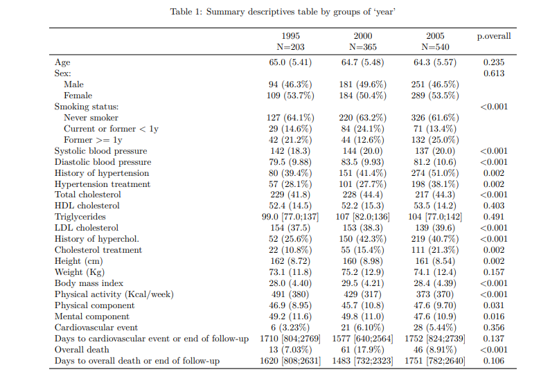
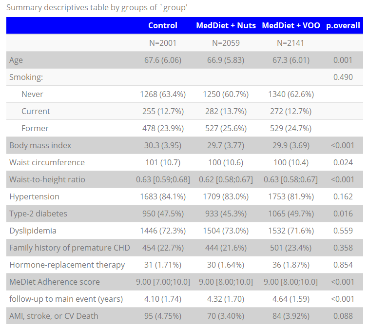

[](http://cran.r-project.org/package=compareGroups)  


compareGroups: package to create descriptive tables
=========

-   [Overview](#overview)
-   [Package installation](#package-installation)
-   [Example](#example)
    -   [Costumizing the table](#costumizing-the-table)
-   [Visual exploration](#visual-exploration)
-   [Exporting the table](#exporting-the-table)
-   [Stratified tables](#stratified-tables)
-   [Odds Ratios and Hazard Ratios](#odds-ratios-and-hazard-ratios)
-   [Web-based User Interface](#web-based-user-interface)
-   [Citation](#citation)

## Overview

**compareGroups** is an R package available on CRAN which performs descriptive tables displaying means, standard deviation, quantiles or frequencies of several variables. Also, p-value to test equality between groups is computed using the appropiate test. <br>

With a very simple code, nice, compact and ready-to-publish descriptives table are displayed on R console. They can also be exported to different formats, such as Word, Excel, PDF or inserted in a R-Sweave or R-markdown document.<br>

You will find an extensive manual describing all **compareGropus** capabilities with real examples in the [vignette](https://CRAN.R-project.org/package=compareGroups).
Also, **compareGroups** package has been published in Journal of Statistical Software [Subirana et al, 2014 [http://www.jstatsoft.org/v57/i12/.](http://www.jstatsoft.org/v57/i12/.)].


## Package installation


Install the **`compareGroups`** package from CRAN and then load it by typing:

```
install.packages("compareGroups")
```

or from github to get the latest version

```
library(devtools)
devtools::install_github(repo = "isubirana/compareGroups")
```

## Example

In the following table, some variables from the PREDIMED study ([http://www.predimed.es/](http://www.predimed.es/)) are analysed. We illustrate the syntax of **`compareGroups`** functions to display tables containing descriptives or possible tests to compare groups.


Following, to describe all the variables of the data set just type:

```
library(compareGroups) # load compareGroups package
data(predimed) # load example data
descrTable(predimed)
```

```
--------Summary descriptives table ---------

__________________________________________________ 
                                    [ALL]      N   
                                    N=6324         
¯¯¯¯¯¯¯¯¯¯¯¯¯¯¯¯¯¯¯¯¯¯¯¯¯¯¯¯¯¯¯¯¯¯¯¯¯¯¯¯¯¯¯¯¯¯¯¯¯¯ 
Intervention group:                           6324 
    Control                      2042 (32.3%)      
    MedDiet + Nuts               2100 (33.2%)      
    MedDiet + VOO                2182 (34.5%)      
Sex:                                          6324 
    Male                         2679 (42.4%)      
    Female                       3645 (57.6%)      
Age                              67.0 (6.17)  6324 
Smoking:                                      6324 
    Never                        3892 (61.5%)      
    Current                      858 (13.6%)       
    Former                       1574 (24.9%)      
Body mass index                  30.0 (3.82)  6324 
Waist circumference               100 (10.6)  6324 
Waist-to-height ratio            0.63 (0.07)  6324 
Hypertension:                                 6324 
    No                           1089 (17.2%)      
    Yes                          5235 (82.8%)      
Type-2 diabetes:                              6324 
    No                           3322 (52.5%)      
    Yes                          3002 (47.5%)      
Dyslipidemia:                                 6324 
    No                           1746 (27.6%)      
    Yes                          4578 (72.4%)      
Family history of premature CHD:              6324 
    No                           4895 (77.4%)      
    Yes                          1429 (22.6%)      
Hormone-replacement therapy:                  5661 
    No                           5564 (98.3%)      
    Yes                           97 (1.71%)       
MeDiet Adherence score           8.68 (1.94)  6324 
follow-up to main event (years)  4.36 (1.69)  6324 
AMI, stroke, or CV Death:                     6324 
    No                           6072 (96.0%)      
    Yes                          252 (3.98%)       
¯¯¯¯¯¯¯¯¯¯¯¯¯¯¯¯¯¯¯¯¯¯¯¯¯¯¯¯¯¯¯¯¯¯¯¯¯¯¯¯¯¯¯¯¯¯¯¯¯¯
```

### Costumizing the table

In the following table, variables are described by intervention group. 
Some variables such as Waist-to-height ratio (`wth`) and MeDiet Adherence score (`p14`) have been treated as non-normal distributed, and medians and quantiles within square brackets instead of means and standard deviations within round brackets are displayed.
Also, individuals older than 55 years old are selected. Appropiate tests to compare means, medians or proportions are performed.
For those binary variables of type "yes/no", you may desire to show only the proportion of "yes" category without showing "yes" but only the variable name or label. For example, for diabetes you may want to see simply "diabetes" instead of "diabetes: yes". This is possible by `hide.no` argument.

Note the simplicity of the syntax. Also, note the use of `formula` to select the variables, and the use of `subset` to filter some individuals as usual in many other R funcions.


``` r
tab <- descrTable(group ~ . , predimed, hide.no="no", method=c(wth=2, p14=2), subset=age>55)
tab
```


```
____________________________________________________________________________________________ 
                                    Control       MedDiet + Nuts   MedDiet + VOO   p.overall 
                                     N=2001           N=2059           N=2141                
¯¯¯¯¯¯¯¯¯¯¯¯¯¯¯¯¯¯¯¯¯¯¯¯¯¯¯¯¯¯¯¯¯¯¯¯¯¯¯¯¯¯¯¯¯¯¯¯¯¯¯¯¯¯¯¯¯¯¯¯¯¯¯¯¯¯¯¯¯¯¯¯¯¯¯¯¯¯¯¯¯¯¯¯¯¯¯¯¯¯¯¯ 
Sex:                                                                                <0.001   
    Male                          780 (39.0%)      930 (45.2%)      865 (40.4%)              
    Female                        1221 (61.0%)     1129 (54.8%)     1276 (59.6%)             
Age                               67.6 (6.06)      66.9 (5.83)      67.3 (6.01)      0.001   
Smoking:                                                                             0.490   
    Never                         1268 (63.4%)     1250 (60.7%)     1340 (62.6%)             
    Current                       255 (12.7%)      282 (13.7%)      272 (12.7%)              
    Former                        478 (23.9%)      527 (25.6%)      529 (24.7%)              
Body mass index                   30.3 (3.95)      29.7 (3.77)      29.9 (3.69)     <0.001   
Waist circumference                101 (10.7)       100 (10.6)       100 (10.4)      0.024   
Waist-to-height ratio           0.63 [0.59;0.68] 0.62 [0.58;0.67] 0.63 [0.58;0.67]  <0.001   
Hypertension                      1683 (84.1%)     1709 (83.0%)     1753 (81.9%)     0.162   
Type-2 diabetes                   950 (47.5%)      933 (45.3%)      1065 (49.7%)     0.016   
Dyslipidemia                      1446 (72.3%)     1504 (73.0%)     1532 (71.6%)     0.559   
Family history of premature CHD   454 (22.7%)      444 (21.6%)      501 (23.4%)      0.358   
Hormone-replacement therapy        31 (1.71%)       30 (1.64%)       36 (1.87%)      0.854   
MeDiet Adherence score          9.00 [7.00;10.0] 9.00 [8.00;10.0] 9.00 [8.00;10.0]  <0.001   
follow-up to main event (years)   4.10 (1.74)      4.32 (1.70)      4.64 (1.59)     <0.001   
AMI, stroke, or CV Death           95 (4.75%)       70 (3.40%)       84 (3.92%)      0.088   
¯¯¯¯¯¯¯¯¯¯¯¯¯¯¯¯¯¯¯¯¯¯¯¯¯¯¯¯¯¯¯¯¯¯¯¯¯¯¯¯¯¯¯¯¯¯¯¯¯¯¯¯¯¯¯¯¯¯¯¯¯¯¯¯¯¯¯¯¯¯¯¯¯¯¯¯¯¯¯¯¯¯¯¯¯¯¯¯¯¯¯¯
```


Also, number of decimals and much more options can be changed to costumize the table as desired (see the  [package manual](https://CRAN.R-project.org/package=compareGroups))


## Visual exploration

With **`compareGroups`** it is also possible to visualize the distribution of analysed variables. This can be done by the `plot` function applied on the table:

``` r
plot(tab["sex"]) # barplot
plot(tab["age"]) # histogram and normality plot
```

|                                     |                                      |
|:-----------------------------------:|:------------------------------------:|
| |  |


## Exporting the table

Once the table is created, it can be printed on the R console in a nice and compact format, or it can be exported to different formats, such as PDF, Excel, Word or LaTex code.

``` r
export2pdf(tab, file = "example.pdf")
export2xls(tab, file = "example.xlsx")
export2word(tab, file = "example.docx")
export2latex(tab, file = "example.tex")
```
This is how the table looks like in PDF:




Also, by using `export2md` function a descriptive table can be inserted in a Rmarkdown chunk to be compiled in HTML, PDF or Word report. Here there is an example of a Rmarkdown compiled to HTML.

``` r
export2md(tab, strip = TRUE, first = TRUE, 
          header.background = "blue", header.color = "white", 
          caption = "Description of variables by intervention groups")
```




## Stratified tables


After creating a table you may want to repeat the descriptives within stratas. For example, you may want to compare the groups for men and for women. This is very easy using the `strataTable` function:

``` r
# remove sex (first variable)
tab <- tab[-1]
# stratify by sex
tabestr <- strataTable(tab, strata="sex")
tabestr
```


```
--------Summary descriptives table ---------

__________________________________________________________________________________________________________________________________________________________
                                                            Male                                                         Female                           
                                ____________________________________________________________  ____________________________________________________________
                                    Control       MedDiet + Nuts   MedDiet + VOO   p.overall      Control       MedDiet + Nuts   MedDiet + VOO   p.overall 
                                     N=780            N=930            N=865                       N=1221           N=1129           N=1276                
¯¯¯¯¯¯¯¯¯¯¯¯¯¯¯¯¯¯¯¯¯¯¯¯¯¯¯¯¯¯¯¯¯¯¯¯¯¯¯¯¯¯¯¯¯¯¯¯¯¯¯¯¯¯¯¯¯¯¯¯¯¯¯¯¯¯¯¯¯¯¯¯¯¯¯¯¯¯¯¯¯¯¯¯¯¯¯¯¯¯¯¯¯¯¯¯¯¯¯¯¯¯¯¯¯¯¯¯¯¯¯¯¯¯¯¯¯¯¯¯¯¯¯¯¯¯¯¯¯¯¯¯¯¯¯¯¯¯¯¯¯¯¯¯¯¯¯¯¯¯¯¯¯¯
Age                               66.8 (6.32)      66.3 (6.10)      66.6 (6.31)      0.181      68.1 (5.84)      67.5 (5.54)      67.7 (5.75)      0.023   
Smoking:                                                                             0.674                                                         0.923   
    Never                         196 (25.1%)      259 (27.8%)      229 (26.5%)                 1072 (87.8%)     991 (87.8%)      1111 (87.1%)             
    Current                       192 (24.6%)      229 (24.6%)      203 (23.5%)                  63 (5.16%)       53 (4.69%)       69 (5.41%)              
    Former                        392 (50.3%)      442 (47.5%)      433 (50.1%)                  86 (7.04%)       85 (7.53%)       96 (7.52%)              
Body mass index                   29.5 (3.46)      29.1 (3.27)      29.2 (3.24)      0.014      30.8 (4.18)      30.2 (4.07)      30.4 (3.90)      0.002   
Waist circumference                104 (9.73)       103 (9.38)       103 (9.63)      0.251      99.1 (10.9)      97.8 (11.0)      98.0 (10.5)      0.009   
Waist-to-height ratio           0.62 [0.58;0.65] 0.61 [0.58;0.65] 0.62 [0.58;0.65]   0.313    0.64 [0.60;0.69] 0.63 [0.58;0.68] 0.63 [0.59;0.68]   0.002   
Hypertension                      626 (80.3%)      726 (78.1%)      656 (75.8%)      0.097      1057 (86.6%)     983 (87.1%)      1097 (86.0%)     0.733   
Type-2 diabetes                   415 (53.2%)      480 (51.6%)      472 (54.6%)      0.455      535 (43.8%)      453 (40.1%)      593 (46.5%)      0.007   
Dyslipidemia                      506 (64.9%)      621 (66.8%)      566 (65.4%)      0.691      940 (77.0%)      883 (78.2%)      966 (75.7%)      0.346   
Family history of premature CHD   129 (16.5%)      157 (16.9%)      152 (17.6%)      0.849      325 (26.6%)      287 (25.4%)      349 (27.4%)      0.560   
Hormone-replacement therapy        0 (0.00%)        0 (0.00%)        0 (0.00%)         .         31 (2.66%)       30 (2.82%)       36 (2.97%)      0.903   
MeDiet Adherence score          9.00 [7.00;10.0] 9.00 [8.00;10.0] 9.00 [8.00;10.0]  <0.001    8.00 [7.00;10.0] 9.00 [8.00;10.0] 9.00 [7.00;10.0]  <0.001   
follow-up to main event (years)   4.07 (1.79)      4.40 (1.73)      4.54 (1.64)     <0.001      4.12 (1.71)      4.26 (1.67)      4.72 (1.56)     <0.001   
AMI, stroke, or CV Death           56 (7.18%)       41 (4.41%)       51 (5.90%)      0.048       39 (3.19%)       29 (2.57%)       33 (2.59%)      0.567   
¯¯¯¯¯¯¯¯¯¯¯¯¯¯¯¯¯¯¯¯¯¯¯¯¯¯¯¯¯¯¯¯¯¯¯¯¯¯¯¯¯¯¯¯¯¯¯¯¯¯¯¯¯¯¯¯¯¯¯¯¯¯¯¯¯¯¯¯¯¯¯¯¯¯¯¯¯¯¯¯¯¯¯¯¯¯¯¯¯¯¯¯¯¯¯¯¯¯¯¯¯¯¯¯¯¯¯¯¯¯¯¯¯¯¯¯¯¯¯¯¯¯¯¯¯¯¯¯¯¯¯¯¯¯¯¯¯¯¯¯¯¯¯¯¯¯¯¯¯¯¯¯¯¯

```

or when is complied in HTML 

``` r
export2md(tabestr, strip = TRUE, first = TRUE, 
          header.background = "blue", header.color = "white", size=11)
```


## Odds Ratios and Hazard Ratios


Using **`compareGroups`** package you can compute Odds Ratios for transversal or case-control studies, or Hazard Ratios for cohort studies

- **Example of case-control study: Odds Ratios**

``` r
data(SNPs)
descrTable(casco ~ .-id, SNPs, show.ratio=TRUE, show.p.overall=FALSE)[1:4]
```

```
--------Summary descriptives table by 'casco'---------

_______________________________________________________________ 
                 0             1              OR        p.ratio 
               N=47          N=110                              
¯¯¯¯¯¯¯¯¯¯¯¯¯¯¯¯¯¯¯¯¯¯¯¯¯¯¯¯¯¯¯¯¯¯¯¯¯¯¯¯¯¯¯¯¯¯¯¯¯¯¯¯¯¯¯¯¯¯¯¯¯¯¯ 
sex:                                                            
    Male    21 (44.7%)    54 (49.1%)         Ref.        Ref.   
    Female  26 (55.3%)    56 (50.9%)   0.84 [0.42;1.67]  0.619  
blood.pre   13.1 (0.88)   12.9 (1.03)  0.78 [0.55;1.11]  0.174  
protein    39938 (19770) 44371 (24897) 1.00 [1.00;1.00]  0.280  
snp10001:                                                       
    CC       2 (4.26%)    10 (9.09%)         Ref.        Ref.   
    CT      21 (44.7%)    32 (29.1%)   0.33 [0.04;1.43]  0.147  
    TT      24 (51.1%)    68 (61.8%)   0.60 [0.08;2.55]  0.521  
¯¯¯¯¯¯¯¯¯¯¯¯¯¯¯¯¯¯¯¯¯¯¯¯¯¯¯¯¯¯¯¯¯¯¯¯¯¯¯¯¯¯¯¯¯¯¯¯¯¯¯¯¯¯¯¯¯¯¯¯¯¯¯
```

- **Example of cohort study: Hazard Ratios**


``` r
# create a Surv response:
predimed$tevent <- Surv(predimed$toevent, predimed$event=="Yes")
# perform descriptive table placeing the Surv object as the response (left side of ~):
tab <- descrTable(tevent ~ .-toevent-event, predimed, method=c(wth=2,p14=2), 
           hide.no="no", show.ratio=TRUE, show.p.overall=FALSE)
# print table on R console
print(tab, header.label=c("p.ratio"="p-value"))           
``` 

```
--------Summary descriptives table by 'tevent'---------

__________________________________________________________________________________________ 
                                    No event          Event              HR        p-value 
                                     N=6072           N=252                                
¯¯¯¯¯¯¯¯¯¯¯¯¯¯¯¯¯¯¯¯¯¯¯¯¯¯¯¯¯¯¯¯¯¯¯¯¯¯¯¯¯¯¯¯¯¯¯¯¯¯¯¯¯¯¯¯¯¯¯¯¯¯¯¯¯¯¯¯¯¯¯¯¯¯¯¯¯¯¯¯¯¯¯¯¯¯¯¯¯¯ 
Intervention group:                                                                        
    Control                       1945 (32.0%)      97 (38.5%)          Ref.        Ref.   
    MedDiet + Nuts                2030 (33.4%)      70 (27.8%)    0.66 [0.48;0.89]  0.008  
    MedDiet + VOO                 2097 (34.5%)      85 (33.7%)    0.70 [0.53;0.94]  0.018  
Sex:                                                                                       
    Male                          2528 (41.6%)     151 (59.9%)          Ref.        Ref.   
    Female                        3544 (58.4%)     101 (40.1%)    0.49 [0.38;0.63] <0.001  
Age                               66.9 (6.14)      69.4 (6.65)    1.06 [1.04;1.09] <0.001  
Smoking:                                                                                   
    Never                         3778 (62.2%)     114 (45.2%)          Ref.        Ref.   
    Current                       809 (13.3%)       49 (19.4%)    1.96 [1.40;2.74] <0.001  
    Former                        1485 (24.5%)      89 (35.3%)    2.02 [1.53;2.67] <0.001  
Body mass index                   30.0 (3.81)      29.8 (3.92)    0.99 [0.96;1.02]  0.455  
Waist circumference                100 (10.6)       102 (10.6)    1.02 [1.01;1.03]  0.003  
Waist-to-height ratio           0.63 [0.58;0.67] 0.63 [0.59;0.68] 5.27 [0.83;33.6]  0.079  
Hypertension                      5025 (82.8%)     210 (83.3%)    1.10 [0.79;1.53]  0.578  
Type-2 diabetes                   2841 (46.8%)     161 (63.9%)    1.88 [1.46;2.44] <0.001  
Dyslipidemia                      4427 (72.9%)     151 (59.9%)    0.62 [0.49;0.80] <0.001  
Family history of premature CHD   1378 (22.7%)      51 (20.2%)    0.93 [0.68;1.26]  0.640  
Hormone-replacement therapy        96 (1.77%)       1 (0.45%)     0.29 [0.04;2.10]  0.223  
MeDiet Adherence score          9.00 [7.00;10.0] 8.00 [7.00;10.0] 0.88 [0.83;0.94] <0.001  
¯¯¯¯¯¯¯¯¯¯¯¯¯¯¯¯¯¯¯¯¯¯¯¯¯¯¯¯¯¯¯¯¯¯¯¯¯¯¯¯¯¯¯¯¯¯¯¯¯¯¯¯¯¯¯¯¯¯¯¯¯¯¯¯¯¯¯¯¯¯¯¯¯¯¯¯¯¯¯¯¯¯¯¯¯¯¯¯¯¯
```


# Web-based User Interface

For those not familiar to R syntax, a Web User Interface (**WUI**) has been implemented using [Shiny](http://shiny.rstudio.com/) tools, which can be used remotely just accessing the [**compareGroups project website**](http://www.comparegroups.eu)


Try the WUI compareGroups [here](http://www.comparegroups.eu/wui)

<br>


# Citation


``` r
citation("compareGroups")
```

```
To cite compareGroups in publications use:

  Isaac Subirana, Hector Sanz, Joan Vila (2014). Building Bivariate Tables: The compareGroups Package for R. Journal of Statistical
  Software, 57(12), 1-16. URL http://www.jstatsoft.org/v57/i12/.

A BibTeX entry for LaTeX users is

  @Article{,
    title = {Building Bivariate Tables: The {compareGroups} Package for {R}},
    author = {Isaac Subirana and H\'ector Sanz and Joan Vila},
    journal = {Journal of Statistical Software},
    year = {2014},
    volume = {57},
    number = {12},
    pages = {1--16},
    url = {http://www.jstatsoft.org/v57/i12/},
  }
```

# References


<p>Subirana, Isaac, Héctor Sanz, and Joan Vila. 2014. “Building Bivariate Tables: The compareGroups Package for R.” <em>Journal of Statistical Software</em> 57 (12): 1–16. <a href="http://www.jstatsoft.org/v57/i12/" class="uri">http://www.jstatsoft.org/v57/i12/</a>.</p>
