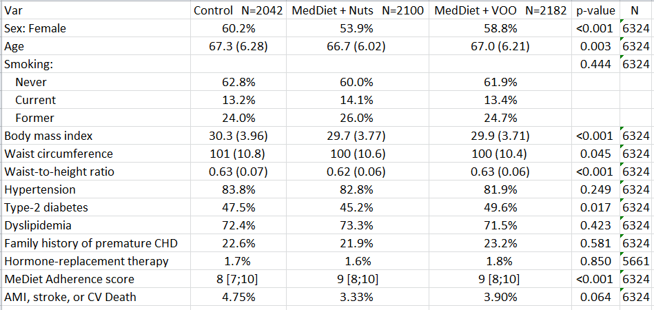

# Introduction

**compareGroups** is an R package available on CRAN which performs descriptive tables displaying means, standard deviation, quantiles or frequencies of several variables. Also, p-value to test equality between groups is computed using the appropiate test. <br>

With a very simple code, nice, compact and ready-to-publish descriptives table are displayed on R console. They can also be exported to different formats, such as Word, Excel, PDF or inserted in a R-Sweave or R-markdown document.<br>

For those not familiar to R syntax, a Web User Interface (**WUI**) has been implemented using [Shiny](http://shiny.rstudio.com/) tools, which can be used remotely just accessing the [**compareGroups project website**](http://www.comparegroups.eu)

<a href="http://www.comparegroups.eu/wui">

</a>


<br>
You will find an extensive manual describing all **compareGropus** capabilities with real examples in the [vignette](https://CRAN.R-project.org/package=compareGroups).
Also, **compareGroups** package has been published in Journal of Statistical Software [@Subirana2014].


# First table

Following, a step-by-step demo of how to use the **compareGroups** code when analysing a data set is described. In this example, a table containing **descriptives by intervention group** is built.


```
knitr::opts_chunk$set(comment="",message=FALSE,warning=FALSE)
options(warn=-1,width=90)
```

## Step 1. Install the package

Install the **`compareGroups`** package from CRAN and then load it by typing:

```
install.packages("compareGroups")
library(compareGroups)
```

```
library(compareGroups)
```

## Step 2. Load data

Load the PREDIMED example data available in **`compareGroups`** package:

```
data(predimed)
```

PREDIMED is a longitudinal study containing several baseline characteristics of the participants as well as events occurred during the 7 years follow-up period (`event` and `toevent`). Each individual has been assigned to a three intervention diet randomly (`group`).

```
head(predimed)
```


## Step 3. Compute descriptives and tests  

### Select variables and methods

Compute all descriptives and tests from selected variables by using the **`compareGroups`** function. <br>

Variables are selected by making use of the R standard `formula` environment. Described variables are placed one the right sight of "`~`" separated by "`+`" sign, while the variable indicating the groups is placed on the left side. To select all variables use "`.`", and to remove variables, "`-`".<br>

Note that no transformations are allowed in the formula environment. If necessary they must be made before calling `compareGroups` function.
<br>

By the argument `method` we set `wtn` and `p14` variables to be reported as median and quartiles instead of mean and standard deviation.

```
res <- compareGroups(group ~ . - toevent, data = predimed, method = c(wtn = 2, p14 = 2))
```


### Explore distribution

**compareGroups** package also offers the possibility to explore variable distribution by the generic function **plot**. This may be usefull to check normality or to find possible outliers, or missclassification of categorical variables. For example, to plot the first two described variables (i.e. age and sex),


```{r, fig.height=5, fig.width=5}
plot(res[1:2])
```

Note the use of "`[`" to select which variables we want to plot. <br>


It is also possible to plot the distribution of described variables by groups


```
plot(res[1:2], bivar = TRUE)
```

### Display results

By applying the generic function <format style="color:blue;font-size:20px">**`print`**</format>, available data, p-values, type of variable and selection is displayed

```
res
```
If you want to display descriptives of each varaible, call the generic function <format style="color:blue;font-size:20px">**`summary`**</format>

```
summary(res[1:2])
```


Note that this is not a descriptive table yet. It will be created in the next step.


## Step 4. Create the descriptive table 

**To build the descriptive table**, apply **`creaTable`** function to the previous object computed by **`compareGroups`** function (`res`). Using `creaTable` function you can customize how categorical variables are displayed (only percertage or absolute frequencies or both) by `type` argument. <br>

Also note the use of `hide.no` category which is useful to hide "no" level for those binary variables. <br>

If you only want to show "Female" category use `hide` argument for `sex` variable indicating which category is going to be hidden. This argument also applies to categorical variables with more than two categories. <br>

To specify the number of decimal digits to show use `digits`arguments. In this example `p14` has no decimals and for `hormo` only one. <br>

Finally, if you want to show how many individuals have non-missing values in each described variable, set `hide.n` argument to `TRUE`.

```
restab <- createTable(res, digits = c(p14 = 0, hormo=1), type = 1, 
                      hide = c(sex = "Male"), hide.no = "no", show.n = TRUE)
```

## Step 5. Export the descriptive table {.tabset}


### R-console

The descriptive table can be printed in the `R` console using the method <format style="color:blue;font-size:20px">`print`</format>, i.e. just typing the name of the object:

```
restab
```


If you want to change some headers, such "p-value" instead of "p.overall" use `header.labels` argument:

```
print(restab, header.labels = c(p.overall = "p-value"))
```


### PDF

Create a PDF document with the table in a publish-ready format

```
export2pdf(restab, file = "example.pdf", header.labels = c(p.overall = "p-value"))
```


### Word

Export the table to a Word document

```
export2word(restab, file = "example.docx", header.labels = c(p.overall = "p-value"))
```


### Excel

Export the descriptive table to an Excel file

```
export2xls(restab, file = "example.xlsx", header.labels = c(p.overall = "p-value"))
```



### CSV

Export the descriptive table to a plain text format, such as csv file, with the semicolon character as the column separator 

```{r, eval=FALSE}
export2csv(restab, file = "example.csv", header.labels = c(p.overall = "p-value"), sep = ";")
```


### Markdown

You can translate to Markdown code and insert it in a R-markdown chunk to create reproducible reports.

```
export2md(restab, header.labels = c(p.overall = "p-value"))
```

### LaTeX

Similar to Markdown file, it is possible to insert LaTeX code in a Sweave file (.tex)

```{r, eval=FALSE}
export2tex(restab, header.labels = c(p.overall = "p-value"))
```


# No groups

To compute descriptives for whole cohort, whithout stratifying or comparing groups, just leave the left hand side of "`~`" empty.

```{r}
resNoGroups <- compareGroups(~ . , predimed)
restabNoGroups <- createTable(resNoGroups, hide.no = "no")
print(restabNoGroups, header.labels = c("all" = "Entire cohort"))
```


# Computing OR and HR

## Odds Ratio

For case control studies, it may be interesting to compute the Odds Ratio for each variable between cases and controls. Although PREDIMED study is not a case-control, we will use `event` variable as case-control status.<br>

Note the use of `fact.ratio` argument to set an increment of 10 units for its OR.
Also, to set the reference cathegory to "male" when displaying the OR set the `ref.ratio` argument. <br>

Finally, also note that `compute` argument must be set to `TRUE` to compute ORs. By default, this argument is set to `FALSE` to save time. Different type of methods to compute Odds Ratio are available by setting `oddsratio.method` (For more info, see `oddsratio` function from `epitools` package).


```
resOR <- compareGroups(event ~ . - toevent, predimed, compute = TRUE, 
                       fact.ratio = c(waist=10), ref = c(sex = 2))
restabOR <- createTable(resOR, show.ratio = TRUE, show.p.overall = FALSE, 
                        hide.no = "no", hide = c(sex = "Male"), type=1)
print(restabOR, header.labels = c(p.ratio = "p-value"))
```


## Hazard Ratios

When analysing a cohort study, one may be interested in computing Hazard Ratios instead of Odds Ratio, and take into account time-to-event or possible censored values. P-values are computed properly by log-rank test.<br>

First of all, you must **recode the time-to-event variable as a survival variable** by using `Surv` function from `survival` package. The recoded variable can be labelled using the `label` function from `Hmisc` package.

```
predimed$eventSurv <- with(predimed, Surv(toevent, event == "Yes"))
label(predimed$eventSurv) <- "Event (possible right censored)"
```

Then, place the recoded variable in the left side of "`~`", and use a syntax similar to the one used to compute Odds Ratios, replacing `event` to `eventSurv`.

```
resHR <- compareGroups(eventSurv ~ . - toevent - event, predimed, compute = TRUE, 
                       fact.ratio = c(waist=10), ref.ratio = c(sex = 2))
restabHR <- createTable(resHR, show.ratio = TRUE, show.p.overall = FALSE, 
                        hide.no = "no", hide = c(sex = "Male"), type=1)
print(restabHR, header.labels = c(p.ratio = "p-value"))
```


# Advanced features

## Displaying subset of variables

Use the "<format style="color:blue">**`[`**</format>" generic method of subsetting to select some variables from already built descriptive table

```{r}
restab[1:4]
```


## Update

The R generic method **`[`** has also been implemented in **`compareGroups`** package. This may be useful to change some specific aspects from the descriptive table without changing the others.

For example, to hide available column ('N') in the previously table

```
update(restab, show.n = FALSE)
```
Or to change the grouping variable (without changing the table format)

```
update(restab, x = update(res, sex ~ .))
```

Note here we have to udpate first the object computed by `compareGroups` function. To do so, we had to store the object previously.
If no `res` object has been stored, we can pick up it by "x" attribute from `restab` object.

```
update(restab, x = update(attr(restab, "x")[[1]], sex ~ .))
```

## Stratifying

If you want to perform diet comparisons by sex, first build the descriptive tables by men and women separately making us of `subset` argument from the `compareGroups` function, to select men and women, respectively. Then use the generic function **`cbind`** to combine the two tables.

```{r}
restabfemale <- update(restab, x = update(res, . ~ . - sex, subset = sex == 'Female'), 
                       show.n = FALSE)
restabmale <- update(restabfemale, x=update(res, . ~ . - sex, subset = sex == 'Male'))
restabstrat <- cbind("Females" = restabfemale, "Males" = restabmale)
print(restabstrat, header.labels = c(p.overall = "p-value"))
```


```{r, eval=FALSE}
export2pdf(restabstrat, file = "examplestrat.pdf", 
           header.labels = c(p.overall = "p-value"), 
           landscape = TRUE, size = "footnotesize", )
```


## Joining groups of variables

To join some variables in the sense of placing a header just before each group of variables (rows of the descriptive tables), first select each set of variables making use of **`[`** and then use the generic method **`rbind`**.

```
restabgroups <- rbind("First group" = restab[1:4], "Second group" = restab[5:8])
print(restabgroups, header.labels = c(p.overall = "p-value"))
```

```
export2pdf(restabgroups, file = "examplegroups.pdf", 
           header.labels = c(p.overall = "p-value"))
```


When the table is exported to LaTeX, the headers are printed in bold. If these headers are very long, they span throught the table columns without making the first column wider.


# References