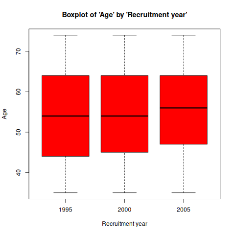
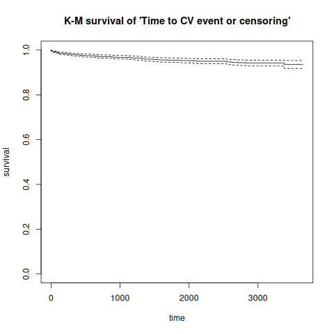
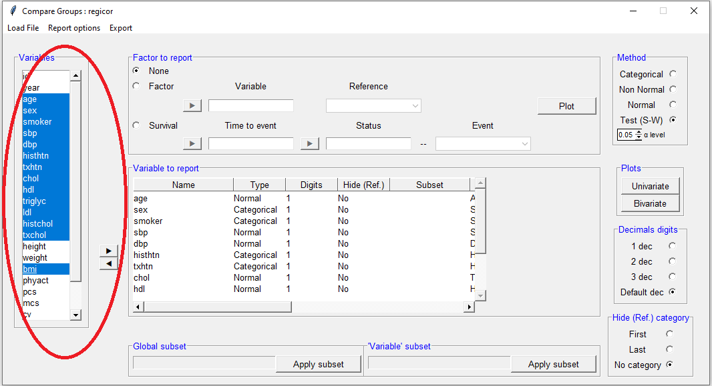
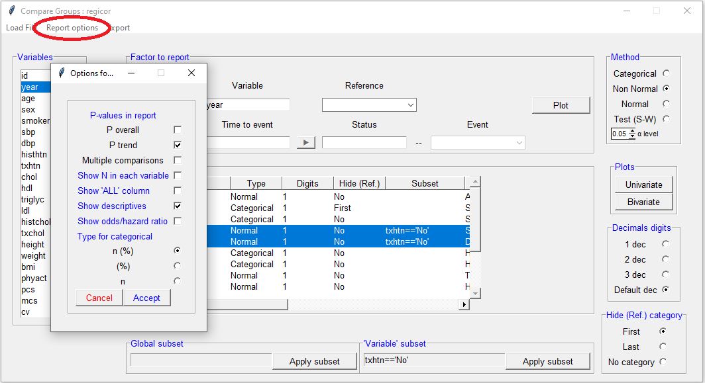
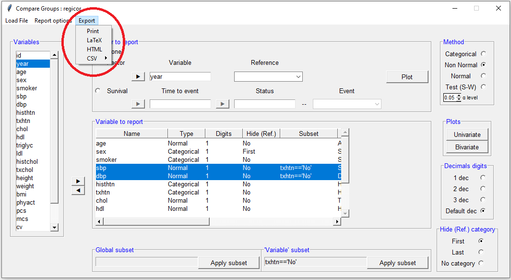
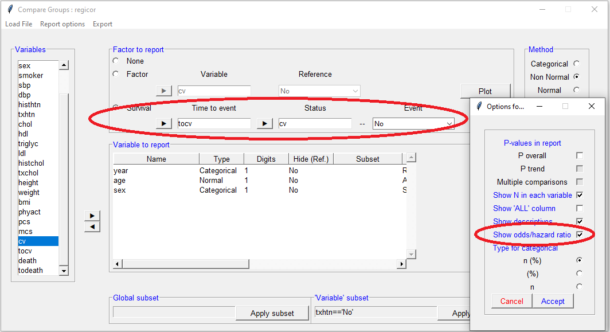

# compareGroups 4.0: Descriptives by groups

**News**

- `tibble` class data sets possibly imported by `haven`, `readxl`,
  `readr`, etc. or to be used by `tydiverse` and `dplyr` packages are
  supported.

- new function called `descrTable` has been implemented to build
  descriptive tables in a single step.

- `export2md` to export descriptive tables to R-markdown documents has
  been improved and now supports stratified tables for HTML.

- new funciton called `strataTable` has been implemented to build
  descriptive tables by stratas (values or levels of a variable).

- Date variables are treated as continuous-non normal, performing
  medians, quartiles and non-parametric tests, but now are printed
  dates.

- New argument `var.equal` added in `compareGroups` and `descrTable`.
  This allows to consider different variances when comparing means
  between more than two groups.

## Introduction

The **`compareGroups`** package (Subirana, Sanz, and Vila 2014) allows
users to create tables displaying results of univariate analyses,
stratified or not by categorical variable groupings.

Tables can easily be exported to CSV, LaTeX, HTML, PDF, Word or Excel,
or inserted in R-markdown files to generate reports automatically.

This package can be used from the **`R`** prompt or from a user-friendly
graphical user interface for non-R familiarized users.

The **`compareGroups`** package is available on CRAN repository. To load
the package using the **`R`** prompt, enter:

``` r
library(compareGroups)
```

This document provides an overview of the usage of the
**`compareGroups`** package with a real examples, both using the R
syntax and the graphical user interface. It is structure as follows:

- Introduction of the package ([section 2](#package)) and the data used
  as example ([section 3](#data)),
- Instructions to perform descriptive tables and exploration plots using
  R syntax are explained ([section 4](#syntax)), and  
- Usage of graphical user interface based on tcl-tk ([section 5](#gui))
  and based on Shiny ([section 6](#wui)) are shown.

## Package structure: classes and methods

The **`compareGroups`** package has three functions:

- `compareGroups` creates an object of class `compareGroups`. This
  object can be:
  - printed
  - summarized
  - plotted
  - updated
- `createTable` creates an object of class `createTable`. This object
  can be:
  - printed
  - summarized
- `export2csv`, `export2html`, `export2latex`, `export2pdf`,
  `export2md`, `export2word` and `export2xls` will export results to
  CSV, HTML, LaTeX, PDF, Markdown, Word or Excel, respectively.

Figure 1 shows how the package is structured in terms of functions,
classes and methods.

\`


Since version 4.0, a new function called **`descrTable`** has been
implemented which is a shortcut of `compareGroups`and `createTable`,
i.e. step 1 and step 2 in a single step (see [section
4.2.5](#descrTable)).

## Data used as example

To illustrate how this package works we took a sample from [REGICOR
study](http://www.regicor.cat). REGICOR is a cross-sectional study with
participants from a north-east region of Spain from whom different sets
of variables were collected: demographic (age, sex, …), anthropomorphic
(height, weight, waist, …), lipid profile (total and cholesterol,
triglycerides, …), questionnaires (physical activity, quality of life,
…), etc. Also, cardiovascular events and mortality were obtained from
hospital and official registries and reports along more than 10 years.

First of all, load REGICOR data typing:

``` r
data(regicor)
```

Variables and labels in this data frame are:

| Name     | Label                                            | Codes                                                   |
|:---------|:-------------------------------------------------|:--------------------------------------------------------|
| id       | Individual id                                    |                                                         |
| year     | Recruitment year                                 | 1995; 2000; 2005                                        |
| age      | Age                                              |                                                         |
| sex      | Sex                                              | Male; Female                                            |
| smoker   | Smoking status                                   | Never smoker; Current or former \< 1y; Former $\geq$ 1y |
| sbp      | Systolic blood pressure                          |                                                         |
| dbp      | Diastolic blood pressure                         |                                                         |
| histhtn  | History of hypertension                          | Yes; No                                                 |
| txhtn    | Hypertension treatment                           | No; Yes                                                 |
| chol     | Total cholesterol                                |                                                         |
| hdl      | HDL cholesterol                                  |                                                         |
| triglyc  | Triglycerides                                    |                                                         |
| ldl      | LDL cholesterol                                  |                                                         |
| histchol | History of hyperchol.                            | Yes; No                                                 |
| txchol   | Cholesterol treatment                            | No; Yes                                                 |
| height   | Height (cm)                                      |                                                         |
| weight   | Weight (Kg)                                      |                                                         |
| bmi      | Body mass index                                  |                                                         |
| phyact   | Physical activity (Kcal/week)                    |                                                         |
| pcs      | Physical component                               |                                                         |
| mcs      | Mental component                                 |                                                         |
| cv       | Cardiovascular event                             | No; Yes                                                 |
| tocv     | Days to cardiovascular event or end of follow-up |                                                         |
| death    | Overall death                                    | No; Yes                                                 |
| todeath  | Days to overall death or end of follow-up        |                                                         |

OBSERVATIONS:

1.  It is important to note that **`compareGroups`** is not aimed to
    perform quality control of the data. Other useful packages such as
    **`2lh`** (Genolini, Desgraupes, and Franca 2011) are available for
    this purpose.

2.  It is strongly recommended that the *data.frame* contain only the
    variables to be analyzed; the ones not needed in the present
    analysis should be removed from the list.

3.  The nature of variables to be analyzed should be known, or at least
    which variables are to be used as categorical. It is important to
    code categorical variables as factors and the order of their levels
    is meaningful in this package.

4.  To label the variables set the “label” attributes from each of them.
    The tables of results will contain the variable labels (by default).

### Time-to-event variables

A variable of class `Surv` must be created to deal with time-to-event
variables (i.e., time to Cardiovascular event/censored in our example):

``` r
library(survival)
regicor$tmain <- with(regicor, Surv(tocv, cv == 'Yes'))
attr(regicor$tmain,"label") <- "Time to CV event or censoring"
```

Note that variable *tcv* are created as time-to-death and
time-to-cardiovascular event taking into account censoring (i.e. they
are of class Surv).

## Using syntax

### Computing descriptives

`compareGroups` is the main function which does all the calculus. It is
needed to store results in an object. Later, applying the function
`createTable` (Section 4.2) to this object will create tables of the
analysis results.

For example, to perform a univariate analysis with the *regicor* data
between *year* (“response” variable) and all other variables
(“explanatory” variables), this formula is required:

``` r
compareGroups(year ~ . , data=regicor)
```

#### Selecting response variables

If only a dot occurs on the right side of the `~` all variables in the
data frame will be used.

To remove the variable *id* from the analysis, use `-` in the formula:

``` r
compareGroups(year ~ . - id, data=regicor)
```

To select some explanatory variables (e.g., *age*, *sex* and *bmi*) and
store results in an object of class `compareGroups`:

``` r
res<-compareGroups(year ~ age + sex + bmi, data=regicor)
res
```


    -------- Summary of results by groups of 'Recruitment year'---------


      var             N    p.value  method            selection
    1 Age             2294 0.079*   continuous normal ALL      
    2 Sex             2294 0.506    categorical       ALL      
    3 Body mass index 2259 <0.001** continuous normal ALL      
    -----
    Signif. codes:  0 '**' 0.05 '*' 0.1 ' ' 1 

Note: Although we have full data (n= 2294) for Age and Sex, there are
some missing data in body mass index (bmi).

Mean values of body mass index is statistically different among
recruitment years (p-value \< 0.05), while Age and Sex are not
statistically related to recruitment year (p-value \> 0.05).

Age & BMI has been used as continuous and normal distributed, while sex
as categorical.

No filters have been used (e.g., selecting only treated patients);
therefore, the *selection* column lists “ALL” (for all variables).

#### Subsetting

To perform the analysis in a subset of participants (e.g., “female”
participants):

``` r
compareGroups(year ~ age + smoker + bmi, data=regicor, subset = sex=='Female')
```


    -------- Summary of results by groups of 'year'---------


      var             N    p.value  method            selection      
    1 Age             1193 0.355    continuous normal sex == "Female"
    2 Smoking status  1162 <0.001** categorical       sex == "Female"
    3 Body mass index 1169 0.079*   continuous normal sex == "Female"
    -----
    Signif. codes:  0 '**' 0.05 '*' 0.1 ' ' 1 

Note that only results for female participants are shown.

To subset specific variable/s (e.g., *age* and *bmi*):

``` r
compareGroups(year ~ age + bmi + smoker, data=regicor, selec = list(age= sex=="Female", bmi = age>50 ))
```


    -------- Summary of results by groups of 'Recruitment year'---------


      var             N    p.value  method            selection      
    1 Age             1193 0.355    continuous normal sex == "Female"
    2 Body mass index 1367 0.002**  continuous normal age > 50       
    3 Smoking status  2233 <0.001** categorical       ALL            
    -----
    Signif. codes:  0 '**' 0.05 '*' 0.1 ' ' 1 

In this case, age distribution are computed among females, while BMI
among people older than 50 years.

Combinations are also allowed, e.g.:

``` r
compareGroups(year ~ age + smoker + bmi, data=regicor, selec = list(bmi=age>50), subset = sex=="Female")
```


    -------- Summary of results by groups of 'year'---------


      var             N    p.value  method            selection                     
    1 Age             1193 0.355    continuous normal sex == "Female"               
    2 Smoking status  1162 <0.001** categorical       sex == "Female"               
    3 Body mass index  709 0.311    continuous normal (sex == "Female") & (age > 50)
    -----
    Signif. codes:  0 '**' 0.05 '*' 0.1 ' ' 1 

A variable can appear twice in the formula, e.g.:

``` r
compareGroups(year ~ age + sex + bmi + bmi, data=regicor, selec = list(bmi.1=txhtn=='Yes'))
```


    -------- Summary of results by groups of 'Recruitment year'---------


      var             N    p.value  method            selection     
    1 Age             2294 0.079*   continuous normal ALL           
    2 Sex             2294 0.506    categorical       ALL           
    3 Body mass index 2259 <0.001** continuous normal ALL           
    4 Body mass index  420 0.006**  continuous normal txhtn == "Yes"
    -----
    Signif. codes:  0 '**' 0.05 '*' 0.1 ' ' 1 

In this case results for *bmi* will be reported for all participants (n=
2294) and also for only those recieving no hypertension treatment. Note
that “bmi.1” in the `selec` argument refers to the second time that
*bmi* appears in the formula.

#### Methods for continuous variables

By default continuous variables are analyzed as normal-distributed. When
a table is built (see `createTable` function, Section 4.2), continuous
variables will be described with mean and standard deviation. To change
default options, e.g., “tryglic” used as non-normal distributed:

``` r
compareGroups(year ~ age + smoker + triglyc, data=regicor, method = c(triglyc=2))
```


    -------- Summary of results by groups of 'Recruitment year'---------


      var            N    p.value  method                selection
    1 Age            2294 0.079*   continuous normal     ALL      
    2 Smoking status 2233 <0.001** categorical           ALL      
    3 Triglycerides  2231 0.762    continuous non-normal ALL      
    -----
    Signif. codes:  0 '**' 0.05 '*' 0.1 ' ' 1 

Note that “continuous non-normal” is shown in the *method* column for
the variable Hormone-replacement therapy.

Possible values in methods statement are:

- 1: forces analysis as normal-distributed

- 2: forces analysis as continuous non-normal

- 3: forces analysis as categorical

- NA: performs a Shapiro-Wilks test to decide between normal or
  non-normal

If the `method` argument is stated as `NA` for a variable, then a
Shapiro-Wilks test for normality is used to decide if the variable is
normal or non-normal distributed. To change the significance threshold:

``` r
compareGroups(year ~ age + smoker + triglyc, data=regicor, method = c(triglyc=NA), alpha= 0.01)
```


    -------- Summary of results by groups of 'Recruitment year'---------


      var            N    p.value  method                selection
    1 Age            2294 0.079*   continuous normal     ALL      
    2 Smoking status 2233 <0.001** categorical           ALL      
    3 Triglycerides  2231 0.762    continuous non-normal ALL      
    -----
    Signif. codes:  0 '**' 0.05 '*' 0.1 ' ' 1 

According to Shapiro-Wilks test, stating the cutpoint at 0.01
significance level, triglycerides departed significantly from the normal
distribution and therefore the method for this variable will be
“continuous non-normal”.

All non factor variables are considered as continuous. Exception is made
(by default) for those that have fewer than 5 different values. This
threshold can be changed in the **min.dis** statement:

``` r
regicor$age7gr<-as.integer(cut(regicor$age, breaks=c(-Inf,40,45,50,55,65,70,Inf), right=TRUE))
compareGroups(year ~ age7gr, data=regicor, method = c(age7gr=NA))
```


    -------- Summary of results by groups of 'Recruitment year'---------


      var    N    p.value method                selection
    1 age7gr 2294 0.022** continuous non-normal ALL      
    -----
    Signif. codes:  0 '**' 0.05 '*' 0.1 ' ' 1 

``` r
compareGroups(year ~ age7gr, data=regicor, method = c(age7gr=NA), min.dis=8)
```


    -------- Summary of results by groups of 'Recruitment year'---------


      var    N    p.value method      selection
    1 age7gr 2294 0.012** categorical ALL      
    -----
    Signif. codes:  0 '**' 0.05 '*' 0.1 ' ' 1 

To avoid errors the maximum categories for the response variable is set
at 5 in this example (default value). If this variable has more than 5
different values, the function `compareGroups` returns an error message.
For example:

``` r
regicor$var6cat <- factor(sample(1:5, nrow(regicor), replace=TRUE))
compareGroups(age7gr ~ sex + bmi + smoker, data=regicor)
```

    Error in compareGroups.fit(X = X, y = y, include.label = include.label, : 
    number of groups must be less or equal to 5

Defaults setting can be changed with the **max.ylev** statement:

``` r
compareGroups(age7gr ~ sex + bmi + smoker, data=regicor, max.ylev=7)
```


    -------- Summary of results by groups of 'age7gr'---------


      var             N    p.value  method            selection
    1 Sex             2294 0.950    categorical       ALL      
    2 Body mass index 2259 <0.001** continuous normal ALL      
    3 Smoking status  2233 <0.001** categorical       ALL      
    -----
    Signif. codes:  0 '**' 0.05 '*' 0.1 ' ' 1 

Similarly, by default there is a limit for the maximum number of levels
for an explanatory variable. If this level is exceeded, the variable is
removed from the analysis and a warning message is printed:

``` r
compareGroups(year ~ sex + age7gr, method=c(age7gr=3), data=regicor, max.xlev=5)
```

    Warning in compareGroups.fit(X = X, y = y, include.label = include.label,  :
      Variables 'age7gr' have been removed since some errors occurred

#### Dressing up the output

Although the options described in this section correspond to
`compareGroups` function, results of changing/setting them won’t be
visible until the table is created with the `createTable` function
(explained later).

- **`include.label`:** By default the variable labels are shown in the
  output (if there is no label the name will be printed). Changing the
  statement include.label from “= TRUE” (default) to “= FALSE” will
  cause variable names to be printed instead.

``` r
compareGroups(year ~ age + smoker + bmi, data=regicor, include.label= FALSE)
```


    -------- Summary of results by groups of 'year'---------


      var    N    p.value  method            selection
    1 age    2294 0.079*   continuous normal ALL      
    2 smoker 2233 <0.001** categorical       ALL      
    3 bmi    2259 <0.001** continuous normal ALL      
    -----
    Signif. codes:  0 '**' 0.05 '*' 0.1 ' ' 1 

- **`Q1`, `Q3`:** When the method for a variable is stated as “2” (i.e.,
  to be analyzed as continuous non-normal; see section 4.1.3), by
  default the median and quartiles 1 and 3 will be shown in the final
  results, after applying the function `createTable` (see Section 4.2).

``` r
resu1<-compareGroups(year ~ age + triglyc, data=regicor, method = c(triglyc=2))
createTable(resu1)
```

    --------Summary descriptives table by 'Recruitment year'---------

    _______________________________________________________________________ 
                       1995            2000            2005       p.overall 
                       N=431           N=786          N=1077                
    ¯¯¯¯¯¯¯¯¯¯¯¯¯¯¯¯¯¯¯¯¯¯¯¯¯¯¯¯¯¯¯¯¯¯¯¯¯¯¯¯¯¯¯¯¯¯¯¯¯¯¯¯¯¯¯¯¯¯¯¯¯¯¯¯¯¯¯¯¯¯¯ 
    Age             54.1 (11.7)     54.3 (11.2)     55.3 (10.6)     0.079   
    Triglycerides 94.0 [71.0;136] 98.0 [72.0;133] 98.0 [72.0;139]   0.762   
    ¯¯¯¯¯¯¯¯¯¯¯¯¯¯¯¯¯¯¯¯¯¯¯¯¯¯¯¯¯¯¯¯¯¯¯¯¯¯¯¯¯¯¯¯¯¯¯¯¯¯¯¯¯¯¯¯¯¯¯¯¯¯¯¯¯¯¯¯¯¯¯ 

Note: percentiles 25 and 75 are calculated for “triglycerides”.

To get instead percentile 2.5% and 97.5%:

``` r
resu2<-compareGroups(year ~ age + triglyc, data=regicor, method = c(triglyc=2), Q1=0.025, Q3=0.975)
createTable(resu2)
```

    --------Summary descriptives table by 'Recruitment year'---------

    _______________________________________________________________________ 
                       1995            2000            2005       p.overall 
                       N=431           N=786          N=1077                
    ¯¯¯¯¯¯¯¯¯¯¯¯¯¯¯¯¯¯¯¯¯¯¯¯¯¯¯¯¯¯¯¯¯¯¯¯¯¯¯¯¯¯¯¯¯¯¯¯¯¯¯¯¯¯¯¯¯¯¯¯¯¯¯¯¯¯¯¯¯¯¯ 
    Age             54.1 (11.7)     54.3 (11.2)     55.3 (10.6)     0.079   
    Triglycerides 94.0 [47.0;292] 98.0 [47.0;278] 98.0 [42.0;293]   0.762   
    ¯¯¯¯¯¯¯¯¯¯¯¯¯¯¯¯¯¯¯¯¯¯¯¯¯¯¯¯¯¯¯¯¯¯¯¯¯¯¯¯¯¯¯¯¯¯¯¯¯¯¯¯¯¯¯¯¯¯¯¯¯¯¯¯¯¯¯¯¯¯¯ 

To get minimum and maximum:

``` r
compareGroups(year ~ age + triglyc, data=regicor, method = c(triglyc=2), Q1=0, Q3=1)
```

- **`simplify`:** Sometimes a categorical variable has no individuals
  for a specific group. For example, *smoker* has 3 levels. As an
  example and to illustrate this problem, we have created a new variable
  *smk* with a new category (“Unknown”):

``` r
regicor$smk<-regicor$smoker
levels(regicor$smk)<- c("Never smoker", "Current or former < 1y", "Former >= 1y", "Unknown")
attr(regicor$smk,"label")<-"Smoking 4 cat."
cbind(table(regicor$smk))
```

                           [,1]
    Never smoker           1201
    Current or former < 1y  593
    Former >= 1y            439
    Unknown                   0

Note that this new category (“unknown”) has no individuals:

``` r
compareGroups(year ~ age + smk + bmi, data=regicor)
```


    -------- Summary of results by groups of 'Recruitment year'---------


      var             N    p.value  method            selection
    1 Age             2294 0.079*   continuous normal ALL      
    2 Smoking 4 cat.  2233 <0.001** categorical       ALL      
    3 Body mass index 2259 <0.001** continuous normal ALL      
    -----
    Signif. codes:  0 '**' 0.05 '*' 0.1 ' ' 1 

    Warning in compare.i(X[, i], y = y, selec.i = selec[i], method.i = method[i],  :
      Some levels of 'smk' are removed since no observation in that/those levels

Note that a “Warning” message is printed related to the problem with
*smk*.

To avoid using empty categories, `simplify` must be stated as `TRUE`
(Default value).

``` r
compareGroups(year ~ age + smk + bmi, data=regicor, simplify=FALSE)
```


    -------- Summary of results by groups of 'Recruitment year'---------


      var             N    p.value  method            selection
    1 Age             2294 0.079*   continuous normal ALL      
    2 Smoking 4 cat.  2233 .        categorical       ALL      
    3 Body mass index 2259 <0.001** continuous normal ALL      
    -----
    Signif. codes:  0 '**' 0.05 '*' 0.1 ' ' 1 

Note that no p-values are calculated for “Smoking” since Chi-squared nor
F-Fisher test cannot be computed with a zero row.

#### Summary

Applying the `summary` function to an object of class `createTable` will
obtain a more detailed output:

``` r
res<-compareGroups(year ~ age + sex + smoker + bmi + triglyc, method = c(triglyc=2), data=regicor)
summary(res[c(1, 2, 5)])
```

     --- Descriptives of each row-variable by groups of 'Recruitment year' ---

    ------------------- 
    row-variable: Age 

          N    mean     sd       lower    upper    p.overall p.trend  p.1995 vs 2000 p.1995 vs 2005 p.2000 vs 2005
    [ALL] 2294 54.73627 11.04926 54.28388 55.18866                                                                
    1995  431  54.09745 11.7172  52.98813 55.20677 0.078588  0.031665 0.936          0.163          0.158         
    2000  786  54.33715 11.21814 53.55168 55.12262                                                                
    2005  1077 55.28319 10.62606 54.64786 55.91853                                                                

    ------------------- 
    row-variable: Sex 

          Male Female Male%    Female%  p.overall p.trend  p.1995 vs 2000 p.1995 vs 2005 p.2000 vs 2005
    [ALL] 1101 1193   47.99477 52.00523                                                                
    1995  206  225    47.79582 52.20418 0.505601  0.543829 0.793746       0.793746       0.791583      
    2000  390  396    49.61832 50.38168                                                                
    2005  505  572    46.88951 53.11049                                                                

    ------------------- 
    row-variable: Triglycerides 

          N    med Q1 Q3     lower upper p.overall p.trend  p.1995 vs 2000 p.1995 vs 2005 p.2000 vs 2005
    [ALL] 2231 97  72 136    95    100                                                                  
    1995  403  94  71 135.5  89    99    0.76155   0.524775 0.836094       0.836094       0.859797      
    2000  752  98  72 133.25 95    102                                                                  
    2005  1076 98  72 139.25 94    102                                                                  

Note that because only variables 1, 3 and 4 are selected, only results
for Age, Sex and Triglycerides are shown. Age is summarized by the mean
and the standard deviation, Sex by frequencies and percentage, and
Triglycerides (method=2) by the median and quartiles.

#### Plotting

Variables can be plotted to see their distribution. Plots differ
according to whether the variable is continuous or categorical. Plots
can be seen on-screen or saved in different formats (BMP, JPG’, PNG, TIF
or PDF). To specify the format use the argument \`type’.

``` r
plot(res[c(1,2)], file="./figures/univar/", type="png")
```


Plots also can be done according to grouping variable. In this case only
a boxplot is shown for continuous variables:

``` r
plot(res[c(1,2)], bivar=TRUE, file="./figures/bivar/", type="png")
```




#### Updating

The object from `compareGroups` can later be updated. For example:

``` r
res<-compareGroups(year ~ age + sex + smoker + bmi, data=regicor)
res
```


    -------- Summary of results by groups of 'Recruitment year'---------


      var             N    p.value  method            selection
    1 Age             2294 0.079*   continuous normal ALL      
    2 Sex             2294 0.506    categorical       ALL      
    3 Smoking status  2233 <0.001** categorical       ALL      
    4 Body mass index 2259 <0.001** continuous normal ALL      
    -----
    Signif. codes:  0 '**' 0.05 '*' 0.1 ' ' 1 

The object `res` is updated using:

``` r
res<-update(res, . ~. - sex + triglyc + cv + tocv, subset = sex=='Female', method = c(triglyc=2, tocv=2), selec = list(triglyc=txchol=='No'))
res
```

Note that “Sex” is removed as an explanatory variable but used as a
filter, subsetting only “Female” participants. Three new variables have
been added: Triglycerides, cardiovascular event (yes/no) and time to
cardiovascular event or censoring (stated continuous non-normal). For
Triglycerides is stated to show only data of participants with no
treatment for cholesterol.

#### Substracting results

Since version 3.0, there is a new function called `getResults` to
retrieve some specific results computed by `compareGroups`, such as
p-values, descriptives (means, proportions, …), etc.

For example, it may be interesting to recover the p-values for each
variable as a vector to further manipulate it in **`R`**, like adjusting
for multiple comparison with `p.adjust`. For example, lets take the
example data from **`SNPassoc`** package that contains information of
dozens of SNPs (genetic variants) from a sample of cases and controls.
In this case we analize five of them:

``` r
data(SNPs)
tab <- createTable(compareGroups(casco ~ snp10001 + snp10002 + snp10005 + snp10008 + snp10009, SNPs))
pvals <- getResults(tab, "p.overall")
p.adjust(pvals, method = "BH")
```

     snp10001  snp10002  snp10005  snp10008  snp10009 
    0.7051300 0.7072158 0.7583432 0.7583432 0.7072158 

Alternatively, since 4.6.0 version, a new function called
**`padjustCompareGroups`** created by Jordi Real \<jordirealgmail.com\>
can be used to compute p-values considering multiple testing. The
methods are the same from `p.adjust` function, i.e. Bonferroni, False
Discovery Rate, etc.

This function takes the `compareGroups` object and re-computes the
p-values. To obtain the same table as above with the p-values correted
by “BH” method:

``` r
cg <- compareGroups(casco ~ snp10001 + snp10002 + snp10005 + snp10008 + snp10009, SNPs)
createTable(padjustCompareGroups(cg, method="BH"))
```

    --------Summary descriptives table by 'casco'---------

    _________________________________________ 
                  0          1      p.overall 
                 N=47      N=110              
    ¯¯¯¯¯¯¯¯¯¯¯¯¯¯¯¯¯¯¯¯¯¯¯¯¯¯¯¯¯¯¯¯¯¯¯¯¯¯¯¯¯ 
    snp10001:                         0.705   
        CC    2 (4.26%)  10 (9.09%)           
        CT    21 (44.7%) 32 (29.1%)           
        TT    24 (51.1%) 68 (61.8%)           
    snp10002:                         0.707   
        AA    0 (0.00%)  5 (4.55%)            
        AC    25 (53.2%) 53 (48.2%)           
        CC    22 (46.8%) 52 (47.3%)           
    snp10005:                         0.758   
        AA    0 (0.00%)  3 (2.73%)            
        AG    22 (46.8%) 48 (43.6%)           
        GG    25 (53.2%) 59 (53.6%)           
    snp10008:                         0.758   
        CC    30 (63.8%) 74 (67.3%)           
        CG    15 (31.9%) 29 (26.4%)           
        GG    2 (4.26%)  7 (6.36%)            
    snp10009:                         0.707   
        AA    21 (45.7%) 51 (46.4%)           
        AG    25 (54.3%) 54 (49.1%)           
        GG    0 (0.00%)  5 (4.55%)            
    ¯¯¯¯¯¯¯¯¯¯¯¯¯¯¯¯¯¯¯¯¯¯¯¯¯¯¯¯¯¯¯¯¯¯¯¯¯¯¯¯¯ 

#### Odds Ratios and Hazard Ratios

When the response variable is binary, the Odds Ratio (OR) can be printed
in the final table. If the response variable is time-to-event (see
Section 3.1), the Hazard Ratio (HR) can be printed instead.

- **`ref`:** This statement can be used to change the reference
  category:

``` r
res1<-compareGroups(cv ~ age + sex + bmi + smoker, data=regicor, ref=1)
createTable(res1, show.ratio=TRUE)
```

    --------Summary descriptives table by 'Cardiovascular event'---------

    ______________________________________________________________________________________ 
                                    No          Yes            OR        p.ratio p.overall 
                                  N=2071       N=92                                        
    ¯¯¯¯¯¯¯¯¯¯¯¯¯¯¯¯¯¯¯¯¯¯¯¯¯¯¯¯¯¯¯¯¯¯¯¯¯¯¯¯¯¯¯¯¯¯¯¯¯¯¯¯¯¯¯¯¯¯¯¯¯¯¯¯¯¯¯¯¯¯¯¯¯¯¯¯¯¯¯¯¯¯¯¯¯¯ 
    Age                        54.6 (11.1)  57.5 (11.0) 1.02 [1.00;1.04]  0.017    0.018   
    Sex:                                                                           0.801   
        Male                   996 (48.1%)  46 (50.0%)        Ref.        Ref.             
        Female                 1075 (51.9%) 46 (50.0%)  0.93 [0.61;1.41]  0.721            
    Body mass index            27.6 (4.56)  28.1 (4.48) 1.02 [0.98;1.07]  0.313    0.307   
    Smoking status:                                                               <0.001   
        Never smoker           1099 (54.3%) 37 (40.2%)        Ref.        Ref.             
        Current or former < 1y 506 (25.0%)  47 (51.1%)  2.75 [1.77;4.32] <0.001            
        Former >= 1y           419 (20.7%)   8 (8.70%)  0.58 [0.25;1.19]  0.142            
    ¯¯¯¯¯¯¯¯¯¯¯¯¯¯¯¯¯¯¯¯¯¯¯¯¯¯¯¯¯¯¯¯¯¯¯¯¯¯¯¯¯¯¯¯¯¯¯¯¯¯¯¯¯¯¯¯¯¯¯¯¯¯¯¯¯¯¯¯¯¯¯¯¯¯¯¯¯¯¯¯¯¯¯¯¯¯ 

Note that for categorical response variables the reference category is
the first one in the statement:

``` r
res2<-compareGroups(cv ~ age + sex + bmi + smoker, data=regicor, ref=c(smoker=1, sex=2))
createTable(res2, show.ratio=TRUE)
```

    --------Summary descriptives table by 'Cardiovascular event'---------

    ______________________________________________________________________________________ 
                                    No          Yes            OR        p.ratio p.overall 
                                  N=2071       N=92                                        
    ¯¯¯¯¯¯¯¯¯¯¯¯¯¯¯¯¯¯¯¯¯¯¯¯¯¯¯¯¯¯¯¯¯¯¯¯¯¯¯¯¯¯¯¯¯¯¯¯¯¯¯¯¯¯¯¯¯¯¯¯¯¯¯¯¯¯¯¯¯¯¯¯¯¯¯¯¯¯¯¯¯¯¯¯¯¯ 
    Age                        54.6 (11.1)  57.5 (11.0) 1.02 [1.00;1.04]  0.017    0.018   
    Sex:                                                                           0.801   
        Male                   996 (48.1%)  46 (50.0%)  1.08 [0.71;1.64]  0.721            
        Female                 1075 (51.9%) 46 (50.0%)        Ref.        Ref.             
    Body mass index            27.6 (4.56)  28.1 (4.48) 1.02 [0.98;1.07]  0.313    0.307   
    Smoking status:                                                               <0.001   
        Never smoker           1099 (54.3%) 37 (40.2%)        Ref.        Ref.             
        Current or former < 1y 506 (25.0%)  47 (51.1%)  2.75 [1.77;4.32] <0.001            
        Former >= 1y           419 (20.7%)   8 (8.70%)  0.58 [0.25;1.19]  0.142            
    ¯¯¯¯¯¯¯¯¯¯¯¯¯¯¯¯¯¯¯¯¯¯¯¯¯¯¯¯¯¯¯¯¯¯¯¯¯¯¯¯¯¯¯¯¯¯¯¯¯¯¯¯¯¯¯¯¯¯¯¯¯¯¯¯¯¯¯¯¯¯¯¯¯¯¯¯¯¯¯¯¯¯¯¯¯¯ 

Note that the reference category for Smoking status is the first and for
Sex the second.

- **`ref.no`:** Similarly to the `ref` statement, `ref.no` is used to
  state “no” as the reference category for all variables with this
  category:

``` r
res<-compareGroups(cv ~ age + sex + bmi + histhtn + txhtn, data=regicor, ref.no='NO')
createTable(res, show.ratio=TRUE)
```

    --------Summary descriptives table by 'Cardiovascular event'---------

    ____________________________________________________________________________________ 
                                  No          Yes            OR        p.ratio p.overall 
                                N=2071       N=92                                        
    ¯¯¯¯¯¯¯¯¯¯¯¯¯¯¯¯¯¯¯¯¯¯¯¯¯¯¯¯¯¯¯¯¯¯¯¯¯¯¯¯¯¯¯¯¯¯¯¯¯¯¯¯¯¯¯¯¯¯¯¯¯¯¯¯¯¯¯¯¯¯¯¯¯¯¯¯¯¯¯¯¯¯¯¯ 
    Age                      54.6 (11.1)  57.5 (11.0) 1.02 [1.00;1.04]  0.017    0.018   
    Sex:                                                                         0.801   
        Male                 996 (48.1%)  46 (50.0%)        Ref.        Ref.             
        Female               1075 (51.9%) 46 (50.0%)  0.93 [0.61;1.41]  0.721            
    Body mass index          27.6 (4.56)  28.1 (4.48) 1.02 [0.98;1.07]  0.313    0.307   
    History of hypertension:                                                     0.058   
        Yes                  647 (31.3%)  38 (41.3%)  1.54 [1.00;2.36]  0.049            
        No                   1418 (68.7%) 54 (58.7%)        Ref.        Ref.             
    Hypertension treatment:                                                      0.270   
        No                   1657 (81.3%) 70 (76.1%)        Ref.        Ref.             
        Yes                  382 (18.7%)  22 (23.9%)  1.37 [0.82;2.21]  0.223            
    ¯¯¯¯¯¯¯¯¯¯¯¯¯¯¯¯¯¯¯¯¯¯¯¯¯¯¯¯¯¯¯¯¯¯¯¯¯¯¯¯¯¯¯¯¯¯¯¯¯¯¯¯¯¯¯¯¯¯¯¯¯¯¯¯¯¯¯¯¯¯¯¯¯¯¯¯¯¯¯¯¯¯¯¯ 

Note: “no”, “No” or “NO” will produce the same results; the coding is
not case sensitive.

- **`fact.ratio`**: By default OR or HR for continuous variables are
  calculated for each unit increase. It can be changed by the `fact.or`
  statement:

``` r
res<-compareGroups(cv ~ age + bmi, data=regicor)
createTable(res, show.ratio=TRUE)
```

    --------Summary descriptives table by 'Cardiovascular event'---------

    __________________________________________________________________________ 
                        No          Yes            OR        p.ratio p.overall 
                      N=2071       N=92                                        
    ¯¯¯¯¯¯¯¯¯¯¯¯¯¯¯¯¯¯¯¯¯¯¯¯¯¯¯¯¯¯¯¯¯¯¯¯¯¯¯¯¯¯¯¯¯¯¯¯¯¯¯¯¯¯¯¯¯¯¯¯¯¯¯¯¯¯¯¯¯¯¯¯¯¯ 
    Age             54.6 (11.1) 57.5 (11.0) 1.02 [1.00;1.04]  0.017    0.018   
    Body mass index 27.6 (4.56) 28.1 (4.48) 1.02 [0.98;1.07]  0.313    0.307   
    ¯¯¯¯¯¯¯¯¯¯¯¯¯¯¯¯¯¯¯¯¯¯¯¯¯¯¯¯¯¯¯¯¯¯¯¯¯¯¯¯¯¯¯¯¯¯¯¯¯¯¯¯¯¯¯¯¯¯¯¯¯¯¯¯¯¯¯¯¯¯¯¯¯¯ 

Here the OR is for the increase of one unit for Age and “Body mass
index”.

``` r
res<-compareGroups(cv ~ age + bmi, data=regicor, fact.ratio= c(age=10, bmi=2))
createTable(res, show.ratio=TRUE)
```

    --------Summary descriptives table by 'Cardiovascular event'---------

    __________________________________________________________________________ 
                        No          Yes            OR        p.ratio p.overall 
                      N=2071       N=92                                        
    ¯¯¯¯¯¯¯¯¯¯¯¯¯¯¯¯¯¯¯¯¯¯¯¯¯¯¯¯¯¯¯¯¯¯¯¯¯¯¯¯¯¯¯¯¯¯¯¯¯¯¯¯¯¯¯¯¯¯¯¯¯¯¯¯¯¯¯¯¯¯¯¯¯¯ 
    Age             54.6 (11.1) 57.5 (11.0) 1.26 [1.04;1.53]  0.017    0.018   
    Body mass index 27.6 (4.56) 28.1 (4.48) 1.05 [0.96;1.14]  0.313    0.307   
    ¯¯¯¯¯¯¯¯¯¯¯¯¯¯¯¯¯¯¯¯¯¯¯¯¯¯¯¯¯¯¯¯¯¯¯¯¯¯¯¯¯¯¯¯¯¯¯¯¯¯¯¯¯¯¯¯¯¯¯¯¯¯¯¯¯¯¯¯¯¯¯¯¯¯ 

Here the OR is for the increase of 10 years for Age and 2 units for
“Body mass index”.

- **`ref.y`:** By default when OR or HR are calculated, the reference
  category for the response variable is the first. The reference
  category could be changed using the `ref.y` statement:

``` r
res<-compareGroups(cv ~ age + sex + bmi + txhtn, data=regicor)
createTable(res, show.ratio=TRUE)
```

    --------Summary descriptives table by 'Cardiovascular event'---------

    ___________________________________________________________________________________ 
                                 No          Yes            OR        p.ratio p.overall 
                               N=2071       N=92                                        
    ¯¯¯¯¯¯¯¯¯¯¯¯¯¯¯¯¯¯¯¯¯¯¯¯¯¯¯¯¯¯¯¯¯¯¯¯¯¯¯¯¯¯¯¯¯¯¯¯¯¯¯¯¯¯¯¯¯¯¯¯¯¯¯¯¯¯¯¯¯¯¯¯¯¯¯¯¯¯¯¯¯¯¯ 
    Age                     54.6 (11.1)  57.5 (11.0) 1.02 [1.00;1.04]  0.017    0.018   
    Sex:                                                                        0.801   
        Male                996 (48.1%)  46 (50.0%)        Ref.        Ref.             
        Female              1075 (51.9%) 46 (50.0%)  0.93 [0.61;1.41]  0.721            
    Body mass index         27.6 (4.56)  28.1 (4.48) 1.02 [0.98;1.07]  0.313    0.307   
    Hypertension treatment:                                                     0.270   
        No                  1657 (81.3%) 70 (76.1%)        Ref.        Ref.             
        Yes                 382 (18.7%)  22 (23.9%)  1.37 [0.82;2.21]  0.223            
    ¯¯¯¯¯¯¯¯¯¯¯¯¯¯¯¯¯¯¯¯¯¯¯¯¯¯¯¯¯¯¯¯¯¯¯¯¯¯¯¯¯¯¯¯¯¯¯¯¯¯¯¯¯¯¯¯¯¯¯¯¯¯¯¯¯¯¯¯¯¯¯¯¯¯¯¯¯¯¯¯¯¯¯ 

Note: This output shows the OR of having a cardiovascular event.
Therefore, having no event is the reference category.

``` r
res<-compareGroups(cv ~ age + sex + bmi + txhtn, data=regicor, ref.y=2)
createTable(res, show.ratio=TRUE)
```

    --------Summary descriptives table by 'Cardiovascular event'---------

    ___________________________________________________________________________________ 
                                 No          Yes            OR        p.ratio p.overall 
                               N=2071       N=92                                        
    ¯¯¯¯¯¯¯¯¯¯¯¯¯¯¯¯¯¯¯¯¯¯¯¯¯¯¯¯¯¯¯¯¯¯¯¯¯¯¯¯¯¯¯¯¯¯¯¯¯¯¯¯¯¯¯¯¯¯¯¯¯¯¯¯¯¯¯¯¯¯¯¯¯¯¯¯¯¯¯¯¯¯¯ 
    Age                     54.6 (11.1)  57.5 (11.0) 0.98 [1.00;0.96]  0.017    0.018   
    Sex:                                                                        0.801   
        Male                996 (48.1%)  46 (50.0%)        Ref.        Ref.             
        Female              1075 (51.9%) 46 (50.0%)  1.08 [0.71;1.64]  0.721            
    Body mass index         27.6 (4.56)  28.1 (4.48) 0.98 [1.02;0.93]  0.313    0.307   
    Hypertension treatment:                                                     0.270   
        No                  1657 (81.3%) 70 (76.1%)        Ref.        Ref.             
        Yes                 382 (18.7%)  22 (23.9%)  0.73 [0.45;1.22]  0.223            
    ¯¯¯¯¯¯¯¯¯¯¯¯¯¯¯¯¯¯¯¯¯¯¯¯¯¯¯¯¯¯¯¯¯¯¯¯¯¯¯¯¯¯¯¯¯¯¯¯¯¯¯¯¯¯¯¯¯¯¯¯¯¯¯¯¯¯¯¯¯¯¯¯¯¯¯¯¯¯¯¯¯¯¯ 

Note: This output shows the OR of having no event, and event is now the
reference category.

When the response variable is of class `Surv`, the bivariate `plot`
function returns a Kaplan-Meier figure if the explanatory variable is
categorical. For continuous variables the function returns a line for
each individual, ending with a circle for censored and with a plus sign
for uncensored.

``` r
plot(compareGroups(tmain ~ sex, data=regicor), bivar=TRUE, file="./figures/bivarsurv/", type="png")
plot(compareGroups(tmain ~ age, data=regicor), bivar=TRUE, file="./figures/bivarsurv/", type="png")
```


#### Time-to-event explanatory variables

When a variable of class `Surv` (see Section 3.1) is used as explanatory
it will be described with the probability of event, computed by
Kaplan-Meier, up to a stated time.

- **`timemax`:** By default probability is calculated at the median of
  the follow-up period. `timemax` option allows us to change at what
  time probability is calculated.

``` r
res<-compareGroups(sex ~  age + tmain, timemax=c(tmain=3*365.25), data=regicor)
res
```

Note that `tmain` is calculated at 3 years, i.e. 3\*365.25 days (see
section 3.1).

The `plot` function applied to a variable of class `Surv` returns a
Kaplan-Meier figure. The figure can be stratified by the grouping
variable.

``` r
plot(res[2], file="./figures/univar/", type="png")
plot(res[2], bivar=TRUE, file="./figures/bivar/", type="png")
```




### Performing the descritive table

The `createTable` function, applied to an object of `compareGroups`
class, returns tables with descriptives that can be displayed on-screen
or exported to CSV, LaTeX, HTML, Word or Excel.

``` r
res<-compareGroups(year ~ age + sex + smoker + bmi + sbp, data=regicor, selec = list(sbp=txhtn=="No"))
restab<-createTable(res)
```

Two tables are created with the `createTable` function: one with the
descriptives and the other with the available data. The `print` method
applied to an object of class `createTable` prints one or both tables on
the **`R`** console:

``` r
print(restab,which.table='descr')
```

    --------Summary descriptives table by 'Recruitment year'---------

    ________________________________________________________________________ 
                                  1995        2000        2005     p.overall 
                                  N=431       N=786      N=1077              
    ¯¯¯¯¯¯¯¯¯¯¯¯¯¯¯¯¯¯¯¯¯¯¯¯¯¯¯¯¯¯¯¯¯¯¯¯¯¯¯¯¯¯¯¯¯¯¯¯¯¯¯¯¯¯¯¯¯¯¯¯¯¯¯¯¯¯¯¯¯¯¯¯ 
    Age                        54.1 (11.7) 54.3 (11.2) 55.3 (10.6)   0.079   
    Sex:                                                             0.506   
        Male                   206 (47.8%) 390 (49.6%) 505 (46.9%)           
        Female                 225 (52.2%) 396 (50.4%) 572 (53.1%)           
    Smoking status:                                                 <0.001   
        Never smoker           234 (56.4%) 414 (54.6%) 553 (52.2%)           
        Current or former < 1y 109 (26.3%) 267 (35.2%) 217 (20.5%)           
        Former >= 1y           72 (17.3%)  77 (10.2%)  290 (27.4%)           
    Body mass index            27.0 (4.15) 28.1 (4.62) 27.6 (4.63)  <0.001   
    Systolic blood pressure    129 (17.4)  130 (20.1)  124 (16.9)   <0.001   
    ¯¯¯¯¯¯¯¯¯¯¯¯¯¯¯¯¯¯¯¯¯¯¯¯¯¯¯¯¯¯¯¯¯¯¯¯¯¯¯¯¯¯¯¯¯¯¯¯¯¯¯¯¯¯¯¯¯¯¯¯¯¯¯¯¯¯¯¯¯¯¯¯ 

Note that the option “descr” prints descriptive tables.

``` r
print(restab,which.table='avail')
```


    ---Available data----

    ____________________________________________________________________________ 
                            [ALL] 1995 2000 2005      method          select     
    ¯¯¯¯¯¯¯¯¯¯¯¯¯¯¯¯¯¯¯¯¯¯¯¯¯¯¯¯¯¯¯¯¯¯¯¯¯¯¯¯¯¯¯¯¯¯¯¯¯¯¯¯¯¯¯¯¯¯¯¯¯¯¯¯¯¯¯¯¯¯¯¯¯¯¯¯ 
    Age                     2294  431  786  1077 continuous-normal      ALL      
    Sex                     2294  431  786  1077    categorical         ALL      
    Smoking status          2233  415  758  1060    categorical         ALL      
    Body mass index         2259  423  771  1065 continuous-normal      ALL      
    Systolic blood pressure 1810  357  649  804  continuous-normal txhtn == "No" 
    ¯¯¯¯¯¯¯¯¯¯¯¯¯¯¯¯¯¯¯¯¯¯¯¯¯¯¯¯¯¯¯¯¯¯¯¯¯¯¯¯¯¯¯¯¯¯¯¯¯¯¯¯¯¯¯¯¯¯¯¯¯¯¯¯¯¯¯¯¯¯¯¯¯¯¯¯ 

While the option “avail” prints the available data, as well as methods
and selections.

By default, only the descriptives table is shown. Stating “both” in
`which.table` argument prints both tables.

#### Dressing up tables

- **`hide`:** If the explanatory variable is dichotomous, one of the
  categories often is hidden in the results displayed (i.e., if 48% are
  male, obviously 52% are female). To hide some category, e.g., “Male”:

``` r
update(restab, hide = c(sex="Male"))
```

    --------Summary descriptives table by 'Recruitment year'---------

    ________________________________________________________________________ 
                                  1995        2000        2005     p.overall 
                                  N=431       N=786      N=1077              
    ¯¯¯¯¯¯¯¯¯¯¯¯¯¯¯¯¯¯¯¯¯¯¯¯¯¯¯¯¯¯¯¯¯¯¯¯¯¯¯¯¯¯¯¯¯¯¯¯¯¯¯¯¯¯¯¯¯¯¯¯¯¯¯¯¯¯¯¯¯¯¯¯ 
    Age                        54.1 (11.7) 54.3 (11.2) 55.3 (10.6)   0.079   
    Sex: Female                225 (52.2%) 396 (50.4%) 572 (53.1%)   0.506   
    Smoking status:                                                 <0.001   
        Never smoker           234 (56.4%) 414 (54.6%) 553 (52.2%)           
        Current or former < 1y 109 (26.3%) 267 (35.2%) 217 (20.5%)           
        Former >= 1y           72 (17.3%)  77 (10.2%)  290 (27.4%)           
    Body mass index            27.0 (4.15) 28.1 (4.62) 27.6 (4.63)  <0.001   
    Systolic blood pressure    129 (17.4)  130 (20.1)  124 (16.9)   <0.001   
    ¯¯¯¯¯¯¯¯¯¯¯¯¯¯¯¯¯¯¯¯¯¯¯¯¯¯¯¯¯¯¯¯¯¯¯¯¯¯¯¯¯¯¯¯¯¯¯¯¯¯¯¯¯¯¯¯¯¯¯¯¯¯¯¯¯¯¯¯¯¯¯¯ 

Note that the percentage of males is hidden.

- **`hide.no`:** Similarly, as explained above, if the category “no” is
  to be hidden for all variables:

``` r
res<-compareGroups(year ~ age + sex + histchol + histhtn, data=regicor)
createTable(res, hide.no='no', hide = c(sex="Male"))
```

    --------Summary descriptives table by 'Recruitment year'---------

    _____________________________________________________________________ 
                               1995        2000        2005     p.overall 
                               N=431       N=786      N=1077              
    ¯¯¯¯¯¯¯¯¯¯¯¯¯¯¯¯¯¯¯¯¯¯¯¯¯¯¯¯¯¯¯¯¯¯¯¯¯¯¯¯¯¯¯¯¯¯¯¯¯¯¯¯¯¯¯¯¯¯¯¯¯¯¯¯¯¯¯¯¯ 
    Age                     54.1 (11.7) 54.3 (11.2) 55.3 (10.6)   0.079   
    Sex: Female             225 (52.2%) 396 (50.4%) 572 (53.1%)   0.506   
    History of hyperchol.   97 (22.5%)  256 (33.2%) 356 (33.2%)  <0.001   
    History of hypertension 111 (25.8%) 233 (29.6%) 379 (35.5%)  <0.001   
    ¯¯¯¯¯¯¯¯¯¯¯¯¯¯¯¯¯¯¯¯¯¯¯¯¯¯¯¯¯¯¯¯¯¯¯¯¯¯¯¯¯¯¯¯¯¯¯¯¯¯¯¯¯¯¯¯¯¯¯¯¯¯¯¯¯¯¯¯¯ 

Note: “no”, “No” or “NO” will produce the same results; the coding is
not case sensitive.

- **`digits`:** The number of digits that appear in the results can be
  changed, e.g:

``` r
createTable(res, digits= c(age=2, sex = 3))
```

    --------Summary descriptives table by 'Recruitment year'---------

    ____________________________________________________________________________ 
                                 1995          2000          2005      p.overall 
                                 N=431         N=786        N=1077               
    ¯¯¯¯¯¯¯¯¯¯¯¯¯¯¯¯¯¯¯¯¯¯¯¯¯¯¯¯¯¯¯¯¯¯¯¯¯¯¯¯¯¯¯¯¯¯¯¯¯¯¯¯¯¯¯¯¯¯¯¯¯¯¯¯¯¯¯¯¯¯¯¯¯¯¯¯ 
    Age                      54.10 (11.72) 54.34 (11.22) 55.28 (10.63)   0.079   
    Sex:                                                                 0.506   
        Male                 206 (47.796%) 390 (49.618%) 505 (46.890%)           
        Female               225 (52.204%) 396 (50.382%) 572 (53.110%)           
    History of hyperchol.:                                              <0.001   
        Yes                   97 (22.5%)    256 (33.2%)   356 (33.2%)            
        No                    334 (77.5%)   515 (66.8%)   715 (66.8%)            
    History of hypertension:                                            <0.001   
        Yes                   111 (25.8%)   233 (29.6%)   379 (35.5%)            
        No                    320 (74.2%)   553 (70.4%)   690 (64.5%)            
    ¯¯¯¯¯¯¯¯¯¯¯¯¯¯¯¯¯¯¯¯¯¯¯¯¯¯¯¯¯¯¯¯¯¯¯¯¯¯¯¯¯¯¯¯¯¯¯¯¯¯¯¯¯¯¯¯¯¯¯¯¯¯¯¯¯¯¯¯¯¯¯¯¯¯¯¯ 

Note that mean and standard deviation has two decimal places for age,
while percentage in sex has been set to three decimal places.

- **`type`:** By default categorical variables are summarized by
  frequencies and percentages. This can be changed by the `type`
  argument:

``` r
createTable(res, type=1)
```

    --------Summary descriptives table by 'Recruitment year'---------

    ______________________________________________________________________ 
                                1995        2000        2005     p.overall 
                                N=431       N=786      N=1077              
    ¯¯¯¯¯¯¯¯¯¯¯¯¯¯¯¯¯¯¯¯¯¯¯¯¯¯¯¯¯¯¯¯¯¯¯¯¯¯¯¯¯¯¯¯¯¯¯¯¯¯¯¯¯¯¯¯¯¯¯¯¯¯¯¯¯¯¯¯¯¯ 
    Age                      54.1 (11.7) 54.3 (11.2) 55.3 (10.6)   0.079   
    Sex:                                                           0.506   
        Male                    47.8%       49.6%       46.9%              
        Female                  52.2%       50.4%       53.1%              
    History of hyperchol.:                                        <0.001   
        Yes                     22.5%       33.2%       33.2%              
        No                      77.5%       66.8%       66.8%              
    History of hypertension:                                      <0.001   
        Yes                     25.8%       29.6%       35.5%              
        No                      74.2%       70.4%       64.5%              
    ¯¯¯¯¯¯¯¯¯¯¯¯¯¯¯¯¯¯¯¯¯¯¯¯¯¯¯¯¯¯¯¯¯¯¯¯¯¯¯¯¯¯¯¯¯¯¯¯¯¯¯¯¯¯¯¯¯¯¯¯¯¯¯¯¯¯¯¯¯¯ 

Note that only percentages are displayed.

``` r
createTable(res, type=3)
```

    --------Summary descriptives table by 'Recruitment year'---------

    ______________________________________________________________________ 
                                1995        2000        2005     p.overall 
                                N=431       N=786      N=1077              
    ¯¯¯¯¯¯¯¯¯¯¯¯¯¯¯¯¯¯¯¯¯¯¯¯¯¯¯¯¯¯¯¯¯¯¯¯¯¯¯¯¯¯¯¯¯¯¯¯¯¯¯¯¯¯¯¯¯¯¯¯¯¯¯¯¯¯¯¯¯¯ 
    Age                      54.1 (11.7) 54.3 (11.2) 55.3 (10.6)   0.079   
    Sex:                                                           0.506   
        Male                     206         390         505               
        Female                   225         396         572               
    History of hyperchol.:                                        <0.001   
        Yes                      97          256         356               
        No                       334         515         715               
    History of hypertension:                                      <0.001   
        Yes                      111         233         379               
        No                       320         553         690               
    ¯¯¯¯¯¯¯¯¯¯¯¯¯¯¯¯¯¯¯¯¯¯¯¯¯¯¯¯¯¯¯¯¯¯¯¯¯¯¯¯¯¯¯¯¯¯¯¯¯¯¯¯¯¯¯¯¯¯¯¯¯¯¯¯¯¯¯¯¯¯ 

Note that only frequencies are displayed.

Value 2 or `NA` return the same results, i.e., the default option.

- **`show.n`:** If option `show.n` is set to `TRUE` a column with
  available data for each variable appears in the results:

``` r
createTable(res, show.n=TRUE)
```

    --------Summary descriptives table by 'Recruitment year'---------

    ___________________________________________________________________________ 
                                1995        2000        2005     p.overall  N   
                                N=431       N=786      N=1077                   
    ¯¯¯¯¯¯¯¯¯¯¯¯¯¯¯¯¯¯¯¯¯¯¯¯¯¯¯¯¯¯¯¯¯¯¯¯¯¯¯¯¯¯¯¯¯¯¯¯¯¯¯¯¯¯¯¯¯¯¯¯¯¯¯¯¯¯¯¯¯¯¯¯¯¯¯ 
    Age                      54.1 (11.7) 54.3 (11.2) 55.3 (10.6)   0.079   2294 
    Sex:                                                           0.506   2294 
        Male                 206 (47.8%) 390 (49.6%) 505 (46.9%)                
        Female               225 (52.2%) 396 (50.4%) 572 (53.1%)                
    History of hyperchol.:                                        <0.001   2273 
        Yes                  97 (22.5%)  256 (33.2%) 356 (33.2%)                
        No                   334 (77.5%) 515 (66.8%) 715 (66.8%)                
    History of hypertension:                                      <0.001   2286 
        Yes                  111 (25.8%) 233 (29.6%) 379 (35.5%)                
        No                   320 (74.2%) 553 (70.4%) 690 (64.5%)                
    ¯¯¯¯¯¯¯¯¯¯¯¯¯¯¯¯¯¯¯¯¯¯¯¯¯¯¯¯¯¯¯¯¯¯¯¯¯¯¯¯¯¯¯¯¯¯¯¯¯¯¯¯¯¯¯¯¯¯¯¯¯¯¯¯¯¯¯¯¯¯¯¯¯¯¯ 

- **`show.descr`:** If argument `show.descr` is set to `FALSE` only
  p-values are displayed:

``` r
createTable(res, show.descr=FALSE)
```

    --------Summary descriptives table by 'Recruitment year'---------

    __________________________________ 
                             p.overall 
    ¯¯¯¯¯¯¯¯¯¯¯¯¯¯¯¯¯¯¯¯¯¯¯¯¯¯¯¯¯¯¯¯¯¯ 
    Age                        0.079   
    Sex:                               
        Male                   0.506   
        Female                         
    History of hyperchol.:             
        Yes                   <0.001   
        No                             
    History of hypertension:           
        Yes                   <0.001   
        No                             
    ¯¯¯¯¯¯¯¯¯¯¯¯¯¯¯¯¯¯¯¯¯¯¯¯¯¯¯¯¯¯¯¯¯¯ 

- **`show.all`:** If `show.all` argument is set to `TRUE` a column is
  displayed with descriptives for all data:

``` r
createTable(res, show.all=TRUE)
```

    --------Summary descriptives table by 'Recruitment year'---------

    ___________________________________________________________________________________ 
                                [ALL]        1995        2000        2005     p.overall 
                                N=2294       N=431       N=786      N=1077              
    ¯¯¯¯¯¯¯¯¯¯¯¯¯¯¯¯¯¯¯¯¯¯¯¯¯¯¯¯¯¯¯¯¯¯¯¯¯¯¯¯¯¯¯¯¯¯¯¯¯¯¯¯¯¯¯¯¯¯¯¯¯¯¯¯¯¯¯¯¯¯¯¯¯¯¯¯¯¯¯¯¯¯¯ 
    Age                      54.7 (11.0)  54.1 (11.7) 54.3 (11.2) 55.3 (10.6)   0.079   
    Sex:                                                                        0.506   
        Male                 1101 (48.0%) 206 (47.8%) 390 (49.6%) 505 (46.9%)           
        Female               1193 (52.0%) 225 (52.2%) 396 (50.4%) 572 (53.1%)           
    History of hyperchol.:                                                     <0.001   
        Yes                  709 (31.2%)  97 (22.5%)  256 (33.2%) 356 (33.2%)           
        No                   1564 (68.8%) 334 (77.5%) 515 (66.8%) 715 (66.8%)           
    History of hypertension:                                                   <0.001   
        Yes                  723 (31.6%)  111 (25.8%) 233 (29.6%) 379 (35.5%)           
        No                   1563 (68.4%) 320 (74.2%) 553 (70.4%) 690 (64.5%)           
    ¯¯¯¯¯¯¯¯¯¯¯¯¯¯¯¯¯¯¯¯¯¯¯¯¯¯¯¯¯¯¯¯¯¯¯¯¯¯¯¯¯¯¯¯¯¯¯¯¯¯¯¯¯¯¯¯¯¯¯¯¯¯¯¯¯¯¯¯¯¯¯¯¯¯¯¯¯¯¯¯¯¯¯ 

- **`show.p.overall`:** If `show.p.overall` argument is set to `FALSE`
  p-values are omitted from the table:

``` r
createTable(res, show.p.overall=FALSE)
```

    --------Summary descriptives table by 'Recruitment year'---------

    ____________________________________________________________ 
                                1995        2000        2005     
                                N=431       N=786      N=1077    
    ¯¯¯¯¯¯¯¯¯¯¯¯¯¯¯¯¯¯¯¯¯¯¯¯¯¯¯¯¯¯¯¯¯¯¯¯¯¯¯¯¯¯¯¯¯¯¯¯¯¯¯¯¯¯¯¯¯¯¯¯ 
    Age                      54.1 (11.7) 54.3 (11.2) 55.3 (10.6) 
    Sex:                                                         
        Male                 206 (47.8%) 390 (49.6%) 505 (46.9%) 
        Female               225 (52.2%) 396 (50.4%) 572 (53.1%) 
    History of hyperchol.:                                       
        Yes                  97 (22.5%)  256 (33.2%) 356 (33.2%) 
        No                   334 (77.5%) 515 (66.8%) 715 (66.8%) 
    History of hypertension:                                     
        Yes                  111 (25.8%) 233 (29.6%) 379 (35.5%) 
        No                   320 (74.2%) 553 (70.4%) 690 (64.5%) 
    ¯¯¯¯¯¯¯¯¯¯¯¯¯¯¯¯¯¯¯¯¯¯¯¯¯¯¯¯¯¯¯¯¯¯¯¯¯¯¯¯¯¯¯¯¯¯¯¯¯¯¯¯¯¯¯¯¯¯¯¯ 

- **`show.p.trend`:** If the response variable has more than two
  categories a p-value for trend can be calculated. Results are
  displayed if the `show.p.trend` argument is set to `TRUE`:

``` r
createTable(res, show.p.trend=TRUE)
```

    --------Summary descriptives table by 'Recruitment year'---------

    ______________________________________________________________________________ 
                                1995        2000        2005     p.overall p.trend 
                                N=431       N=786      N=1077                      
    ¯¯¯¯¯¯¯¯¯¯¯¯¯¯¯¯¯¯¯¯¯¯¯¯¯¯¯¯¯¯¯¯¯¯¯¯¯¯¯¯¯¯¯¯¯¯¯¯¯¯¯¯¯¯¯¯¯¯¯¯¯¯¯¯¯¯¯¯¯¯¯¯¯¯¯¯¯¯ 
    Age                      54.1 (11.7) 54.3 (11.2) 55.3 (10.6)   0.079    0.032  
    Sex:                                                           0.506    0.544  
        Male                 206 (47.8%) 390 (49.6%) 505 (46.9%)                   
        Female               225 (52.2%) 396 (50.4%) 572 (53.1%)                   
    History of hyperchol.:                                        <0.001   <0.001  
        Yes                  97 (22.5%)  256 (33.2%) 356 (33.2%)                   
        No                   334 (77.5%) 515 (66.8%) 715 (66.8%)                   
    History of hypertension:                                      <0.001   <0.001  
        Yes                  111 (25.8%) 233 (29.6%) 379 (35.5%)                   
        No                   320 (74.2%) 553 (70.4%) 690 (64.5%)                   
    ¯¯¯¯¯¯¯¯¯¯¯¯¯¯¯¯¯¯¯¯¯¯¯¯¯¯¯¯¯¯¯¯¯¯¯¯¯¯¯¯¯¯¯¯¯¯¯¯¯¯¯¯¯¯¯¯¯¯¯¯¯¯¯¯¯¯¯¯¯¯¯¯¯¯¯¯¯¯ 

Note: The p-value for trend is computed from the Pearson test when
row-variable is normal and from the Spearman test when it is continuous
non-normal. If row-variable is of class `Surv`, the test score is
computed from a Cox model where the grouping variable is introduced as
an integer variable predictor. If the row-variable is categorical, the
p-value for trend is computed as
`1-pchisq(cor(as.integer(x),as.integer(y))^2*(length(x)-1),1)`

- **`show.p.mul`:** For a response variable with more than two
  categories a pairwise comparison of p-values, corrected for multiple
  comparisons, can be calculated. Results are displayed if the
  `show.p.mul` argument is set to `TRUE`:

``` r
createTable(res, show.p.mul=TRUE)
```

    --------Summary descriptives table by 'Recruitment year'---------

    ___________________________________________________________________________________________________________________ 
                                1995        2000        2005     p.overall p.1995 vs 2000 p.1995 vs 2005 p.2000 vs 2005 
                                N=431       N=786      N=1077                                                           
    ¯¯¯¯¯¯¯¯¯¯¯¯¯¯¯¯¯¯¯¯¯¯¯¯¯¯¯¯¯¯¯¯¯¯¯¯¯¯¯¯¯¯¯¯¯¯¯¯¯¯¯¯¯¯¯¯¯¯¯¯¯¯¯¯¯¯¯¯¯¯¯¯¯¯¯¯¯¯¯¯¯¯¯¯¯¯¯¯¯¯¯¯¯¯¯¯¯¯¯¯¯¯¯¯¯¯¯¯¯¯¯¯¯¯¯ 
    Age                      54.1 (11.7) 54.3 (11.2) 55.3 (10.6)   0.079       0.936          0.163          0.158      
    Sex:                                                           0.506       0.794          0.794          0.792      
        Male                 206 (47.8%) 390 (49.6%) 505 (46.9%)                                                        
        Female               225 (52.2%) 396 (50.4%) 572 (53.1%)                                                        
    History of hyperchol.:                                        <0.001       <0.001         <0.001         1.000      
        Yes                  97 (22.5%)  256 (33.2%) 356 (33.2%)                                                        
        No                   334 (77.5%) 515 (66.8%) 715 (66.8%)                                                        
    History of hypertension:                                      <0.001       0.169          0.001          0.015      
        Yes                  111 (25.8%) 233 (29.6%) 379 (35.5%)                                                        
        No                   320 (74.2%) 553 (70.4%) 690 (64.5%)                                                        
    ¯¯¯¯¯¯¯¯¯¯¯¯¯¯¯¯¯¯¯¯¯¯¯¯¯¯¯¯¯¯¯¯¯¯¯¯¯¯¯¯¯¯¯¯¯¯¯¯¯¯¯¯¯¯¯¯¯¯¯¯¯¯¯¯¯¯¯¯¯¯¯¯¯¯¯¯¯¯¯¯¯¯¯¯¯¯¯¯¯¯¯¯¯¯¯¯¯¯¯¯¯¯¯¯¯¯¯¯¯¯¯¯¯¯¯ 

Note: Tukey method is used when explanatory variable is
normal-distributed and Benjamini & Hochberg (Benjamini and Hochberg
1995) method otherwise.

- **`show.ratio`:** If response variable is dichotomous or has been
  defined as class `survival` (see Section 3.1), Odds Ratios and Hazard
  Ratios can be displayed in the results by stating `TRUE` at the
  show.ratio option:

``` r
createTable(update(res, subset= year!=1995), show.ratio=TRUE)
```

    --------Summary descriptives table by 'year'---------

    ___________________________________________________________________________________ 
                                2000        2005            OR        p.ratio p.overall 
                                N=786      N=1077                                       
    ¯¯¯¯¯¯¯¯¯¯¯¯¯¯¯¯¯¯¯¯¯¯¯¯¯¯¯¯¯¯¯¯¯¯¯¯¯¯¯¯¯¯¯¯¯¯¯¯¯¯¯¯¯¯¯¯¯¯¯¯¯¯¯¯¯¯¯¯¯¯¯¯¯¯¯¯¯¯¯¯¯¯¯ 
    Age                      54.3 (11.2) 55.3 (10.6) 1.01 [1.00;1.02]  0.064    0.066   
    Sex:                                                                        0.264   
        Male                 390 (49.6%) 505 (46.9%)       Ref.        Ref.             
        Female               396 (50.4%) 572 (53.1%) 1.12 [0.93;1.34]  0.245            
    History of hyperchol.:                                                      1.000   
        Yes                  256 (33.2%) 356 (33.2%)       Ref.        Ref.             
        No                   515 (66.8%) 715 (66.8%) 1.00 [0.82;1.22]  0.988            
    History of hypertension:                                                    0.010   
        Yes                  233 (29.6%) 379 (35.5%)       Ref.        Ref.             
        No                   553 (70.4%) 690 (64.5%) 0.77 [0.63;0.93]  0.008            
    ¯¯¯¯¯¯¯¯¯¯¯¯¯¯¯¯¯¯¯¯¯¯¯¯¯¯¯¯¯¯¯¯¯¯¯¯¯¯¯¯¯¯¯¯¯¯¯¯¯¯¯¯¯¯¯¯¯¯¯¯¯¯¯¯¯¯¯¯¯¯¯¯¯¯¯¯¯¯¯¯¯¯¯ 

Note that recruitment year 1995 of the response variable has been
omitted in order to have only two categories (i.e., a dichotomous
variable). No Odds Ratios would be calculated if response variable has
more than two categories.

Note that when response variable is of class `Surv`, Hazard Ratios are
calculated instead of Odds Ratios.

``` r
createTable(compareGroups(tmain ~  year + age + sex, data=regicor), show.ratio=TRUE)
```

    --------Summary descriptives table by 'Time to CV event or censoring'---------

    _____________________________________________________________________________ 
                        No event      Event           HR        p.ratio p.overall 
                         N=2071       N=92                                        
    ¯¯¯¯¯¯¯¯¯¯¯¯¯¯¯¯¯¯¯¯¯¯¯¯¯¯¯¯¯¯¯¯¯¯¯¯¯¯¯¯¯¯¯¯¯¯¯¯¯¯¯¯¯¯¯¯¯¯¯¯¯¯¯¯¯¯¯¯¯¯¯¯¯¯¯¯¯ 
    Recruitment year:                                                     0.157   
        1995          388 (18.7%)  10 (10.9%)        Ref.        Ref.             
        2000          706 (34.1%)  35 (38.0%)  1.95 [0.96;3.93]  0.063            
        2005          977 (47.2%)  47 (51.1%)  1.82 [0.92;3.59]  0.087            
    Age               54.6 (11.1)  57.5 (11.0) 1.02 [1.00;1.04]  0.021    0.021   
    Sex:                                                                  0.696   
        Male          996 (48.1%)  46 (50.0%)        Ref.        Ref.             
        Female        1075 (51.9%) 46 (50.0%)  0.92 [0.61;1.39]  0.696            
    ¯¯¯¯¯¯¯¯¯¯¯¯¯¯¯¯¯¯¯¯¯¯¯¯¯¯¯¯¯¯¯¯¯¯¯¯¯¯¯¯¯¯¯¯¯¯¯¯¯¯¯¯¯¯¯¯¯¯¯¯¯¯¯¯¯¯¯¯¯¯¯¯¯¯¯¯¯ 

- **`digits.ratio`:** The number of decimal places for Odds/Hazard
  ratios can be changed by the `digits.ratio` argument:

``` r
createTable(compareGroups(tmain ~  year + age + sex, data=regicor), show.ratio=TRUE, digits.ratio= 3)
```

    --------Summary descriptives table by 'Time to CV event or censoring'---------

    ________________________________________________________________________________ 
                        No event      Event            HR          p.ratio p.overall 
                         N=2071       N=92                                           
    ¯¯¯¯¯¯¯¯¯¯¯¯¯¯¯¯¯¯¯¯¯¯¯¯¯¯¯¯¯¯¯¯¯¯¯¯¯¯¯¯¯¯¯¯¯¯¯¯¯¯¯¯¯¯¯¯¯¯¯¯¯¯¯¯¯¯¯¯¯¯¯¯¯¯¯¯¯¯¯¯ 
    Recruitment year:                                                        0.157   
        1995          388 (18.7%)  10 (10.9%)         Ref.          Ref.             
        2000          706 (34.1%)  35 (38.0%)  1.946 [0.964;3.930]  0.063            
        2005          977 (47.2%)  47 (51.1%)  1.816 [0.918;3.593]  0.087            
    Age               54.6 (11.1)  57.5 (11.0) 1.022 [1.003;1.041]  0.021    0.021   
    Sex:                                                                     0.696   
        Male          996 (48.1%)  46 (50.0%)         Ref.          Ref.             
        Female        1075 (51.9%) 46 (50.0%)  0.922 [0.613;1.387]  0.696            
    ¯¯¯¯¯¯¯¯¯¯¯¯¯¯¯¯¯¯¯¯¯¯¯¯¯¯¯¯¯¯¯¯¯¯¯¯¯¯¯¯¯¯¯¯¯¯¯¯¯¯¯¯¯¯¯¯¯¯¯¯¯¯¯¯¯¯¯¯¯¯¯¯¯¯¯¯¯¯¯¯ 

- **`header.labels`:** Change some key table header, such as the
  p.overall, etc. Note that this is done when printing the table
  changing the argument in the `print` function and not in the
  `createTable` function. This argument is also present in other
  function that exports the table to pdf, plain text, etc.

``` r
tab<-createTable(compareGroups(tmain ~  year + age + sex, data=regicor), show.all = TRUE)
print(tab, header.labels = c("p.overall" = "p-value", "all" = "All"))
```

    --------Summary descriptives table by 'Time to CV event or censoring'---------

    _______________________________________________________________ 
                          All        No event      Event    p-value 
                         N=2163       N=2071       N=92             
    ¯¯¯¯¯¯¯¯¯¯¯¯¯¯¯¯¯¯¯¯¯¯¯¯¯¯¯¯¯¯¯¯¯¯¯¯¯¯¯¯¯¯¯¯¯¯¯¯¯¯¯¯¯¯¯¯¯¯¯¯¯¯¯ 
    Recruitment year:                                        0.157  
        1995          398 (18.4%)  388 (18.7%)  10 (10.9%)          
        2000          741 (34.3%)  706 (34.1%)  35 (38.0%)          
        2005          1024 (47.3%) 977 (47.2%)  47 (51.1%)          
    Age               54.7 (11.1)  54.6 (11.1)  57.5 (11.0)  0.021  
    Sex:                                                     0.696  
        Male          1042 (48.2%) 996 (48.1%)  46 (50.0%)          
        Female        1121 (51.8%) 1075 (51.9%) 46 (50.0%)          
    ¯¯¯¯¯¯¯¯¯¯¯¯¯¯¯¯¯¯¯¯¯¯¯¯¯¯¯¯¯¯¯¯¯¯¯¯¯¯¯¯¯¯¯¯¯¯¯¯¯¯¯¯¯¯¯¯¯¯¯¯¯¯¯ 

#### Combining tables by row (groups of variable)

Tables made with the same response variable can be combined by row:

``` r
restab1 <- createTable(compareGroups(year ~ age + sex, data=regicor))
restab2 <- createTable(compareGroups(year ~ bmi + smoker, data=regicor))
rbind("Non-modifiable risk factors"=restab1, "Modifiable risk factors"=restab2)
```

    --------Summary descriptives table by 'Recruitment year'---------

    ____________________________________________________________________________ 
                                      1995        2000        2005     p.overall 
                                      N=431       N=786      N=1077              
    ¯¯¯¯¯¯¯¯¯¯¯¯¯¯¯¯¯¯¯¯¯¯¯¯¯¯¯¯¯¯¯¯¯¯¯¯¯¯¯¯¯¯¯¯¯¯¯¯¯¯¯¯¯¯¯¯¯¯¯¯¯¯¯¯¯¯¯¯¯¯¯¯¯¯¯¯ 
    Non-modifiable risk factors:
        Age                        54.1 (11.7) 54.3 (11.2) 55.3 (10.6)   0.079   
        Sex:                                                             0.506   
            Male                   206 (47.8%) 390 (49.6%) 505 (46.9%)           
            Female                 225 (52.2%) 396 (50.4%) 572 (53.1%)           
    Modifiable risk factors:
        Body mass index            27.0 (4.15) 28.1 (4.62) 27.6 (4.63)  <0.001   
        Smoking status:                                                 <0.001   
            Never smoker           234 (56.4%) 414 (54.6%) 553 (52.2%)           
            Current or former < 1y 109 (26.3%) 267 (35.2%) 217 (20.5%)           
            Former >= 1y           72 (17.3%)  77 (10.2%)  290 (27.4%)           
    ¯¯¯¯¯¯¯¯¯¯¯¯¯¯¯¯¯¯¯¯¯¯¯¯¯¯¯¯¯¯¯¯¯¯¯¯¯¯¯¯¯¯¯¯¯¯¯¯¯¯¯¯¯¯¯¯¯¯¯¯¯¯¯¯¯¯¯¯¯¯¯¯¯¯¯¯ 

Note how variables are grouped under “Non-modifiable” and “Modifiable””
risk factors because of an epigraph defined in the `rbind` command in
the example.

The resulting object is of class `rbind.createTable`, which can be
subset but not updated. It inherits the class `createTable`. Therefore,
columns and other arguments from the `createTable` function cannot be
modified:

To select only Age and Smoking:

``` r
x <- rbind("Non-modifiable"=restab1,"Modifiable"=restab2)
rbind("Non-modifiable"=restab1,"Modifiable"=restab2)[c(1,4)]
```

    --------Summary descriptives table by 'Recruitment year'---------

    ____________________________________________________________________________ 
                                      1995        2000        2005     p.overall 
                                      N=431       N=786      N=1077              
    ¯¯¯¯¯¯¯¯¯¯¯¯¯¯¯¯¯¯¯¯¯¯¯¯¯¯¯¯¯¯¯¯¯¯¯¯¯¯¯¯¯¯¯¯¯¯¯¯¯¯¯¯¯¯¯¯¯¯¯¯¯¯¯¯¯¯¯¯¯¯¯¯¯¯¯¯ 
    Non-modifiable:
        Age                        54.1 (11.7) 54.3 (11.2) 55.3 (10.6)   0.079   
    Modifiable:
        Smoking status:                                                 <0.001   
            Never smoker           234 (56.4%) 414 (54.6%) 553 (52.2%)           
            Current or former < 1y 109 (26.3%) 267 (35.2%) 217 (20.5%)           
            Former >= 1y           72 (17.3%)  77 (10.2%)  290 (27.4%)           
    ¯¯¯¯¯¯¯¯¯¯¯¯¯¯¯¯¯¯¯¯¯¯¯¯¯¯¯¯¯¯¯¯¯¯¯¯¯¯¯¯¯¯¯¯¯¯¯¯¯¯¯¯¯¯¯¯¯¯¯¯¯¯¯¯¯¯¯¯¯¯¯¯¯¯¯¯ 

To change the order:

``` r
rbind("Modifiable"=restab1,"Non-modifiable"=restab2)[c(4,3,2,1)]
```

    --------Summary descriptives table by 'Recruitment year'---------

    ____________________________________________________________________________ 
                                      1995        2000        2005     p.overall 
                                      N=431       N=786      N=1077              
    ¯¯¯¯¯¯¯¯¯¯¯¯¯¯¯¯¯¯¯¯¯¯¯¯¯¯¯¯¯¯¯¯¯¯¯¯¯¯¯¯¯¯¯¯¯¯¯¯¯¯¯¯¯¯¯¯¯¯¯¯¯¯¯¯¯¯¯¯¯¯¯¯¯¯¯¯ 
    Non-modifiable:
        Smoking status:                                                 <0.001   
            Never smoker           234 (56.4%) 414 (54.6%) 553 (52.2%)           
            Current or former < 1y 109 (26.3%) 267 (35.2%) 217 (20.5%)           
            Former >= 1y           72 (17.3%)  77 (10.2%)  290 (27.4%)           
        Body mass index            27.0 (4.15) 28.1 (4.62) 27.6 (4.63)  <0.001   
    Modifiable:
        Sex:                                                             0.506   
            Male                   206 (47.8%) 390 (49.6%) 505 (46.9%)           
            Female                 225 (52.2%) 396 (50.4%) 572 (53.1%)           
        Age                        54.1 (11.7) 54.3 (11.2) 55.3 (10.6)   0.079   
    ¯¯¯¯¯¯¯¯¯¯¯¯¯¯¯¯¯¯¯¯¯¯¯¯¯¯¯¯¯¯¯¯¯¯¯¯¯¯¯¯¯¯¯¯¯¯¯¯¯¯¯¯¯¯¯¯¯¯¯¯¯¯¯¯¯¯¯¯¯¯¯¯¯¯¯¯ 

#### Combining tables by column (strata)

Columns from tables built with the same explanatory and response
variables but done with a different subset (i.e. “ALL”, “Male” and
“Female”, strata) can be combined:

``` r
res<-compareGroups(year ~ age +  smoker + bmi + histhtn , data=regicor)
alltab <- createTable(res,  show.p.overall = FALSE)
femaletab <- createTable(update(res,subset=sex=='Female'), show.p.overall = FALSE)
maletab <- createTable(update(res,subset=sex=='Male'), show.p.overall = FALSE)
```

``` r
cbind("ALL"=alltab,"FEMALE"=femaletab,"MALE"=maletab)
```

    --------Summary descriptives table ---------

    ________________________________________________________________________________________________________________________________________
                                               ALL                                FEMALE                                MALE                
                               ___________________________________  ___________________________________  ___________________________________
                                  1995        2000        2005         1995        2000        2005         1995        2000        2005     
                                  N=431       N=786      N=1077        N=225       N=396       N=572        N=206       N=390       N=505    
    ¯¯¯¯¯¯¯¯¯¯¯¯¯¯¯¯¯¯¯¯¯¯¯¯¯¯¯¯¯¯¯¯¯¯¯¯¯¯¯¯¯¯¯¯¯¯¯¯¯¯¯¯¯¯¯¯¯¯¯¯¯¯¯¯¯¯¯¯¯¯¯¯¯¯¯¯¯¯¯¯¯¯¯¯¯¯¯¯¯¯¯¯¯¯¯¯¯¯¯¯¯¯¯¯¯¯¯¯¯¯¯¯¯¯¯¯¯¯¯¯¯¯¯¯¯¯¯¯¯¯¯¯¯¯¯¯
    Age                        54.1 (11.7) 54.3 (11.2) 55.3 (10.6)  54.1 (11.7) 54.4 (11.2) 55.2 (10.6)  54.1 (11.8) 54.3 (11.2) 55.4 (10.7) 
    Smoking status:                                                                                                                          
        Never smoker           234 (56.4%) 414 (54.6%) 553 (52.2%)  182 (83.1%) 302 (79.3%) 416 (74.0%)  52 (26.5%)  112 (29.7%) 137 (27.5%) 
        Current or former < 1y 109 (26.3%) 267 (35.2%) 217 (20.5%)  32 (14.6%)  68 (17.8%)  83 (14.8%)   77 (39.3%)  199 (52.8%) 134 (26.9%) 
        Former >= 1y           72 (17.3%)  77 (10.2%)  290 (27.4%)   5 (2.28%)  11 (2.89%)  63 (11.2%)   67 (34.2%)  66 (17.5%)  227 (45.6%) 
    Body mass index            27.0 (4.15) 28.1 (4.62) 27.6 (4.63)  27.2 (4.57) 28.0 (5.25) 27.3 (5.39)  26.9 (3.64) 28.2 (3.89) 27.9 (3.58) 
    History of hypertension:                                                                                                                 
        Yes                    111 (25.8%) 233 (29.6%) 379 (35.5%)  61 (27.1%)  123 (31.1%) 198 (34.8%)  50 (24.3%)  110 (28.2%) 181 (36.2%) 
        No                     320 (74.2%) 553 (70.4%) 690 (64.5%)  164 (72.9%) 273 (68.9%) 371 (65.2%)  156 (75.7%) 280 (71.8%) 319 (63.8%) 
    ¯¯¯¯¯¯¯¯¯¯¯¯¯¯¯¯¯¯¯¯¯¯¯¯¯¯¯¯¯¯¯¯¯¯¯¯¯¯¯¯¯¯¯¯¯¯¯¯¯¯¯¯¯¯¯¯¯¯¯¯¯¯¯¯¯¯¯¯¯¯¯¯¯¯¯¯¯¯¯¯¯¯¯¯¯¯¯¯¯¯¯¯¯¯¯¯¯¯¯¯¯¯¯¯¯¯¯¯¯¯¯¯¯¯¯¯¯¯¯¯¯¯¯¯¯¯¯¯¯¯¯¯¯¯¯¯

By default the name of the table is displayed for each set of columns.

``` r
cbind(alltab,femaletab,maletab)
```

    --------Summary descriptives table ---------

    ________________________________________________________________________________________________________________________________________
                                             alltab                              femaletab                             maletab              
                               ___________________________________  ___________________________________  ___________________________________
                                  1995        2000        2005         1995        2000        2005         1995        2000        2005     
                                  N=431       N=786      N=1077        N=225       N=396       N=572        N=206       N=390       N=505    
    ¯¯¯¯¯¯¯¯¯¯¯¯¯¯¯¯¯¯¯¯¯¯¯¯¯¯¯¯¯¯¯¯¯¯¯¯¯¯¯¯¯¯¯¯¯¯¯¯¯¯¯¯¯¯¯¯¯¯¯¯¯¯¯¯¯¯¯¯¯¯¯¯¯¯¯¯¯¯¯¯¯¯¯¯¯¯¯¯¯¯¯¯¯¯¯¯¯¯¯¯¯¯¯¯¯¯¯¯¯¯¯¯¯¯¯¯¯¯¯¯¯¯¯¯¯¯¯¯¯¯¯¯¯¯¯¯
    Age                        54.1 (11.7) 54.3 (11.2) 55.3 (10.6)  54.1 (11.7) 54.4 (11.2) 55.2 (10.6)  54.1 (11.8) 54.3 (11.2) 55.4 (10.7) 
    Smoking status:                                                                                                                          
        Never smoker           234 (56.4%) 414 (54.6%) 553 (52.2%)  182 (83.1%) 302 (79.3%) 416 (74.0%)  52 (26.5%)  112 (29.7%) 137 (27.5%) 
        Current or former < 1y 109 (26.3%) 267 (35.2%) 217 (20.5%)  32 (14.6%)  68 (17.8%)  83 (14.8%)   77 (39.3%)  199 (52.8%) 134 (26.9%) 
        Former >= 1y           72 (17.3%)  77 (10.2%)  290 (27.4%)   5 (2.28%)  11 (2.89%)  63 (11.2%)   67 (34.2%)  66 (17.5%)  227 (45.6%) 
    Body mass index            27.0 (4.15) 28.1 (4.62) 27.6 (4.63)  27.2 (4.57) 28.0 (5.25) 27.3 (5.39)  26.9 (3.64) 28.2 (3.89) 27.9 (3.58) 
    History of hypertension:                                                                                                                 
        Yes                    111 (25.8%) 233 (29.6%) 379 (35.5%)  61 (27.1%)  123 (31.1%) 198 (34.8%)  50 (24.3%)  110 (28.2%) 181 (36.2%) 
        No                     320 (74.2%) 553 (70.4%) 690 (64.5%)  164 (72.9%) 273 (68.9%) 371 (65.2%)  156 (75.7%) 280 (71.8%) 319 (63.8%) 
    ¯¯¯¯¯¯¯¯¯¯¯¯¯¯¯¯¯¯¯¯¯¯¯¯¯¯¯¯¯¯¯¯¯¯¯¯¯¯¯¯¯¯¯¯¯¯¯¯¯¯¯¯¯¯¯¯¯¯¯¯¯¯¯¯¯¯¯¯¯¯¯¯¯¯¯¯¯¯¯¯¯¯¯¯¯¯¯¯¯¯¯¯¯¯¯¯¯¯¯¯¯¯¯¯¯¯¯¯¯¯¯¯¯¯¯¯¯¯¯¯¯¯¯¯¯¯¯¯¯¯¯¯¯¯¯¯

NOTE: The resulting object is of class `cbind.createTable` and inherits
also the class `createTable`. This cannot be updated. It can be nicely
printed on the R console and also exported to LaTeX but it cannot be
exported to CSV or HTML.

  

Since version 4.0, it exists the function **`strataTable`** to build
tables within stratas defined by the values or levels defined of a
variable. Notice that the syntax is much simpler than using `cbind`
method. For example, to perform descriptives by groups, and stratified
per gender:

1.  first build the table with descriptives by groups:

``` r
res <- compareGroups(year ~ age + bmi + smoker + histchol + histhtn, regicor)
restab <- createTable(res, hide.no="no")
```

2.  and then apply the `strataTable` function on the table:

``` r
strataTable(restab, "sex")
```

    --------Summary descriptives table ---------

    _______________________________________________________________________________________________________________________
                                                   Male                                          Female                    
                               _____________________________________________  _____________________________________________
                                  1995        2000        2005     p.overall     1995        2000        2005     p.overall 
                                  N=206       N=390       N=505                  N=225       N=396       N=572              
    ¯¯¯¯¯¯¯¯¯¯¯¯¯¯¯¯¯¯¯¯¯¯¯¯¯¯¯¯¯¯¯¯¯¯¯¯¯¯¯¯¯¯¯¯¯¯¯¯¯¯¯¯¯¯¯¯¯¯¯¯¯¯¯¯¯¯¯¯¯¯¯¯¯¯¯¯¯¯¯¯¯¯¯¯¯¯¯¯¯¯¯¯¯¯¯¯¯¯¯¯¯¯¯¯¯¯¯¯¯¯¯¯¯¯¯¯¯¯¯
    Age                        54.1 (11.8) 54.3 (11.2) 55.4 (10.7)   0.211    54.1 (11.7) 54.4 (11.2) 55.2 (10.6)   0.355   
    Body mass index            26.9 (3.64) 28.2 (3.89) 27.9 (3.58)  <0.001    27.2 (4.57) 28.0 (5.25) 27.3 (5.39)   0.079   
    Smoking status:                                                 <0.001                                         <0.001   
        Never smoker           52 (26.5%)  112 (29.7%) 137 (27.5%)            182 (83.1%) 302 (79.3%) 416 (74.0%)           
        Current or former < 1y 77 (39.3%)  199 (52.8%) 134 (26.9%)            32 (14.6%)  68 (17.8%)  83 (14.8%)            
        Former >= 1y           67 (34.2%)  66 (17.5%)  227 (45.6%)             5 (2.28%)  11 (2.89%)  63 (11.2%)            
    History of hyperchol.      48 (23.3%)  138 (35.8%) 167 (33.2%)   0.007    49 (21.8%)  118 (30.6%) 189 (33.3%)   0.006   
    History of hypertension    50 (24.3%)  110 (28.2%) 181 (36.2%)   0.002    61 (27.1%)  123 (31.1%) 198 (34.8%)   0.097   
    ¯¯¯¯¯¯¯¯¯¯¯¯¯¯¯¯¯¯¯¯¯¯¯¯¯¯¯¯¯¯¯¯¯¯¯¯¯¯¯¯¯¯¯¯¯¯¯¯¯¯¯¯¯¯¯¯¯¯¯¯¯¯¯¯¯¯¯¯¯¯¯¯¯¯¯¯¯¯¯¯¯¯¯¯¯¯¯¯¯¯¯¯¯¯¯¯¯¯¯¯¯¯¯¯¯¯¯¯¯¯¯¯¯¯¯¯¯¯¯

#### Miscellaneous

In this section some other `createTable` options and methods are
discussed:

- **`print`:** By default only the table with the descriptives is
  printed. With `which.table` argument it can be changed: “avail”
  returns data available and “both” returns both tables:

``` r
print(createTable(compareGroups(year ~ age + sex + smoker + bmi, data=regicor)), which.table='both')
```

    --------Summary descriptives table by 'Recruitment year'---------

    ________________________________________________________________________ 
                                  1995        2000        2005     p.overall 
                                  N=431       N=786      N=1077              
    ¯¯¯¯¯¯¯¯¯¯¯¯¯¯¯¯¯¯¯¯¯¯¯¯¯¯¯¯¯¯¯¯¯¯¯¯¯¯¯¯¯¯¯¯¯¯¯¯¯¯¯¯¯¯¯¯¯¯¯¯¯¯¯¯¯¯¯¯¯¯¯¯ 
    Age                        54.1 (11.7) 54.3 (11.2) 55.3 (10.6)   0.079   
    Sex:                                                             0.506   
        Male                   206 (47.8%) 390 (49.6%) 505 (46.9%)           
        Female                 225 (52.2%) 396 (50.4%) 572 (53.1%)           
    Smoking status:                                                 <0.001   
        Never smoker           234 (56.4%) 414 (54.6%) 553 (52.2%)           
        Current or former < 1y 109 (26.3%) 267 (35.2%) 217 (20.5%)           
        Former >= 1y           72 (17.3%)  77 (10.2%)  290 (27.4%)           
    Body mass index            27.0 (4.15) 28.1 (4.62) 27.6 (4.63)  <0.001   
    ¯¯¯¯¯¯¯¯¯¯¯¯¯¯¯¯¯¯¯¯¯¯¯¯¯¯¯¯¯¯¯¯¯¯¯¯¯¯¯¯¯¯¯¯¯¯¯¯¯¯¯¯¯¯¯¯¯¯¯¯¯¯¯¯¯¯¯¯¯¯¯¯ 


    ---Available data----

    _____________________________________________________________ 
                    [ALL] 1995 2000 2005      method       select 
    ¯¯¯¯¯¯¯¯¯¯¯¯¯¯¯¯¯¯¯¯¯¯¯¯¯¯¯¯¯¯¯¯¯¯¯¯¯¯¯¯¯¯¯¯¯¯¯¯¯¯¯¯¯¯¯¯¯¯¯¯¯ 
    Age             2294  431  786  1077 continuous-normal  ALL   
    Sex             2294  431  786  1077    categorical     ALL   
    Smoking status  2233  415  758  1060    categorical     ALL   
    Body mass index 2259  423  771  1065 continuous-normal  ALL   
    ¯¯¯¯¯¯¯¯¯¯¯¯¯¯¯¯¯¯¯¯¯¯¯¯¯¯¯¯¯¯¯¯¯¯¯¯¯¯¯¯¯¯¯¯¯¯¯¯¯¯¯¯¯¯¯¯¯¯¯¯¯ 

With the `print` method setting `nmax` argument to `FALSE`, the total
maximum “n” in the available data is omitted in the first row.

``` r
print(createTable(compareGroups(year ~ age + sex + smoker + bmi, data=regicor)),  nmax=FALSE)
```

    --------Summary descriptives table by 'Recruitment year'---------

    ________________________________________________________________________ 
                                  1995        2000        2005     p.overall 
    ¯¯¯¯¯¯¯¯¯¯¯¯¯¯¯¯¯¯¯¯¯¯¯¯¯¯¯¯¯¯¯¯¯¯¯¯¯¯¯¯¯¯¯¯¯¯¯¯¯¯¯¯¯¯¯¯¯¯¯¯¯¯¯¯¯¯¯¯¯¯¯¯ 
    Age                        54.1 (11.7) 54.3 (11.2) 55.3 (10.6)   0.079   
    Sex:                                                             0.506   
        Male                   206 (47.8%) 390 (49.6%) 505 (46.9%)           
        Female                 225 (52.2%) 396 (50.4%) 572 (53.1%)           
    Smoking status:                                                 <0.001   
        Never smoker           234 (56.4%) 414 (54.6%) 553 (52.2%)           
        Current or former < 1y 109 (26.3%) 267 (35.2%) 217 (20.5%)           
        Former >= 1y           72 (17.3%)  77 (10.2%)  290 (27.4%)           
    Body mass index            27.0 (4.15) 28.1 (4.62) 27.6 (4.63)  <0.001   
    ¯¯¯¯¯¯¯¯¯¯¯¯¯¯¯¯¯¯¯¯¯¯¯¯¯¯¯¯¯¯¯¯¯¯¯¯¯¯¯¯¯¯¯¯¯¯¯¯¯¯¯¯¯¯¯¯¯¯¯¯¯¯¯¯¯¯¯¯¯¯¯¯ 

- **`summary`:** returns the same table as that generated with `print`
  method setting `which.table='avail'`:

``` r
summary(createTable(compareGroups(year ~ age + sex + smoker + bmi, data=regicor)))
```


    ---Available data----

    _____________________________________________________________ 
                    [ALL] 1995 2000 2005      method       select 
    ¯¯¯¯¯¯¯¯¯¯¯¯¯¯¯¯¯¯¯¯¯¯¯¯¯¯¯¯¯¯¯¯¯¯¯¯¯¯¯¯¯¯¯¯¯¯¯¯¯¯¯¯¯¯¯¯¯¯¯¯¯ 
    Age             2294  431  786  1077 continuous-normal  ALL   
    Sex             2294  431  786  1077    categorical     ALL   
    Smoking status  2233  415  758  1060    categorical     ALL   
    Body mass index 2259  423  771  1065 continuous-normal  ALL   
    ¯¯¯¯¯¯¯¯¯¯¯¯¯¯¯¯¯¯¯¯¯¯¯¯¯¯¯¯¯¯¯¯¯¯¯¯¯¯¯¯¯¯¯¯¯¯¯¯¯¯¯¯¯¯¯¯¯¯¯¯¯ 

- **`update`:** An object of class `createTable` can be updated:

``` r
res<-compareGroups(year ~ age + sex + smoker + bmi, data=regicor)
restab<-createTable(res, type=1)
restab
```

    --------Summary descriptives table by 'Recruitment year'---------

    ________________________________________________________________________ 
                                  1995        2000        2005     p.overall 
                                  N=431       N=786      N=1077              
    ¯¯¯¯¯¯¯¯¯¯¯¯¯¯¯¯¯¯¯¯¯¯¯¯¯¯¯¯¯¯¯¯¯¯¯¯¯¯¯¯¯¯¯¯¯¯¯¯¯¯¯¯¯¯¯¯¯¯¯¯¯¯¯¯¯¯¯¯¯¯¯¯ 
    Age                        54.1 (11.7) 54.3 (11.2) 55.3 (10.6)   0.079   
    Sex:                                                             0.506   
        Male                      47.8%       49.6%       46.9%              
        Female                    52.2%       50.4%       53.1%              
    Smoking status:                                                 <0.001   
        Never smoker              56.4%       54.6%       52.2%              
        Current or former < 1y    26.3%       35.2%       20.5%              
        Former >= 1y              17.3%       10.2%       27.4%              
    Body mass index            27.0 (4.15) 28.1 (4.62) 27.6 (4.63)  <0.001   
    ¯¯¯¯¯¯¯¯¯¯¯¯¯¯¯¯¯¯¯¯¯¯¯¯¯¯¯¯¯¯¯¯¯¯¯¯¯¯¯¯¯¯¯¯¯¯¯¯¯¯¯¯¯¯¯¯¯¯¯¯¯¯¯¯¯¯¯¯¯¯¯¯ 

``` r
update(restab, show.n=TRUE)
```

    --------Summary descriptives table by 'Recruitment year'---------

    _____________________________________________________________________________ 
                                  1995        2000        2005     p.overall  N   
                                  N=431       N=786      N=1077                   
    ¯¯¯¯¯¯¯¯¯¯¯¯¯¯¯¯¯¯¯¯¯¯¯¯¯¯¯¯¯¯¯¯¯¯¯¯¯¯¯¯¯¯¯¯¯¯¯¯¯¯¯¯¯¯¯¯¯¯¯¯¯¯¯¯¯¯¯¯¯¯¯¯¯¯¯¯¯ 
    Age                        54.1 (11.7) 54.3 (11.2) 55.3 (10.6)   0.079   2294 
    Sex:                                                             0.506   2294 
        Male                      47.8%       49.6%       46.9%                   
        Female                    52.2%       50.4%       53.1%                   
    Smoking status:                                                 <0.001   2233 
        Never smoker              56.4%       54.6%       52.2%                   
        Current or former < 1y    26.3%       35.2%       20.5%                   
        Former >= 1y              17.3%       10.2%       27.4%                   
    Body mass index            27.0 (4.15) 28.1 (4.62) 27.6 (4.63)  <0.001   2259 
    ¯¯¯¯¯¯¯¯¯¯¯¯¯¯¯¯¯¯¯¯¯¯¯¯¯¯¯¯¯¯¯¯¯¯¯¯¯¯¯¯¯¯¯¯¯¯¯¯¯¯¯¯¯¯¯¯¯¯¯¯¯¯¯¯¯¯¯¯¯¯¯¯¯¯¯¯¯ 

In just one statement it is possible to update an object of class
`compareGroups` and `createTable`:

``` r
update(restab, x = update(res, subset=c(sex=='Female')), show.n=TRUE)
```

    --------Summary descriptives table by 'year'---------

    _____________________________________________________________________________ 
                                  1995        2000        2005     p.overall  N   
                                  N=225       N=396       N=572                   
    ¯¯¯¯¯¯¯¯¯¯¯¯¯¯¯¯¯¯¯¯¯¯¯¯¯¯¯¯¯¯¯¯¯¯¯¯¯¯¯¯¯¯¯¯¯¯¯¯¯¯¯¯¯¯¯¯¯¯¯¯¯¯¯¯¯¯¯¯¯¯¯¯¯¯¯¯¯ 
    Age                        54.1 (11.7) 54.4 (11.2) 55.2 (10.6)   0.355   1193 
    Sex: Female                   100%        100%        100%         .     1193 
    Smoking status:                                                 <0.001   1162 
        Never smoker              83.1%       79.3%       74.0%                   
        Current or former < 1y    14.6%       17.8%       14.8%                   
        Former >= 1y              2.28%       2.89%       11.2%                   
    Body mass index            27.2 (4.57) 28.0 (5.25) 27.3 (5.39)   0.079   1169 
    ¯¯¯¯¯¯¯¯¯¯¯¯¯¯¯¯¯¯¯¯¯¯¯¯¯¯¯¯¯¯¯¯¯¯¯¯¯¯¯¯¯¯¯¯¯¯¯¯¯¯¯¯¯¯¯¯¯¯¯¯¯¯¯¯¯¯¯¯¯¯¯¯¯¯¯¯¯ 

Note that the `compareGroups` object (*res*) is updated, selecting only
“Female”” participants, and the *createTable* class object (*restab*) is
updated to add a column with the maximum available data for each
explanatory variable.

- **`subsetting`:** Objects from `createTable` function can also be
  subset using “\[”:

``` r
createTable(compareGroups(year ~ age + sex + smoker + bmi + histhtn, data=regicor))
```

    --------Summary descriptives table by 'Recruitment year'---------

    ________________________________________________________________________ 
                                  1995        2000        2005     p.overall 
                                  N=431       N=786      N=1077              
    ¯¯¯¯¯¯¯¯¯¯¯¯¯¯¯¯¯¯¯¯¯¯¯¯¯¯¯¯¯¯¯¯¯¯¯¯¯¯¯¯¯¯¯¯¯¯¯¯¯¯¯¯¯¯¯¯¯¯¯¯¯¯¯¯¯¯¯¯¯¯¯¯ 
    Age                        54.1 (11.7) 54.3 (11.2) 55.3 (10.6)   0.079   
    Sex:                                                             0.506   
        Male                   206 (47.8%) 390 (49.6%) 505 (46.9%)           
        Female                 225 (52.2%) 396 (50.4%) 572 (53.1%)           
    Smoking status:                                                 <0.001   
        Never smoker           234 (56.4%) 414 (54.6%) 553 (52.2%)           
        Current or former < 1y 109 (26.3%) 267 (35.2%) 217 (20.5%)           
        Former >= 1y           72 (17.3%)  77 (10.2%)  290 (27.4%)           
    Body mass index            27.0 (4.15) 28.1 (4.62) 27.6 (4.63)  <0.001   
    History of hypertension:                                        <0.001   
        Yes                    111 (25.8%) 233 (29.6%) 379 (35.5%)           
        No                     320 (74.2%) 553 (70.4%) 690 (64.5%)           
    ¯¯¯¯¯¯¯¯¯¯¯¯¯¯¯¯¯¯¯¯¯¯¯¯¯¯¯¯¯¯¯¯¯¯¯¯¯¯¯¯¯¯¯¯¯¯¯¯¯¯¯¯¯¯¯¯¯¯¯¯¯¯¯¯¯¯¯¯¯¯¯¯ 

``` r
createTable(compareGroups(year ~ age + sex + smoker + bmi + histhtn, data=regicor))[1:2, ]
```

    --------Summary descriptives table by 'Recruitment year'---------

    ________________________________________________________ 
                  1995        2000        2005     p.overall 
                  N=431       N=786      N=1077              
    ¯¯¯¯¯¯¯¯¯¯¯¯¯¯¯¯¯¯¯¯¯¯¯¯¯¯¯¯¯¯¯¯¯¯¯¯¯¯¯¯¯¯¯¯¯¯¯¯¯¯¯¯¯¯¯¯ 
    Age        54.1 (11.7) 54.3 (11.2) 55.3 (10.6)   0.079   
    Sex:                                             0.506   
        Male   206 (47.8%) 390 (49.6%) 505 (46.9%)           
        Female 225 (52.2%) 396 (50.4%) 572 (53.1%)           
    ¯¯¯¯¯¯¯¯¯¯¯¯¯¯¯¯¯¯¯¯¯¯¯¯¯¯¯¯¯¯¯¯¯¯¯¯¯¯¯¯¯¯¯¯¯¯¯¯¯¯¯¯¯¯¯¯ 

#### Building tables in one step

Making use of **`descrTable`** the user can build descriptive table in
one step. This function takes all the arguments of `compareGroups`
function plus the ones from `createTable` function. The result is the
same as if the user first call compareGroups and then createTable.
Therefore one can use the same methods and functions avaiable for
createTable objects (subsetting, ploting, printing, exporting, etc.)

To describe all varaible from regicor dataset, just type:

``` r
descrTable(regicor)
```

    --------Summary descriptives table ---------

    _____________________________________________________________________________ 
                                                              [ALL]           N   
                                                             N=2294               
    ¯¯¯¯¯¯¯¯¯¯¯¯¯¯¯¯¯¯¯¯¯¯¯¯¯¯¯¯¯¯¯¯¯¯¯¯¯¯¯¯¯¯¯¯¯¯¯¯¯¯¯¯¯¯¯¯¯¯¯¯¯¯¯¯¯¯¯¯¯¯¯¯¯¯¯¯¯ 
    Individual id                                    1215817624 (1339538686) 2294 
    Recruitment year:                                                        2294 
        1995                                               431 (18.8%)            
        2000                                               786 (34.3%)            
        2005                                              1077 (46.9%)            
    Age                                                    54.7 (11.0)       2294 
    Sex:                                                                     2294 
        Male                                              1101 (48.0%)            
        Female                                            1193 (52.0%)            
    Smoking status:                                                          2233 
        Never smoker                                      1201 (53.8%)            
        Current or former < 1y                             593 (26.6%)            
        Former >= 1y                                       439 (19.7%)            
    Systolic blood pressure                                131 (20.3)        2280 
    Diastolic blood pressure                               79.7 (10.5)       2280 
    History of hypertension:                                                 2286 
        Yes                                                723 (31.6%)            
        No                                                1563 (68.4%)            
    Hypertension treatment:                                                  2251 
        No                                                1823 (81.0%)            
        Yes                                                428 (19.0%)            
    Total cholesterol                                      219 (45.2)        2193 
    HDL cholesterol                                        52.7 (14.7)       2225 
    Triglycerides                                          116 (73.9)        2231 
    LDL cholesterol                                        143 (39.7)        2126 
    History of hyperchol.:                                                   2273 
        Yes                                                709 (31.2%)            
        No                                                1564 (68.8%)            
    Cholesterol treatment:                                                   2239 
        No                                                2011 (89.8%)            
        Yes                                                228 (10.2%)            
    Height (cm)                                            163 (9.22)        2259 
    Weight (Kg)                                            73.4 (13.7)       2259 
    Body mass index                                        27.6 (4.56)       2259 
    Physical activity (Kcal/week)                           399 (388)        2206 
    Physical component                                     49.6 (9.01)       2054 
    Mental component                                       48.0 (11.0)       2054 
    Cardiovascular event:                                                    2163 
        No                                                2071 (95.7%)            
        Yes                                                92 (4.25%)             
    Days to cardiovascular event or end of follow-up       1755 (1081)       2163 
    Overall death:                                                           2148 
        No                                                1975 (91.9%)            
        Yes                                                173 (8.05%)            
    Days to overall death or end of follow-up              1721 (1051)       2148 
    Time to CV event or censoring                             4.49%          2163 
    age7gr                                                 4.03 (1.82)       2294 
    Smoking 4 cat.:                                                          2233 
        Never smoker                                      1201 (53.8%)            
        Current or former < 1y                             593 (26.6%)            
        Former >= 1y                                       439 (19.7%)            
    ¯¯¯¯¯¯¯¯¯¯¯¯¯¯¯¯¯¯¯¯¯¯¯¯¯¯¯¯¯¯¯¯¯¯¯¯¯¯¯¯¯¯¯¯¯¯¯¯¯¯¯¯¯¯¯¯¯¯¯¯¯¯¯¯¯¯¯¯¯¯¯¯¯¯¯¯¯ 

To describe some variables, make use of formula argument (just as using
`compareGroups` function)

``` r
descrTable(~ age + sex, regicor)
```

    --------Summary descriptives table ---------

    ____________________________ 
                  [ALL]      N   
                  N=2294         
    ¯¯¯¯¯¯¯¯¯¯¯¯¯¯¯¯¯¯¯¯¯¯¯¯¯¯¯¯ 
    Age        54.7 (11.0)  2294 
    Sex:                    2294 
        Male   1101 (48.0%)      
        Female 1193 (52.0%)      
    ¯¯¯¯¯¯¯¯¯¯¯¯¯¯¯¯¯¯¯¯¯¯¯¯¯¯¯¯ 

To hide “no” category from yes-no variables, use the `hide.no` argument
from `createTable`:

``` r
descrTable(regicor, hide.no="no")
```

    --------Summary descriptives table ---------

    _____________________________________________________________________________ 
                                                              [ALL]           N   
                                                             N=2294               
    ¯¯¯¯¯¯¯¯¯¯¯¯¯¯¯¯¯¯¯¯¯¯¯¯¯¯¯¯¯¯¯¯¯¯¯¯¯¯¯¯¯¯¯¯¯¯¯¯¯¯¯¯¯¯¯¯¯¯¯¯¯¯¯¯¯¯¯¯¯¯¯¯¯¯¯¯¯ 
    Individual id                                    1215817624 (1339538686) 2294 
    Recruitment year:                                                        2294 
        1995                                               431 (18.8%)            
        2000                                               786 (34.3%)            
        2005                                              1077 (46.9%)            
    Age                                                    54.7 (11.0)       2294 
    Sex:                                                                     2294 
        Male                                              1101 (48.0%)            
        Female                                            1193 (52.0%)            
    Smoking status:                                                          2233 
        Never smoker                                      1201 (53.8%)            
        Current or former < 1y                             593 (26.6%)            
        Former >= 1y                                       439 (19.7%)            
    Systolic blood pressure                                131 (20.3)        2280 
    Diastolic blood pressure                               79.7 (10.5)       2280 
    History of hypertension                                723 (31.6%)       2286 
    Hypertension treatment                                 428 (19.0%)       2251 
    Total cholesterol                                      219 (45.2)        2193 
    HDL cholesterol                                        52.7 (14.7)       2225 
    Triglycerides                                          116 (73.9)        2231 
    LDL cholesterol                                        143 (39.7)        2126 
    History of hyperchol.                                  709 (31.2%)       2273 
    Cholesterol treatment                                  228 (10.2%)       2239 
    Height (cm)                                            163 (9.22)        2259 
    Weight (Kg)                                            73.4 (13.7)       2259 
    Body mass index                                        27.6 (4.56)       2259 
    Physical activity (Kcal/week)                           399 (388)        2206 
    Physical component                                     49.6 (9.01)       2054 
    Mental component                                       48.0 (11.0)       2054 
    Cardiovascular event                                   92 (4.25%)        2163 
    Days to cardiovascular event or end of follow-up       1755 (1081)       2163 
    Overall death                                          173 (8.05%)       2148 
    Days to overall death or end of follow-up              1721 (1051)       2148 
    Time to CV event or censoring                             4.49%          2163 
    age7gr                                                 4.03 (1.82)       2294 
    Smoking 4 cat.:                                                          2233 
        Never smoker                                      1201 (53.8%)            
        Current or former < 1y                             593 (26.6%)            
        Former >= 1y                                       439 (19.7%)            
    ¯¯¯¯¯¯¯¯¯¯¯¯¯¯¯¯¯¯¯¯¯¯¯¯¯¯¯¯¯¯¯¯¯¯¯¯¯¯¯¯¯¯¯¯¯¯¯¯¯¯¯¯¯¯¯¯¯¯¯¯¯¯¯¯¯¯¯¯¯¯¯¯¯¯¯¯¯ 

To report descriptives by group as well as the descriptives of the
entire cohort:

``` r
descrTable(year ~ ., regicor, hide.no="no", show.all=TRUE)
```

    --------Summary descriptives table by 'Recruitment year'---------

    __________________________________________________________________________________________________________________________________ 
                                                              [ALL]                1995              2000           2005     p.overall 
                                                             N=2294                N=431             N=786         N=1077              
    ¯¯¯¯¯¯¯¯¯¯¯¯¯¯¯¯¯¯¯¯¯¯¯¯¯¯¯¯¯¯¯¯¯¯¯¯¯¯¯¯¯¯¯¯¯¯¯¯¯¯¯¯¯¯¯¯¯¯¯¯¯¯¯¯¯¯¯¯¯¯¯¯¯¯¯¯¯¯¯¯¯¯¯¯¯¯¯¯¯¯¯¯¯¯¯¯¯¯¯¯¯¯¯¯¯¯¯¯¯¯¯¯¯¯¯¯¯¯¯¯¯¯¯¯¯¯¯¯¯¯ 
    Individual id                                    1215817624 (1339538686) 1000002914 (1242) 3000104610 (2379) 1996 (1161)   0.000   
    Age                                                    54.7 (11.0)          54.1 (11.7)       54.3 (11.2)    55.3 (10.6)   0.079   
    Sex:                                                                                                                       0.506   
        Male                                              1101 (48.0%)          206 (47.8%)       390 (49.6%)    505 (46.9%)           
        Female                                            1193 (52.0%)          225 (52.2%)       396 (50.4%)    572 (53.1%)           
    Smoking status:                                                                                                           <0.001   
        Never smoker                                      1201 (53.8%)          234 (56.4%)       414 (54.6%)    553 (52.2%)           
        Current or former < 1y                             593 (26.6%)          109 (26.3%)       267 (35.2%)    217 (20.5%)           
        Former >= 1y                                       439 (19.7%)          72 (17.3%)        77 (10.2%)     290 (27.4%)           
    Systolic blood pressure                                131 (20.3)           133 (19.2)        133 (21.3)     129 (19.8)   <0.001   
    Diastolic blood pressure                               79.7 (10.5)          77.0 (10.5)       80.8 (10.3)    79.9 (10.6)  <0.001   
    History of hypertension                                723 (31.6%)          111 (25.8%)       233 (29.6%)    379 (35.5%)  <0.001   
    Hypertension treatment                                 428 (19.0%)          71 (16.5%)        127 (16.2%)    230 (22.2%)   0.002   
    Total cholesterol                                      219 (45.2)           225 (43.1)        224 (44.4)     213 (45.9)   <0.001   
    HDL cholesterol                                        52.7 (14.7)          51.9 (14.5)       52.3 (15.6)    53.2 (14.2)   0.198   
    Triglycerides                                          116 (73.9)           114 (74.4)        114 (70.7)     117 (76.0)    0.583   
    LDL cholesterol                                        143 (39.7)           152 (38.4)        149 (38.6)     136 (39.7)   <0.001   
    History of hyperchol.                                  709 (31.2%)          97 (22.5%)        256 (33.2%)    356 (33.2%)  <0.001   
    Cholesterol treatment                                  228 (10.2%)          28 (6.50%)        68 (8.80%)     132 (12.8%)  <0.001   
    Height (cm)                                            163 (9.22)           163 (9.21)        162 (9.39)     163 (9.05)    0.004   
    Weight (Kg)                                            73.4 (13.7)          72.3 (12.6)       73.8 (14.0)    73.6 (13.9)   0.120   
    Body mass index                                        27.6 (4.56)          27.0 (4.15)       28.1 (4.62)    27.6 (4.63)  <0.001   
    Physical activity (Kcal/week)                           399 (388)            491 (419)         422 (377)      351 (378)   <0.001   
    Physical component                                     49.6 (9.01)          49.3 (8.08)       49.0 (9.63)    50.1 (8.91)   0.037   
    Mental component                                       48.0 (11.0)          49.2 (11.3)       48.9 (11.0)    46.9 (10.8)  <0.001   
    Cardiovascular event                                   92 (4.25%)           10 (2.51%)        35 (4.72%)     47 (4.59%)    0.161   
    Days to cardiovascular event or end of follow-up       1755 (1081)          1784 (1101)       1686 (1080)    1793 (1072)   0.099   
    Overall death                                          173 (8.05%)          18 (4.65%)        81 (11.0%)     74 (7.23%)   <0.001   
    Days to overall death or end of follow-up              1721 (1051)          1713 (1042)       1674 (1050)    1758 (1055)   0.254   
    Time to CV event or censoring                             4.49%                2.69%             4.70%          5.01%      0.157   
    age7gr                                                 4.03 (1.82)          3.88 (1.93)       3.95 (1.84)    4.15 (1.77)   0.013   
    Smoking 4 cat.:                                                                                                           <0.001   
        Never smoker                                      1201 (53.8%)          234 (56.4%)       414 (54.6%)    553 (52.2%)           
        Current or former < 1y                             593 (26.6%)          109 (26.3%)       267 (35.2%)    217 (20.5%)           
        Former >= 1y                                       439 (19.7%)          72 (17.3%)        77 (10.2%)     290 (27.4%)           
    ¯¯¯¯¯¯¯¯¯¯¯¯¯¯¯¯¯¯¯¯¯¯¯¯¯¯¯¯¯¯¯¯¯¯¯¯¯¯¯¯¯¯¯¯¯¯¯¯¯¯¯¯¯¯¯¯¯¯¯¯¯¯¯¯¯¯¯¯¯¯¯¯¯¯¯¯¯¯¯¯¯¯¯¯¯¯¯¯¯¯¯¯¯¯¯¯¯¯¯¯¯¯¯¯¯¯¯¯¯¯¯¯¯¯¯¯¯¯¯¯¯¯¯¯¯¯¯¯¯¯ 

Or you can select individuals using the `subset` argument.

``` r
descrTable(regicor, subset=age>65)
```

    --------Summary descriptives table ---------

    ____________________________________________________________________________ 
                                                              [ALL]           N  
                                                              N=505              
    ¯¯¯¯¯¯¯¯¯¯¯¯¯¯¯¯¯¯¯¯¯¯¯¯¯¯¯¯¯¯¯¯¯¯¯¯¯¯¯¯¯¯¯¯¯¯¯¯¯¯¯¯¯¯¯¯¯¯¯¯¯¯¯¯¯¯¯¯¯¯¯¯¯¯¯¯ 
    Individual id                                    1160432191 (1328914243) 505 
    Recruitment year:                                                        505 
        1995                                               94 (18.6%)            
        2000                                               164 (32.5%)           
        2005                                               247 (48.9%)           
    Age                                                    69.8 (2.51)       505 
    Sex:                                                                     505 
        Male                                               246 (48.7%)           
        Female                                             259 (51.3%)           
    Smoking status:                                                          488 
        Never smoker                                       310 (63.5%)           
        Current or former < 1y                             82 (16.8%)            
        Former >= 1y                                       96 (19.7%)            
    Systolic blood pressure                                144 (18.8)        497 
    Diastolic blood pressure                               80.8 (10.2)       497 
    History of hypertension:                                                 504 
        Yes                                                252 (50.0%)           
        No                                                 252 (50.0%)           
    Hypertension treatment:                                                  497 
        No                                                 305 (61.4%)           
        Yes                                                192 (38.6%)           
    Total cholesterol                                      219 (43.2)        482 
    HDL cholesterol                                        52.9 (14.5)       489 
    Triglycerides                                          116 (47.1)        490 
    LDL cholesterol                                        143 (39.0)        477 
    History of hyperchol.:                                                   495 
        Yes                                                191 (38.6%)           
        No                                                 304 (61.4%)           
    Cholesterol treatment:                                                   488 
        No                                                 377 (77.3%)           
        Yes                                                111 (22.7%)           
    Height (cm)                                            160 (8.85)        493 
    Weight (Kg)                                            73.8 (11.8)       493 
    Body mass index                                        28.9 (4.33)       493 
    Physical activity (Kcal/week)                           410 (335)        473 
    Physical component                                     46.0 (9.94)       442 
    Mental component                                       49.3 (11.0)       442 
    Cardiovascular event:                                                    479 
        No                                                 453 (94.6%)           
        Yes                                                26 (5.43%)            
    Days to cardiovascular event or end of follow-up       1837 (1093)       479 
    Overall death:                                                           473 
        No                                                 397 (83.9%)           
        Yes                                                76 (16.1%)            
    Days to overall death or end of follow-up              1672 (1026)       473 
    Time to CV event or censoring                             5.68%          479 
    age7gr                                                 6.40 (0.49)       505 
    Smoking 4 cat.:                                                          488 
        Never smoker                                       310 (63.5%)           
        Current or former < 1y                             82 (16.8%)            
        Former >= 1y                                       96 (19.7%)            
    ¯¯¯¯¯¯¯¯¯¯¯¯¯¯¯¯¯¯¯¯¯¯¯¯¯¯¯¯¯¯¯¯¯¯¯¯¯¯¯¯¯¯¯¯¯¯¯¯¯¯¯¯¯¯¯¯¯¯¯¯¯¯¯¯¯¯¯¯¯¯¯¯¯¯¯¯ 

### Exporting tables

Tables can be exported to CSV, HTML, LaTeX, PDF, Markdown, Word or Excel

- `export2csv(restab, file='table1.csv')`, exports to CSV format

- `export2html(restab, file='table1.html')`, exports to HTML format

- `export2latex(restab, file='table1.tex')`, exports to LaTeX format (to
  be included in Swaeave documents R chunks)

- `export2pdf(restab, file='table1.pdf')`, exports to PDF format

- `export2md(restab, file='table1.md')`, to be included inside Markdown
  documents R chunks

- `export2word(restab, file='table1.docx')`, exports to Word format

- `export2xls(restab, file='table1.xlsx')`, exports to Excel format

Note that, since version 3.0, it is necessary write the extension of the
file.

#### General exporting options

- **`which.table`:** By default only the table with the descriptives is
  exported. This can be changed with the `which.table` argument: “avail”
  exports only available data and “both” exports both tables.

- **`nmax`:** By default a first row with the maximum “n” for available
  data (i.e. the number of participants minus the least missing data) is
  exported. Stating `nmax` argument to FALSE this first row is omitted.

- **`sep`:** Only relevant when table is exported to csv. Stating, for
  example, `sep = ";"` table will be exported to csv with columns
  separated by “;”.

#### Exporting to LaTeX

A special case of exporting is when tables are exported to LaTeX. The
function `export2latex` returns an object with the tex code as a
character that can be changed in the **`R`** session.

- **`file`:** If `file` argument in `export2latex` is missing, the code
  is printed in the **`R`** console. This can be useful when **`R`**
  code is inserted in a LaTeX document chunk to be processed with
  **`Sweave`** package.

``` r
restab<-createTable(compareGroups(year ~ age + sex + smoker + bmi + histchol, data=regicor))
export2latex(restab)
```

        
        \begin{longtable}{lcccc}\caption{Summary descriptives table by groups of `Recruitment year'}\\
        \hline  
         &    1995     &    2000     &    2005     & \multirow{2}{*}{p.overall}\\ 
     &    N=431    &    N=786    &   N=1077    &           \\ 
      
        \hline
        \hline     
        \endfirsthead 
        \multicolumn{5}{l}{\tablename\ \thetable{} \textit{-- continued from previous page}}\\ 
        \hline
         &    1995     &    2000     &    2005     & \multirow{2}{*}{p.overall}\\ 
     &    N=431    &    N=786    &   N=1077    &           \\ 

        \hline
        \hline  
        \endhead   
        \hline
        \multicolumn{5}{l}{\textit{continued on next page}} \\ 
        \endfoot   
        \multicolumn{5}{l}{}  \\ 
        \endlastfoot 
        Age & 54.1 (11.7) & 54.3 (11.2) & 55.3 (10.6) &   0.079  \\ 
    Sex: &             &             &             &   0.506  \\ 
    $\qquad$Male & 206 (47.8\%) & 390 (49.6\%) & 505 (46.9\%) &          \\ 
    $\qquad$Female & 225 (52.2\%) & 396 (50.4\%) & 572 (53.1\%) &          \\ 
    Smoking status: &             &             &             &  $<$0.001  \\ 
    $\qquad$Never smoker & 234 (56.4\%) & 414 (54.6\%) & 553 (52.2\%) &          \\ 
    $\qquad$Current or former $<$ 1y & 109 (26.3\%) & 267 (35.2\%) & 217 (20.5\%) &          \\ 
    $\qquad$Former $\geq$ 1y & 72 (17.3\%)  & 77 (10.2\%)  & 290 (27.4\%) &          \\ 
    Body mass index & 27.0 (4.15) & 28.1 (4.62) & 27.6 (4.63) &  $<$0.001  \\ 
    History of hyperchol.: &             &             &             &  $<$0.001  \\ 
    $\qquad$Yes & 97 (22.5\%)  & 256 (33.2\%) & 356 (33.2\%) &          \\ 
    $\qquad$No & 334 (77.5\%) & 515 (66.8\%) & 715 (66.8\%) &           \\ 
     
        \hline
        \end{longtable} 

- **`size`:** The font size of exported tables can be changed by this
  argument. Possible values are “tiny”, “scriptsize”, “footnotesize”,
  “small”, “normalsize”, “large”, “Large”, “LARGE”,“huge”, “Huge” or
  “same”. Default is “same”, which means that font size of the table is
  the same as specified in the main LaTeX document where the table will
  be inserted.

- **`caption`:** The table caption for descriptives table and available
  data table. If `which.table` is set to “both” the first element of
  “caption” will be assigned to descriptives table and the second to
  available data table. If it is set to ““, no caption is inserted.
  Default value is `NULL`, which writes”Summary descriptives table by
  groups of ‘y’” for descriptives table and “Available data by groups of
  ‘y’” for the available data table.

- **`loc.caption`:** Table caption location. Possible values are “top”
  or “bottom”. Default value is “top”.

- **`label`:** Used to cite tables in a LaTeX document. If `which.table`
  is set to “both” the first element of “label” will be assigned to the
  descriptives table and the second to the available data table. Default
  value is `NULL`, which assigns no label to the table/s.

- **`landscape`:** Table is placed in horizontal way. This option is
  specially useful when table contains many columns and/or they are too
  wide to be placed vertically.

#### Exporting to Rmarkdown

Since 4.0 version, `export2md` supports `cbind.createTable` class
objects, i.e. when exporting stratified descriptive tables. Also, nicer
and more customizable tables can be reported making use of `kableExtra`
package (such as size, strip rows, etc.).

Following, there are some examples when exporting to HTML.

First create the descriptive table of REGICOR variables by recruitment
year.

``` r
res <- compareGroups(year ~ ., regicor)
restab <- createTable(res, hide.no="no")
```

- **Default export2md to HTML:**

``` r
export2md(restab)
```

|                                                  |       1995        |       2000        |    2005     | p.overall |
|:-------------------------------------------------|:-----------------:|:-----------------:|:-----------:|:---------:|
|                                                  |       N=431       |       N=786       |   N=1077    |           |
| Individual id                                    | 1000002914 (1242) | 3000104610 (2379) | 1996 (1161) |   0.000   |
| Age                                              |    54.1 (11.7)    |    54.3 (11.2)    | 55.3 (10.6) |   0.079   |
| Sex:                                             |                   |                   |             |   0.506   |
| Male                                             |    206 (47.8%)    |    390 (49.6%)    | 505 (46.9%) |           |
| Female                                           |    225 (52.2%)    |    396 (50.4%)    | 572 (53.1%) |           |
| Smoking status:                                  |                   |                   |             |  \<0.001  |
| Never smoker                                     |    234 (56.4%)    |    414 (54.6%)    | 553 (52.2%) |           |
| Current or former \< 1y                          |    109 (26.3%)    |    267 (35.2%)    | 217 (20.5%) |           |
| Former \>= 1y                                    |    72 (17.3%)     |    77 (10.2%)     | 290 (27.4%) |           |
| Systolic blood pressure                          |    133 (19.2)     |    133 (21.3)     | 129 (19.8)  |  \<0.001  |
| Diastolic blood pressure                         |    77.0 (10.5)    |    80.8 (10.3)    | 79.9 (10.6) |  \<0.001  |
| History of hypertension                          |    111 (25.8%)    |    233 (29.6%)    | 379 (35.5%) |  \<0.001  |
| Hypertension treatment                           |    71 (16.5%)     |    127 (16.2%)    | 230 (22.2%) |   0.002   |
| Total cholesterol                                |    225 (43.1)     |    224 (44.4)     | 213 (45.9)  |  \<0.001  |
| HDL cholesterol                                  |    51.9 (14.5)    |    52.3 (15.6)    | 53.2 (14.2) |   0.198   |
| Triglycerides                                    |    114 (74.4)     |    114 (70.7)     | 117 (76.0)  |   0.583   |
| LDL cholesterol                                  |    152 (38.4)     |    149 (38.6)     | 136 (39.7)  |  \<0.001  |
| History of hyperchol.                            |    97 (22.5%)     |    256 (33.2%)    | 356 (33.2%) |  \<0.001  |
| Cholesterol treatment                            |    28 (6.50%)     |    68 (8.80%)     | 132 (12.8%) |  \<0.001  |
| Height (cm)                                      |    163 (9.21)     |    162 (9.39)     | 163 (9.05)  |   0.004   |
| Weight (Kg)                                      |    72.3 (12.6)    |    73.8 (14.0)    | 73.6 (13.9) |   0.120   |
| Body mass index                                  |    27.0 (4.15)    |    28.1 (4.62)    | 27.6 (4.63) |  \<0.001  |
| Physical activity (Kcal/week)                    |     491 (419)     |     422 (377)     |  351 (378)  |  \<0.001  |
| Physical component                               |    49.3 (8.08)    |    49.0 (9.63)    | 50.1 (8.91) |   0.037   |
| Mental component                                 |    49.2 (11.3)    |    48.9 (11.0)    | 46.9 (10.8) |  \<0.001  |
| Cardiovascular event                             |    10 (2.51%)     |    35 (4.72%)     | 47 (4.59%)  |   0.161   |
| Days to cardiovascular event or end of follow-up |    1784 (1101)    |    1686 (1080)    | 1793 (1072) |   0.099   |
| Overall death                                    |    18 (4.65%)     |    81 (11.0%)     | 74 (7.23%)  |  \<0.001  |
| Days to overall death or end of follow-up        |    1713 (1042)    |    1674 (1050)    | 1758 (1055) |   0.254   |
| Time to CV event or censoring                    |       2.69%       |       4.70%       |    5.01%    |   0.157   |
| age7gr                                           |    3.88 (1.93)    |    3.95 (1.84)    | 4.15 (1.77) |   0.013   |
| Smoking 4 cat.:                                  |                   |                   |             |  \<0.001  |
| Never smoker                                     |    234 (56.4%)    |    414 (54.6%)    | 553 (52.2%) |           |
| Current or former \< 1y                          |    109 (26.3%)    |    267 (35.2%)    | 217 (20.5%) |           |
| Former \>= 1y                                    |    72 (17.3%)     |    77 (10.2%)     | 290 (27.4%) |           |

Summary descriptives table by groups of \`Recruitment year’

- **Add strip rows, colouring rows by variables:**

``` r
export2md(restab, strip=TRUE, first.strip=TRUE)
```

|                                                  |       1995        |       2000        |    2005     | p.overall |
|:-------------------------------------------------|:-----------------:|:-----------------:|:-----------:|:---------:|
|                                                  |       N=431       |       N=786       |   N=1077    |           |
| Individual id                                    | 1000002914 (1242) | 3000104610 (2379) | 1996 (1161) |   0.000   |
| Age                                              |    54.1 (11.7)    |    54.3 (11.2)    | 55.3 (10.6) |   0.079   |
| Sex:                                             |                   |                   |             |   0.506   |
| Male                                             |    206 (47.8%)    |    390 (49.6%)    | 505 (46.9%) |           |
| Female                                           |    225 (52.2%)    |    396 (50.4%)    | 572 (53.1%) |           |
| Smoking status:                                  |                   |                   |             |  \<0.001  |
| Never smoker                                     |    234 (56.4%)    |    414 (54.6%)    | 553 (52.2%) |           |
| Current or former \< 1y                          |    109 (26.3%)    |    267 (35.2%)    | 217 (20.5%) |           |
| Former \>= 1y                                    |    72 (17.3%)     |    77 (10.2%)     | 290 (27.4%) |           |
| Systolic blood pressure                          |    133 (19.2)     |    133 (21.3)     | 129 (19.8)  |  \<0.001  |
| Diastolic blood pressure                         |    77.0 (10.5)    |    80.8 (10.3)    | 79.9 (10.6) |  \<0.001  |
| History of hypertension                          |    111 (25.8%)    |    233 (29.6%)    | 379 (35.5%) |  \<0.001  |
| Hypertension treatment                           |    71 (16.5%)     |    127 (16.2%)    | 230 (22.2%) |   0.002   |
| Total cholesterol                                |    225 (43.1)     |    224 (44.4)     | 213 (45.9)  |  \<0.001  |
| HDL cholesterol                                  |    51.9 (14.5)    |    52.3 (15.6)    | 53.2 (14.2) |   0.198   |
| Triglycerides                                    |    114 (74.4)     |    114 (70.7)     | 117 (76.0)  |   0.583   |
| LDL cholesterol                                  |    152 (38.4)     |    149 (38.6)     | 136 (39.7)  |  \<0.001  |
| History of hyperchol.                            |    97 (22.5%)     |    256 (33.2%)    | 356 (33.2%) |  \<0.001  |
| Cholesterol treatment                            |    28 (6.50%)     |    68 (8.80%)     | 132 (12.8%) |  \<0.001  |
| Height (cm)                                      |    163 (9.21)     |    162 (9.39)     | 163 (9.05)  |   0.004   |
| Weight (Kg)                                      |    72.3 (12.6)    |    73.8 (14.0)    | 73.6 (13.9) |   0.120   |
| Body mass index                                  |    27.0 (4.15)    |    28.1 (4.62)    | 27.6 (4.63) |  \<0.001  |
| Physical activity (Kcal/week)                    |     491 (419)     |     422 (377)     |  351 (378)  |  \<0.001  |
| Physical component                               |    49.3 (8.08)    |    49.0 (9.63)    | 50.1 (8.91) |   0.037   |
| Mental component                                 |    49.2 (11.3)    |    48.9 (11.0)    | 46.9 (10.8) |  \<0.001  |
| Cardiovascular event                             |    10 (2.51%)     |    35 (4.72%)     | 47 (4.59%)  |   0.161   |
| Days to cardiovascular event or end of follow-up |    1784 (1101)    |    1686 (1080)    | 1793 (1072) |   0.099   |
| Overall death                                    |    18 (4.65%)     |    81 (11.0%)     | 74 (7.23%)  |  \<0.001  |
| Days to overall death or end of follow-up        |    1713 (1042)    |    1674 (1050)    | 1758 (1055) |   0.254   |
| Time to CV event or censoring                    |       2.69%       |       4.70%       |    5.01%    |   0.157   |
| age7gr                                           |    3.88 (1.93)    |    3.95 (1.84)    | 4.15 (1.77) |   0.013   |
| Smoking 4 cat.:                                  |                   |                   |             |  \<0.001  |
| Never smoker                                     |    234 (56.4%)    |    414 (54.6%)    | 553 (52.2%) |           |
| Current or former \< 1y                          |    109 (26.3%)    |    267 (35.2%)    | 217 (20.5%) |           |
| Former \>= 1y                                    |    72 (17.3%)     |    77 (10.2%)     | 290 (27.4%) |           |

Summary descriptives table by groups of \`Recruitment year’

- **Change size:**

``` r
export2md(restab, size=6)
```

|                                                  |       1995        |       2000        |    2005     | p.overall |
|:-------------------------------------------------|:-----------------:|:-----------------:|:-----------:|:---------:|
|                                                  |       N=431       |       N=786       |   N=1077    |           |
| Individual id                                    | 1000002914 (1242) | 3000104610 (2379) | 1996 (1161) |   0.000   |
| Age                                              |    54.1 (11.7)    |    54.3 (11.2)    | 55.3 (10.6) |   0.079   |
| Sex:                                             |                   |                   |             |   0.506   |
| Male                                             |    206 (47.8%)    |    390 (49.6%)    | 505 (46.9%) |           |
| Female                                           |    225 (52.2%)    |    396 (50.4%)    | 572 (53.1%) |           |
| Smoking status:                                  |                   |                   |             |  \<0.001  |
| Never smoker                                     |    234 (56.4%)    |    414 (54.6%)    | 553 (52.2%) |           |
| Current or former \< 1y                          |    109 (26.3%)    |    267 (35.2%)    | 217 (20.5%) |           |
| Former \>= 1y                                    |    72 (17.3%)     |    77 (10.2%)     | 290 (27.4%) |           |
| Systolic blood pressure                          |    133 (19.2)     |    133 (21.3)     | 129 (19.8)  |  \<0.001  |
| Diastolic blood pressure                         |    77.0 (10.5)    |    80.8 (10.3)    | 79.9 (10.6) |  \<0.001  |
| History of hypertension                          |    111 (25.8%)    |    233 (29.6%)    | 379 (35.5%) |  \<0.001  |
| Hypertension treatment                           |    71 (16.5%)     |    127 (16.2%)    | 230 (22.2%) |   0.002   |
| Total cholesterol                                |    225 (43.1)     |    224 (44.4)     | 213 (45.9)  |  \<0.001  |
| HDL cholesterol                                  |    51.9 (14.5)    |    52.3 (15.6)    | 53.2 (14.2) |   0.198   |
| Triglycerides                                    |    114 (74.4)     |    114 (70.7)     | 117 (76.0)  |   0.583   |
| LDL cholesterol                                  |    152 (38.4)     |    149 (38.6)     | 136 (39.7)  |  \<0.001  |
| History of hyperchol.                            |    97 (22.5%)     |    256 (33.2%)    | 356 (33.2%) |  \<0.001  |
| Cholesterol treatment                            |    28 (6.50%)     |    68 (8.80%)     | 132 (12.8%) |  \<0.001  |
| Height (cm)                                      |    163 (9.21)     |    162 (9.39)     | 163 (9.05)  |   0.004   |
| Weight (Kg)                                      |    72.3 (12.6)    |    73.8 (14.0)    | 73.6 (13.9) |   0.120   |
| Body mass index                                  |    27.0 (4.15)    |    28.1 (4.62)    | 27.6 (4.63) |  \<0.001  |
| Physical activity (Kcal/week)                    |     491 (419)     |     422 (377)     |  351 (378)  |  \<0.001  |
| Physical component                               |    49.3 (8.08)    |    49.0 (9.63)    | 50.1 (8.91) |   0.037   |
| Mental component                                 |    49.2 (11.3)    |    48.9 (11.0)    | 46.9 (10.8) |  \<0.001  |
| Cardiovascular event                             |    10 (2.51%)     |    35 (4.72%)     | 47 (4.59%)  |   0.161   |
| Days to cardiovascular event or end of follow-up |    1784 (1101)    |    1686 (1080)    | 1793 (1072) |   0.099   |
| Overall death                                    |    18 (4.65%)     |    81 (11.0%)     | 74 (7.23%)  |  \<0.001  |
| Days to overall death or end of follow-up        |    1713 (1042)    |    1674 (1050)    | 1758 (1055) |   0.254   |
| Time to CV event or censoring                    |       2.69%       |       4.70%       |    5.01%    |   0.157   |
| age7gr                                           |    3.88 (1.93)    |    3.95 (1.84)    | 4.15 (1.77) |   0.013   |
| Smoking 4 cat.:                                  |                   |                   |             |  \<0.001  |
| Never smoker                                     |    234 (56.4%)    |    414 (54.6%)    | 553 (52.2%) |           |
| Current or former \< 1y                          |    109 (26.3%)    |    267 (35.2%)    | 217 (20.5%) |           |
| Former \>= 1y                                    |    72 (17.3%)     |    77 (10.2%)     | 290 (27.4%) |           |

Summary descriptives table by groups of \`Recruitment year’

- **Making variable names column wider:**

``` r
export2md(restab, width="400px")
```

|                                                  |       1995        |       2000        |    2005     | p.overall |
|:-------------------------------------------------|:-----------------:|:-----------------:|:-----------:|:---------:|
|                                                  |       N=431       |       N=786       |   N=1077    |           |
| Individual id                                    | 1000002914 (1242) | 3000104610 (2379) | 1996 (1161) |   0.000   |
| Age                                              |    54.1 (11.7)    |    54.3 (11.2)    | 55.3 (10.6) |   0.079   |
| Sex:                                             |                   |                   |             |   0.506   |
| Male                                             |    206 (47.8%)    |    390 (49.6%)    | 505 (46.9%) |           |
| Female                                           |    225 (52.2%)    |    396 (50.4%)    | 572 (53.1%) |           |
| Smoking status:                                  |                   |                   |             |  \<0.001  |
| Never smoker                                     |    234 (56.4%)    |    414 (54.6%)    | 553 (52.2%) |           |
| Current or former \< 1y                          |    109 (26.3%)    |    267 (35.2%)    | 217 (20.5%) |           |
| Former \>= 1y                                    |    72 (17.3%)     |    77 (10.2%)     | 290 (27.4%) |           |
| Systolic blood pressure                          |    133 (19.2)     |    133 (21.3)     | 129 (19.8)  |  \<0.001  |
| Diastolic blood pressure                         |    77.0 (10.5)    |    80.8 (10.3)    | 79.9 (10.6) |  \<0.001  |
| History of hypertension                          |    111 (25.8%)    |    233 (29.6%)    | 379 (35.5%) |  \<0.001  |
| Hypertension treatment                           |    71 (16.5%)     |    127 (16.2%)    | 230 (22.2%) |   0.002   |
| Total cholesterol                                |    225 (43.1)     |    224 (44.4)     | 213 (45.9)  |  \<0.001  |
| HDL cholesterol                                  |    51.9 (14.5)    |    52.3 (15.6)    | 53.2 (14.2) |   0.198   |
| Triglycerides                                    |    114 (74.4)     |    114 (70.7)     | 117 (76.0)  |   0.583   |
| LDL cholesterol                                  |    152 (38.4)     |    149 (38.6)     | 136 (39.7)  |  \<0.001  |
| History of hyperchol.                            |    97 (22.5%)     |    256 (33.2%)    | 356 (33.2%) |  \<0.001  |
| Cholesterol treatment                            |    28 (6.50%)     |    68 (8.80%)     | 132 (12.8%) |  \<0.001  |
| Height (cm)                                      |    163 (9.21)     |    162 (9.39)     | 163 (9.05)  |   0.004   |
| Weight (Kg)                                      |    72.3 (12.6)    |    73.8 (14.0)    | 73.6 (13.9) |   0.120   |
| Body mass index                                  |    27.0 (4.15)    |    28.1 (4.62)    | 27.6 (4.63) |  \<0.001  |
| Physical activity (Kcal/week)                    |     491 (419)     |     422 (377)     |  351 (378)  |  \<0.001  |
| Physical component                               |    49.3 (8.08)    |    49.0 (9.63)    | 50.1 (8.91) |   0.037   |
| Mental component                                 |    49.2 (11.3)    |    48.9 (11.0)    | 46.9 (10.8) |  \<0.001  |
| Cardiovascular event                             |    10 (2.51%)     |    35 (4.72%)     | 47 (4.59%)  |   0.161   |
| Days to cardiovascular event or end of follow-up |    1784 (1101)    |    1686 (1080)    | 1793 (1072) |   0.099   |
| Overall death                                    |    18 (4.65%)     |    81 (11.0%)     | 74 (7.23%)  |  \<0.001  |
| Days to overall death or end of follow-up        |    1713 (1042)    |    1674 (1050)    | 1758 (1055) |   0.254   |
| Time to CV event or censoring                    |       2.69%       |       4.70%       |    5.01%    |   0.157   |
| age7gr                                           |    3.88 (1.93)    |    3.95 (1.84)    | 4.15 (1.77) |   0.013   |
| Smoking 4 cat.:                                  |                   |                   |             |  \<0.001  |
| Never smoker                                     |    234 (56.4%)    |    414 (54.6%)    | 553 (52.2%) |           |
| Current or former \< 1y                          |    109 (26.3%)    |    267 (35.2%)    | 217 (20.5%) |           |
| Former \>= 1y                                    |    72 (17.3%)     |    77 (10.2%)     | 290 (27.4%) |           |

Summary descriptives table by groups of \`Recruitment year’

- **Stratified table:**

``` r
restab <- strataTable(descrTable(year ~ . -id, regicor), "sex")
```

``` r
export2md(restab, size=8)
```

[TABLE]

Summary descriptive tables

### Generating an exhaustive report

Since version 2.0 of **`compareGroups`** package, there is a function
called `report` which automatically generates a PDF document with the
“descriptive” table as well as the corresponding “available”” table. In
addition, plots of all analysed variables are shown.

In order to make easier to navigate through the document, an index with
hyperlinks is inserted in the document.

See the help file of this function where you can find an example with
the REGICOR data (the other example data set contained in the
**`compareGroups`** package)

``` r
# to know more about report function
?report

# info about REGICOR data set
?regicor
```

Also, you can use the function `radiograph` that dumps the raw values on
a plain text file. This may be useful to identify possible wrong codes
or non-valid values in the data set.

### Dealing with missing values

Many times, it is important to be aware of the missingness contained in
each variable, possibly by groups. Although “available” table shows the
number of the non-missing values for each row-variable and in each
group, it would be desirable to test whether the frequency of
non-available data is different between groups.

For this porpose, a new function has been implemented in the
**`compareGroups`** package, which is called `missingTable`. This
function applies to both `compareGroups` and `createTable` class
objects. This last option is useful when the table is already created.
To illustrate it, we will use the REGICOR data set, comparing missing
rates of all variables by year:

``` r
# from a compareGroups object
data(regicor)
res <- compareGroups(year ~ .-id, regicor)
missingTable(res)
```


    -------- Summary of results by groups of 'year'---------


       var      N    p.value  method      selection
    1  age      2294 .        categorical ALL      
    2  sex      2294 .        categorical ALL      
    3  smoker   2294 0.010**  categorical ALL      
    4  sbp      2294 <0.001** categorical ALL      
    5  dbp      2294 <0.001** categorical ALL      
    6  histhtn  2294 0.015**  categorical ALL      
    7  txhtn    2294 <0.001** categorical ALL      
    8  chol     2294 <0.001** categorical ALL      
    9  hdl      2294 <0.001** categorical ALL      
    10 triglyc  2294 <0.001** categorical ALL      
    11 ldl      2294 <0.001** categorical ALL      
    12 histchol 2294 0.001**  categorical ALL      
    13 txchol   2294 <0.001** categorical ALL      
    14 height   2294 0.318    categorical ALL      
    15 weight   2294 0.318    categorical ALL      
    16 bmi      2294 0.318    categorical ALL      
    17 phyact   2294 <0.001** categorical ALL      
    18 pcs      2294 <0.001** categorical ALL      
    19 mcs      2294 <0.001** categorical ALL      
    20 cv       2294 0.118    categorical ALL      
    21 tocv     2294 0.118    categorical ALL      
    22 death    2294 0.001**  categorical ALL      
    23 todeath  2294 0.001**  categorical ALL      
    -----
    Signif. codes:  0 '**' 0.05 '*' 0.1 ' ' 1 

    --------Missingness table by 'year'---------

    ____________________________________________________ 
                1995       2000        2005    p.overall 
               N=431       N=786      N=1077             
    ¯¯¯¯¯¯¯¯¯¯¯¯¯¯¯¯¯¯¯¯¯¯¯¯¯¯¯¯¯¯¯¯¯¯¯¯¯¯¯¯¯¯¯¯¯¯¯¯¯¯¯¯ 
    age      0 (0.00%)   0 (0.00%)  0 (0.00%)      .     
    sex      0 (0.00%)   0 (0.00%)  0 (0.00%)      .     
    smoker   16 (3.71%) 28 (3.56%)  17 (1.58%)   0.010   
    sbp      3 (0.70%)  11 (1.40%)  0 (0.00%)   <0.001   
    dbp      3 (0.70%)  11 (1.40%)  0 (0.00%)   <0.001   
    histhtn  0 (0.00%)   0 (0.00%)  8 (0.74%)    0.015   
    txhtn    0 (0.00%)   0 (0.00%)  43 (3.99%)  <0.001   
    chol     28 (6.50%) 71 (9.03%)  2 (0.19%)   <0.001   
    hdl      30 (6.96%) 38 (4.83%)  1 (0.09%)   <0.001   
    triglyc  28 (6.50%) 34 (4.33%)  1 (0.09%)   <0.001   
    ldl      43 (9.98%) 98 (12.5%)  27 (2.51%)  <0.001   
    histchol 0 (0.00%)  15 (1.91%)  6 (0.56%)    0.001   
    txchol   0 (0.00%)  13 (1.65%)  42 (3.90%)  <0.001   
    height   8 (1.86%)  15 (1.91%)  12 (1.11%)   0.318   
    weight   8 (1.86%)  15 (1.91%)  12 (1.11%)   0.318   
    bmi      8 (1.86%)  15 (1.91%)  12 (1.11%)   0.318   
    phyact   64 (14.8%) 22 (2.80%)  2 (0.19%)   <0.001   
    pcs      34 (7.89%) 123 (15.6%) 83 (7.71%)  <0.001   
    mcs      34 (7.89%) 123 (15.6%) 83 (7.71%)  <0.001   
    cv       33 (7.66%) 45 (5.73%)  53 (4.92%)   0.118   
    tocv     33 (7.66%) 45 (5.73%)  53 (4.92%)   0.118   
    death    44 (10.2%) 48 (6.11%)  54 (5.01%)   0.001   
    todeath  44 (10.2%) 48 (6.11%)  54 (5.01%)   0.001   
    ¯¯¯¯¯¯¯¯¯¯¯¯¯¯¯¯¯¯¯¯¯¯¯¯¯¯¯¯¯¯¯¯¯¯¯¯¯¯¯¯¯¯¯¯¯¯¯¯¯¯¯¯ 

``` r
# or from createTable objects
restab <- createTable(res, hide.no = 'no')
missingTable(restab)
```

Perhaps a NA value of a categorical variable may mean something
different from just non available. For example, patients admitted for
“Coronary Acute Syndrome” with `NA` in “ST elevation” may have a higher
risk of in-hospital death than the ones with available data, i.e. “ST
elevation” yes or not. If these kind of variables are introduced in the
data set as `NA`, they are removed from the analysis. To avoid the user
having to recode `NA` as a new category for all categorical variables,
new argument called `include.miss` in `compareGroups` function has been
implemented which does it automatically. Let’s see an example with all
variables from REGICOR data set by cardiovascular event.

``` r
# first create time-to-cardiovascular event
regicor$tcv<-with(regicor,Surv(tocv,cv=='Yes'))
# create the table
res <- compareGroups(tcv ~ . -id-tocv-cv-todeath-death, regicor, include.miss = TRUE)
restab <- createTable(res, hide.no = 'no')
restab
```

    --------Summary descriptives table by 'tcv'---------

    ________________________________________________________________ 
                                    No event      Event    p.overall 
                                     N=2071       N=92               
    ¯¯¯¯¯¯¯¯¯¯¯¯¯¯¯¯¯¯¯¯¯¯¯¯¯¯¯¯¯¯¯¯¯¯¯¯¯¯¯¯¯¯¯¯¯¯¯¯¯¯¯¯¯¯¯¯¯¯¯¯¯¯¯¯ 
    Recruitment year:                                        0.157   
        1995                      388 (18.7%)  10 (10.9%)            
        2000                      706 (34.1%)  35 (38.0%)            
        2005                      977 (47.2%)  47 (51.1%)            
    Age                           54.6 (11.1)  57.5 (11.0)   0.021   
    Sex:                                                     0.696   
        Male                      996 (48.1%)  46 (50.0%)            
        Female                    1075 (51.9%) 46 (50.0%)            
    Smoking status:                                         <0.001   
        Never smoker              1099 (53.1%) 37 (40.2%)            
        Current or former < 1y    506 (24.4%)  47 (51.1%)            
        Former >= 1y              419 (20.2%)   8 (8.70%)            
        'Missing'                  47 (2.27%)   0 (0.00%)            
    Systolic blood pressure        131 (20.3)  138 (21.5)    0.001   
    Diastolic blood pressure      79.5 (10.4)  82.9 (12.3)   0.002   
    History of hypertension:                                 0.118   
        Yes                       647 (31.2%)  38 (41.3%)            
        No                        1418 (68.5%) 54 (58.7%)            
        'Missing'                  6 (0.29%)    0 (0.00%)            
    Hypertension treatment:                                  0.198   
        No                        1657 (80.0%) 70 (76.1%)            
        Yes                       382 (18.4%)  22 (23.9%)            
        'Missing'                  32 (1.55%)   0 (0.00%)            
    Total cholesterol              218 (44.5)  224 (50.4)    0.207   
    HDL cholesterol               52.8 (14.8)  50.4 (13.3)   0.114   
    Triglycerides                  113 (68.2)  123 (52.4)    0.190   
    LDL cholesterol                143 (39.6)  149 (45.6)    0.148   
    History of hyperchol.:                                   0.470   
        Yes                       639 (30.9%)  25 (27.2%)            
        No                        1414 (68.3%) 67 (72.8%)            
        'Missing'                  18 (0.87%)   0 (0.00%)            
    Cholesterol treatment:                                   0.190   
        No                        1817 (87.7%) 86 (93.5%)            
        Yes                       213 (10.3%)   6 (6.52%)            
        'Missing'                  41 (1.98%)   0 (0.00%)            
    Height (cm)                    163 (9.21)  163 (9.34)    0.692   
    Weight (Kg)                   73.4 (13.7)  74.9 (12.8)   0.294   
    Body mass index               27.6 (4.56)  28.1 (4.48)   0.299   
    Physical activity (Kcal/week)  405 (397)    338 (238)    0.089   
    Physical component            49.7 (8.95)  47.4 (9.03)   0.023   
    Mental component              48.1 (10.9)  46.3 (12.2)   0.122   
    ¯¯¯¯¯¯¯¯¯¯¯¯¯¯¯¯¯¯¯¯¯¯¯¯¯¯¯¯¯¯¯¯¯¯¯¯¯¯¯¯¯¯¯¯¯¯¯¯¯¯¯¯¯¯¯¯¯¯¯¯¯¯¯¯ 

### Analysis of genetic data

In the version 2.0 of **`compareGroups`**, it is possible to analyse
genetic data, more concretely Single Nucleotic Polymorphisms (SNPs),
using the function `compareSNPs`. This function takes advantage of
**`SNPassoc`** (González et al. 2012) and **`HardyWeinberg`**
(Graffelman 2012) packages to perform quality control of genetic data
displaying the Minor Allele Frequencies, Missingness, Hardy Weinberg
Equilibrium, etc. of the whole data set or by groups. When groups are
considered, it also performs a test to check whether missingness rates
is the same among groups.

Following, we illustrate this by an example taking a data set from
**`SNPassoc`** package.

First of all, load the `SNPs` data from **`SNPassoc`**, and visualize
the first rows. Notice how are the SNPs coded, i.e. by the alleles. The
alleles separator can be any character. If so, this must be specified in
the `sep` argument of `compareSNPs` function (type
[`?compareSNPs`](https://isubirana.github.io/compareGroups/index.html/reference/compareSNPs.md)
for more details).

``` r
data(SNPs)
head(SNPs)
```

      id casco    sex blood.pre  protein snp10001 snp10002 snp10003 snp10004 snp10005 snp10006 snp10007 snp10008 snp10009 snp100010 snp100011 snp100012
    1  1     1 Female      13.7 75640.52       TT       CC       GG       GG       GG       AA       CC       CC       AA        TT        GG        GG
    2  2     1 Female      12.7 28688.22       TT       AC       GG       GG       AG       AA       CC       CC       AG        TT        GG        CG
    3  3     1 Female      12.9 17279.59       TT       CC       GG       GG       GG       AA       CC       CC       AA        TT        CC        GG
    4  4     1   Male      14.6 27253.99       CT       CC       GG       GG       GG       AA       CC       CC       AA        TT        GG        GG
    5  5     1 Female      13.4 38066.57       TT       AC       GG       GG       GG       AA       CC       CC       AG        TT        GG        GG
    6  6     1 Female      11.3  9872.46       TT       CC       GG       GG       GG       AA       CC       CC       AA        TT        GG        GG
      snp100013 snp100014 snp100015 snp100016 snp100017 snp100018 snp100019 snp100020 snp100021 snp100022 snp100023 snp100024 snp100025 snp100026
    1        AA        AA        GG        GG        TT        TT        CC        GG        GG        AA        TT        TT        CC        GG
    2        AA        AC        GG        GG        CT        CT        CG        GG        GG        AA        AT        TT        CC        GG
    3        AA        CC        GG        GG        TT        TT        CC        GG        GG        AA        TT        TT        CC        GG
    4        AA        AC        GG        GG        TT        TT        CG        GG        GG        AA        TT        CT        CC        GG
    5        AA        AC        GG        GG        CT        CT        CG        GG        GG        AA        AT        TT        CC        GG
    6        AA        AA        GG        GG        TT        TT        CC        GG        GG        AA        TT        TT        CC        GG
      snp100027 snp100028 snp100029 snp100030 snp100031 snp100032 snp100033 snp100034 snp100035
    1        CC        CC        GG        AA        TT        AA        AA        TT        TT
    2        CG        CT        GG        AA        TT        AG        AG        TT        TT
    3        CC        CC        GG        AA        TT        AA        AA        TT        TT
    4        CC        CT        AG        AA        TT        AG        AG        CT        TT
    5        CG        CT        GG        AA        TT        AG        AG        TT        TT
    6        CC        CC        GG        AA        TT        AA        AA        TT      <NA>

In this data frame there are some genetic and non-genetic data. Genetic
variables are those whose names begin with “snp”. If we want to
summarize the first three SNPs by case control status:

``` r
res<-compareSNPs(casco ~ snp10001 + snp10002 + snp10003, data=SNPs)
res
```

    *********** Summary of genetic data (SNPs) by groups ***********


      *** casco = '0' ***

    _____________________________________________________ 
    SNP      Ntyped    MAF Genotypes    Genotypes.p HWE.p 
    ===================================================== 
    snp10001     47  26.6%  TT|TC|CC  51.1|44.7|4.3 0.487 
    snp10002     47  26.6%  CC|CA|AA  46.8|53.2|0.0 0.029 
    snp10003     44 100.0%        GG 100.0| 0.0|0.0 1.000 
    ¯¯¯¯¯¯¯¯¯¯¯¯¯¯¯¯¯¯¯¯¯¯¯¯¯¯¯¯¯¯¯¯¯¯¯¯¯¯¯¯¯¯¯¯¯¯¯¯¯¯¯¯¯ 


      *** casco = '1' ***

    _____________________________________________________ 
    SNP      Ntyped    MAF Genotypes    Genotypes.p HWE.p 
    ===================================================== 
    snp10001    110  23.6%  TT|TC|CC  61.8|29.1|9.1 0.069 
    snp10002    110  28.6%  CC|CA|AA  47.3|48.2|4.5 0.091 
    snp10003    100 100.0%        GG 100.0| 0.0|0.0 1.000 
    ¯¯¯¯¯¯¯¯¯¯¯¯¯¯¯¯¯¯¯¯¯¯¯¯¯¯¯¯¯¯¯¯¯¯¯¯¯¯¯¯¯¯¯¯¯¯¯¯¯¯¯¯¯ 


      *** Missingness test ***

    ________________ 
    snps     p.value 
    ================ 
    snp10001   1.000 
    snp10002   1.000 
    snp10003   0.756 
    ¯¯¯¯¯¯¯¯¯¯¯¯¯¯¯¯ 

Note that all variables specified in the right hand side of the formula
must be SNPs, i.e. variables whose levels or codes can be interpreted as
genotypes (see `setupSNPs` function from **`SNPassoc`** package for more
information). Separated summary tables by groups of cases and controls
are displayed, and the last table corresponds to missingness test
comparing non-available rates among groups.

If summarizing SNPs in the whole data set is desired, without separating
by groups, leave the left side of formula in blank, as in
`compareGroups` function. In this case, a single table is displayed and
no missingness test is performed.

``` r
res<-compareSNPs(~ snp10001 + snp10002 + snp10003, data=SNPs)
res
```

    *********** Summary of genetic data (SNPs) ***********
    _____________________________________________________ 
    SNP      Ntyped    MAF Genotypes    Genotypes.p HWE.p 
    ===================================================== 
    snp10001    157  24.5%  TT|TC|CC  58.6|33.8|7.6 0.353 
    snp10002    157  28.0%  CC|CA|AA  47.1|49.7|3.2 0.006 
    snp10003    144 100.0%        GG 100.0| 0.0|0.0 1.000 
    ¯¯¯¯¯¯¯¯¯¯¯¯¯¯¯¯¯¯¯¯¯¯¯¯¯¯¯¯¯¯¯¯¯¯¯¯¯¯¯¯¯¯¯¯¯¯¯¯¯¯¯¯¯ 

## Using the Graphical User Inferface (GUI) - tcltk

Once the **`compareGroups`** package is loaded, a Graphical User
Interface (GUI) is displayed in response to typing
`cGroupsGUI(regicor)`. The GUI is meant to make it feasible for users
who are unfamiliar with **`R`** to construct bivariate tables. Note
that, since version 3.0, it is necessary to specifiy an existing
data.frame as input. So, for example, you can load the REGICOR data by
typing `data(regicor)` before calling `cGroupsGUI` function.

In this section we illustrate, step by step, how to construct a
bivariate table containing descriptives by groups from the *regicor*
data using the GUI:

|                          |       1995        |       2000        |       2005        | p.overall |
|:-------------------------|:-----------------:|:-----------------:|:-----------------:|:---------:|
|                          |       N=431       |       N=786       |      N=1077       |           |
| Age                      |    54.1 (11.7)    |    54.3 (11.2)    |    55.3 (10.6)    |   0.079   |
| Sex: Female              |    225 (52.2%)    |    396 (50.4%)    |    572 (53.1%)    |   0.506   |
| Smoking status:          |                   |                   |                   |  \<0.001  |
| Never smoker             |    234 (56.4%)    |    414 (54.6%)    |    553 (52.2%)    |           |
| Current or former \< 1y  |    109 (26.3%)    |    267 (35.2%)    |    217 (20.5%)    |           |
| Former \>= 1y            |    72 (17.3%)     |    77 (10.2%)     |    290 (27.4%)    |           |
| Systolic blood pressure  |    133 (19.2)     |    133 (21.3)     |    129 (19.8)     |  \<0.001  |
| Diastolic blood pressure |    77.0 (10.5)    |    80.8 (10.3)    |    79.9 (10.6)    |  \<0.001  |
| History of hypertension  |    111 (25.8%)    |    233 (29.6%)    |    379 (35.5%)    |  \<0.001  |
| Hypertension treatment   |    71 (16.5%)     |    127 (16.2%)    |    230 (22.2%)    |   0.002   |
| Total cholesterol        |    225 (43.1)     |    224 (44.4)     |    213 (45.9)     |  \<0.001  |
| HDL cholesterol          |    51.9 (14.5)    |    52.3 (15.6)    |    53.2 (14.2)    |   0.198   |
| Triglycerides            | 94.0 \[71.0;136\] | 98.0 \[72.0;133\] | 98.0 \[72.0;139\] |   0.762   |
| LDL cholesterol          |    152 (38.4)     |    149 (38.6)     |    136 (39.7)     |  \<0.001  |
| History of hyperchol.    |    97 (22.5%)     |    256 (33.2%)    |    356 (33.2%)    |  \<0.001  |
| Cholesterol treatment    |    28 (6.50%)     |    68 (8.80%)     |    132 (12.8%)    |  \<0.001  |
| Body mass index          |    27.0 (4.15)    |    28.1 (4.62)    |    27.6 (4.63)    |  \<0.001  |

Summary descriptives table by groups of \`Recruitment year’

- **Step 1.** Browse for and select the data to be loaded. Valid file
  types include SPSS or **`R`** format, CSV plain text file or a
  *data.frame* already existing in the Workspace. You need to specify a
  data set. In this example the *regicor* data is loaded.


- **Step 2.** Choose the variables to be described (row-variables).



- **Step 3.** If descriptives by recruitment year are desired (for
  example), move the variable *year* to the GUI top frame, making it the
  factor variable. To report descriptives for the whole sample (i.e., no
  groups), click on the “none” button.


- **Step 4.** It is possible to hide the first, last or no categories of
  a categorical row-variable. In this example, “Male” levels will be
  hidden for Sex; conversely, all categories will be shown for other
  categorical variables.


- **Step 5.** For each continuous variable, it is possible to specify
  whether to treat it as normal or non-normal or to transform a
  numerical variable into a categorical one. This last option can be
  interesting if a categorical variable has been coded as numerical. By
  default, all continuous variables are treated as normal. In this
  example, triglycerides will be treated as non-normal, i.e., median and
  quartiles will be reported instead of mean and standard deviation.


- **Step 6.** For each row-variable, it is possible to select a subset
  of individuals from the data set to be included. In this example,
  descriptives of systolic and diastolic blood pressure (*sbp* and
  *dbp*) be reported only for those with no htn treatment. Also, it is
  possible to specify criteria to select a subset of individuals to be
  included for all row-variables: type the logical condition (selection
  criteria of individuals) on the “Global subset” window instead of
  “Variable subset”.


- **Step 7.** Some bivariate table characteristics can be set by
  clicking on “Report options” from the main menu, such as to report
  descriptives (mean, frequencies, medians, etc.), display the p-trend,
  and show only relative frequencies.



- **Step 8.** Finally, specify the bivariate table format (LaTeX, CVS
  plain text or HTML). Clicking on “print”” will then display the
  bivariate table, as well as a summary (available data, etc.), on the
  **`R`** console. The table can also be exported to the file formats
  listed.



### Computing Odds Ratio

For a case-control study, it may be necessary to report the Odds Ratio
between cases and controls for each variable. The table below contains
Odds Ratios for cardiovascular event for each row-variable.

|                          |         OR         | p.ratio | p.overall |
|:-------------------------|:------------------:|:-------:|:---------:|
| Age                      | 1.02 \[1.00;1.04\] |  0.017  |   0.018   |
| Sex: Female              | 0.93 \[0.61;1.41\] |  0.721  |   0.801   |
| Smoking status:          |                    |         |  \<0.001  |
| Never smoker             |        Ref.        |  Ref.   |           |
| Current or former \< 1y  | 2.75 \[1.77;4.32\] | \<0.001 |           |
| Former \>= 1y            | 0.58 \[0.25;1.19\] |  0.142  |           |
| Body mass index          | 1.02 \[0.98;1.07\] |  0.313  |   0.307   |
| Total cholesterol        | 1.00 \[1.00;1.01\] |  0.208  |   0.263   |
| Triglycerides            | 1.00 \[1.00;1.00\] |  0.184  |   0.004   |
| LDL cholesterol          | 1.00 \[1.00;1.01\] |  0.151  |   0.210   |
| Systolic blood pressure  | 1.02 \[1.01;1.02\] |  0.002  |   0.004   |
| Diastolic blood pressure | 1.03 \[1.01;1.05\] |  0.002  |   0.009   |
| Hypertension treatment   | 1.37 \[0.82;2.21\] |  0.223  |   0.270   |

Summary descriptives table by groups of \`Cardiovascular event’

To build this table, as illustrated in the screens below, you would
select *htn* variable (Hypertension status) as the factor variable,
indicate “no” category on the “reference” pull-down menu, and mark “Show
odds/hazard ratio” in the “Report Options” menu before exporting the
table.


### Computing Hazard Ratio

In a cohort study, it may be more informative to compute hazard ratio
taking into account time-to-event.

|                   |   No event   |    Event    |         HR         | p.ratio | p.overall |
|:------------------|:------------:|:-----------:|:------------------:|:-------:|:---------:|
|                   |    N=2071    |    N=92     |                    |         |           |
| Recruitment year: |              |             |                    |         |   0.157   |
| 1995              | 388 (18.7%)  | 10 (10.9%)  |        Ref.        |  Ref.   |           |
| 2000              | 706 (34.1%)  | 35 (38.0%)  | 1.95 \[0.96;3.93\] |  0.063  |           |
| 2005              | 977 (47.2%)  | 47 (51.1%)  | 1.82 \[0.92;3.59\] |  0.087  |           |
| Age               | 54.6 (11.1)  | 57.5 (11.0) | 1.02 \[1.00;1.04\] |  0.021  |   0.021   |
| Sex:              |              |             |                    |         |   0.696   |
| Male              | 996 (48.1%)  | 46 (50.0%)  |        Ref.        |  Ref.   |           |
| Female            | 1075 (51.9%) | 46 (50.0%)  | 0.92 \[0.61;1.39\] |  0.696  |           |

Summary descriptives table by groups of \`tcv’

To generate this table, select *tocv* variable and *cv*, indicating the
time-to-event and the status, respectively, and select the event
category for the status variable. Finally, as for Odds Ratios, mark
‘Show odds/hazard ratio’ in the ‘Report Options’ menu before exporting
the table.



To return to the **`R`** console, just close the GUI window.

## References

Benjamini, Y., and Y. Hochberg. 1995. “Controlling the False Discovery
Rate: A Practical and Powerful Approach to Multiple Testing.” *J. Roy.
Statist. Soc. Ser. B* 57: 289–300.

Genolini, C., B Desgraupes, and Lionel-Riou Franca. 2011. *R2lh: R to
LaTeX and HTML*. <https://CRAN.R-project.org/package=r2lh>.

González, Juan R, Lluís Armengol, Elisabet Guinó, Xavier Solé, and and
Víctor Moreno. 2012. *SNPassoc: SNPs-Based Whole Genome Association
Studies*. <https://CRAN.R-project.org/package=SNPassoc>.

Graffelman, Jan. 2012. *HardyWeinberg: Graphical Tests for
Hardy-Weinberg Equilibrium*.
<https://CRAN.R-project.org/package=HardyWeinberg>.

Subirana, Isaac, Héctor Sanz, and Joan Vila. 2014. “Building Bivariate
Tables: The compareGroups Package for R.” *Journal of Statistical
Software* 57 (12): 1–16. <https://www.jstatsoft.org/v57/i12/>.
