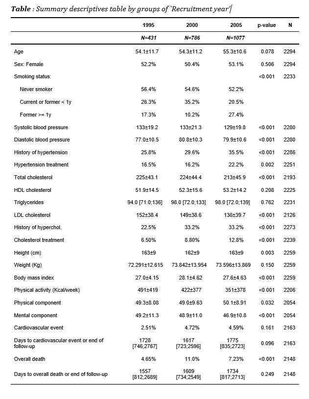

# Example 1: Building a descriptive table.

Several types of statistics (mean, standard deviation, quantiles or
frequencies) are displayed according to the nature of each variable
(categorical, continuous and normal-distributed or other quantitative
type distribution). Also, p-value to test equality between groups is
computed using the appropiate test.

## Step 1. Install the package

Install the **`compareGroups`** package from CRAN and then load it by
typing:

``` r
install.packages("compareGroups")
library(compareGroups)
```

## Step 2. Load data

Load the REGICOR example data available in **`compareGroups`** package:

``` r
data(regicor)
```

## Step 3. Compute descriptives and tests

Compute all descriptives and tests from selected variables by using the
**`compareGroups`** function.  
Note the use of `formula` argument as usual in `R`, so “.” indicates all
variables in the dataset while “-” sign indicates removing, and variable
on left side of “~” sign indicates the groups (if descriptives of whole
datset without separating by groups is desired left it in blank). Store
the results in an object that can be used afterwards to perform plots or
bivariate table itself.  
By the argument `method` we set triglycerides (`triglyc`), days to
cardiovascular event (`tocv`) and days until death (`todeath`) variables
to be reported as median and quartiles instead of mean and standard
deviation.

``` r
res <- compareGroups(year ~ . - id, data = regicor, 
                     method=c(triglyc=2, tocv=2, todeath=2))
```

## Step 4. Create the descriptive table

Use the **`creaTable`** function passing the previous object computed by
**`compareGroups`** function (`res`). Using this function you can
customize how categorical variables are displayed (only percertage or
absolute frequencies or both) by `type` argument or whether standard
deviation appears inside brackets or separated by plus/minus symbol by
`sd.type` argument.  
Also note the use of `hide.no` category which is useful to hide “no”
level for those binary variables.  
If you only want to show “Female” category use `hide` argument for `sex`
variable indicating which category is going to be hiden. This argument
also applies to categorical variables with more than two categories. To
specify the number of decimal digits to show use `digits`arguments. In
this example `height` have no decimals and for `weight` with three
digits. Finally, if you want to show how many individuals have
non-missing values in each described variable, set `show.n` argument to
`TRUE`.

``` r
restab <- createTable(res, digits = c(height=0, weight=3), type = 1, sd.type = 2, 
                      hide = c(sex = "Male"), hide.no = "no", show.n = TRUE)
```

## Step 5. Print or export the descriptive table

### Print on R console

The descriptive table can be printed in the `R` console using the method
`print`, i.e. just typing the name of the object:

``` r
restab
```

    --------Summary descriptives table by 'Recruitment year'---------

    _______________________________________________________________________________________________________________ 
                                                          1995            2000            2005       p.overall  N   
                                                          N=431           N=786          N=1077                     
    ¯¯¯¯¯¯¯¯¯¯¯¯¯¯¯¯¯¯¯¯¯¯¯¯¯¯¯¯¯¯¯¯¯¯¯¯¯¯¯¯¯¯¯¯¯¯¯¯¯¯¯¯¯¯¯¯¯¯¯¯¯¯¯¯¯¯¯¯¯¯¯¯¯¯¯¯¯¯¯¯¯¯¯¯¯¯¯¯¯¯¯¯¯¯¯¯¯¯¯¯¯¯¯¯¯¯¯¯¯¯¯ 
    Age                                                 54.1±11.7       54.3±11.2       55.3±10.6      0.079   2294 
    Sex: Female                                           52.2%           50.4%           53.1%        0.506   2294 
    Smoking status:                                                                                   <0.001   2233 
        Never smoker                                      56.4%           54.6%           52.2%                     
        Current or former < 1y                            26.3%           35.2%           20.5%                     
        Former >= 1y                                      17.3%           10.2%           27.4%                     
    Systolic blood pressure                             133±19.2        133±21.3        129±19.8      <0.001   2280 
    Diastolic blood pressure                            77.0±10.5       80.8±10.3       79.9±10.6     <0.001   2280 
    History of hypertension                               25.8%           29.6%           35.5%       <0.001   2286 
    Hypertension treatment                                16.5%           16.2%           22.2%        0.002   2251 
    Total cholesterol                                   225±43.1        224±44.4        213±45.9      <0.001   2193 
    HDL cholesterol                                     51.9±14.5       52.3±15.6       53.2±14.2      0.198   2225 
    Triglycerides                                    94.0 [71.0;136] 98.0 [72.0;133] 98.0 [72.0;139]   0.762   2231 
    LDL cholesterol                                     152±38.4        149±38.6        136±39.7      <0.001   2126 
    History of hyperchol.                                 22.5%           33.2%           33.2%       <0.001   2273 
    Cholesterol treatment                                 6.50%           8.80%           12.8%       <0.001   2239 
    Height (cm)                                           163±9           162±9           163±9        0.004   2259 
    Weight (Kg)                                       72.291±12.615   73.842±13.954   73.596±13.869    0.120   2259 
    Body mass index                                     27.0±4.15       28.1±4.62       27.6±4.63     <0.001   2259 
    Physical activity (Kcal/week)                        491±419         422±377         351±378      <0.001   2206 
    Physical component                                  49.3±8.08       49.0±9.63       50.1±8.91      0.037   2054 
    Mental component                                    49.2±11.3       48.9±11.0       46.9±10.8     <0.001   2054 
    Cardiovascular event                                  2.51%           4.72%           4.59%        0.161   2163 
    Days to cardiovascular event or end of follow-up 1728 [746;2767] 1617 [723;2596] 1775 [835;2723]   0.096   2163 
    Overall death                                         4.65%           11.0%           7.23%       <0.001   2148 
    Days to overall death or end of follow-up        1557 [812;2689] 1609 [734;2549] 1734 [817;2713]   0.249   2148 
    ¯¯¯¯¯¯¯¯¯¯¯¯¯¯¯¯¯¯¯¯¯¯¯¯¯¯¯¯¯¯¯¯¯¯¯¯¯¯¯¯¯¯¯¯¯¯¯¯¯¯¯¯¯¯¯¯¯¯¯¯¯¯¯¯¯¯¯¯¯¯¯¯¯¯¯¯¯¯¯¯¯¯¯¯¯¯¯¯¯¯¯¯¯¯¯¯¯¯¯¯¯¯¯¯¯¯¯¯¯¯¯ 

If you want to change some bivariate table header, such “p-value”
instead of “p.overall” use `header.labels` argument:

``` r
print(restab, header.labels = c(p.overall = "p-value"))
```

    --------Summary descriptives table by 'Recruitment year'---------

    _____________________________________________________________________________________________________________ 
                                                          1995            2000            2005       p-value  N   
                                                          N=431           N=786          N=1077                   
    ¯¯¯¯¯¯¯¯¯¯¯¯¯¯¯¯¯¯¯¯¯¯¯¯¯¯¯¯¯¯¯¯¯¯¯¯¯¯¯¯¯¯¯¯¯¯¯¯¯¯¯¯¯¯¯¯¯¯¯¯¯¯¯¯¯¯¯¯¯¯¯¯¯¯¯¯¯¯¯¯¯¯¯¯¯¯¯¯¯¯¯¯¯¯¯¯¯¯¯¯¯¯¯¯¯¯¯¯¯ 
    Age                                                 54.1±11.7       54.3±11.2       55.3±10.6     0.079  2294 
    Sex: Female                                           52.2%           50.4%           53.1%       0.506  2294 
    Smoking status:                                                                                  <0.001  2233 
        Never smoker                                      56.4%           54.6%           52.2%                   
        Current or former < 1y                            26.3%           35.2%           20.5%                   
        Former >= 1y                                      17.3%           10.2%           27.4%                   
    Systolic blood pressure                             133±19.2        133±21.3        129±19.8     <0.001  2280 
    Diastolic blood pressure                            77.0±10.5       80.8±10.3       79.9±10.6    <0.001  2280 
    History of hypertension                               25.8%           29.6%           35.5%      <0.001  2286 
    Hypertension treatment                                16.5%           16.2%           22.2%       0.002  2251 
    Total cholesterol                                   225±43.1        224±44.4        213±45.9     <0.001  2193 
    HDL cholesterol                                     51.9±14.5       52.3±15.6       53.2±14.2     0.198  2225 
    Triglycerides                                    94.0 [71.0;136] 98.0 [72.0;133] 98.0 [72.0;139]  0.762  2231 
    LDL cholesterol                                     152±38.4        149±38.6        136±39.7     <0.001  2126 
    History of hyperchol.                                 22.5%           33.2%           33.2%      <0.001  2273 
    Cholesterol treatment                                 6.50%           8.80%           12.8%      <0.001  2239 
    Height (cm)                                           163±9           162±9           163±9       0.004  2259 
    Weight (Kg)                                       72.291±12.615   73.842±13.954   73.596±13.869   0.120  2259 
    Body mass index                                     27.0±4.15       28.1±4.62       27.6±4.63    <0.001  2259 
    Physical activity (Kcal/week)                        491±419         422±377         351±378     <0.001  2206 
    Physical component                                  49.3±8.08       49.0±9.63       50.1±8.91     0.037  2054 
    Mental component                                    49.2±11.3       48.9±11.0       46.9±10.8    <0.001  2054 
    Cardiovascular event                                  2.51%           4.72%           4.59%       0.161  2163 
    Days to cardiovascular event or end of follow-up 1728 [746;2767] 1617 [723;2596] 1775 [835;2723]  0.096  2163 
    Overall death                                         4.65%           11.0%           7.23%      <0.001  2148 
    Days to overall death or end of follow-up        1557 [812;2689] 1609 [734;2549] 1734 [817;2713]  0.249  2148 
    ¯¯¯¯¯¯¯¯¯¯¯¯¯¯¯¯¯¯¯¯¯¯¯¯¯¯¯¯¯¯¯¯¯¯¯¯¯¯¯¯¯¯¯¯¯¯¯¯¯¯¯¯¯¯¯¯¯¯¯¯¯¯¯¯¯¯¯¯¯¯¯¯¯¯¯¯¯¯¯¯¯¯¯¯¯¯¯¯¯¯¯¯¯¯¯¯¯¯¯¯¯¯¯¯¯¯¯¯¯ 

### Exporting to different formats


- **Word**

Export to a Word.

``` r
export2word(restab, file = "example1.docx", header.labels = c(p.overall = "p-value"))
```



- **PDF**

If you want to create a PDF document with the table in a publish-ready
format

``` r
export2pdf(restab, file = "example1.pdf", header.labels = c(p.overall = "p-value"))
```


*Note: To create tables in PDF you must have some LaTeX compiler
installed on your computer.*

- **Excel**

If you want export the descriptive table to an Excel file:

``` r
export2xls(restab, file = "example1.xlsx", header.labels = c(p.overall = "p-value"))
```


*Note: You must have `writexlR` package installed.*

- **Markdown**

You can translate to Markdown code and insert it in a R-markdown chunk
to create reproducible reports.

``` r
export2md(restab, header.labels = c(p.overall = "p-value"))
```

|                                                  |       1995        |       2000        |       2005        | p-value |  N   |
|:-------------------------------------------------|:-----------------:|:-----------------:|:-----------------:|:-------:|:----:|
|                                                  |       N=431       |       N=786       |      N=1077       |         |      |
| Age                                              |     54.1±11.7     |     54.3±11.2     |     55.3±10.6     |  0.079  | 2294 |
| Sex: Female                                      |       52.2%       |       50.4%       |       53.1%       |  0.506  | 2294 |
| Smoking status:                                  |                   |                   |                   | \<0.001 | 2233 |
| Never smoker                                     |       56.4%       |       54.6%       |       52.2%       |         |      |
| Current or former \< 1y                          |       26.3%       |       35.2%       |       20.5%       |         |      |
| Former \>= 1y                                    |       17.3%       |       10.2%       |       27.4%       |         |      |
| Systolic blood pressure                          |     133±19.2      |     133±21.3      |     129±19.8      | \<0.001 | 2280 |
| Diastolic blood pressure                         |     77.0±10.5     |     80.8±10.3     |     79.9±10.6     | \<0.001 | 2280 |
| History of hypertension                          |       25.8%       |       29.6%       |       35.5%       | \<0.001 | 2286 |
| Hypertension treatment                           |       16.5%       |       16.2%       |       22.2%       |  0.002  | 2251 |
| Total cholesterol                                |     225±43.1      |     224±44.4      |     213±45.9      | \<0.001 | 2193 |
| HDL cholesterol                                  |     51.9±14.5     |     52.3±15.6     |     53.2±14.2     |  0.198  | 2225 |
| Triglycerides                                    | 94.0 \[71.0;136\] | 98.0 \[72.0;133\] | 98.0 \[72.0;139\] |  0.762  | 2231 |
| LDL cholesterol                                  |     152±38.4      |     149±38.6      |     136±39.7      | \<0.001 | 2126 |
| History of hyperchol.                            |       22.5%       |       33.2%       |       33.2%       | \<0.001 | 2273 |
| Cholesterol treatment                            |       6.50%       |       8.80%       |       12.8%       | \<0.001 | 2239 |
| Height (cm)                                      |       163±9       |       162±9       |       163±9       |  0.004  | 2259 |
| Weight (Kg)                                      |   72.291±12.615   |   73.842±13.954   |   73.596±13.869   |  0.120  | 2259 |
| Body mass index                                  |     27.0±4.15     |     28.1±4.62     |     27.6±4.63     | \<0.001 | 2259 |
| Physical activity (Kcal/week)                    |      491±419      |      422±377      |      351±378      | \<0.001 | 2206 |
| Physical component                               |     49.3±8.08     |     49.0±9.63     |     50.1±8.91     |  0.037  | 2054 |
| Mental component                                 |     49.2±11.3     |     48.9±11.0     |     46.9±10.8     | \<0.001 | 2054 |
| Cardiovascular event                             |       2.51%       |       4.72%       |       4.59%       |  0.161  | 2163 |
| Days to cardiovascular event or end of follow-up | 1728 \[746;2767\] | 1617 \[723;2596\] | 1775 \[835;2723\] |  0.096  | 2163 |
| Overall death                                    |       4.65%       |       11.0%       |       7.23%       | \<0.001 | 2148 |
| Days to overall death or end of follow-up        | 1557 \[812;2689\] | 1609 \[734;2549\] | 1734 \[817;2713\] |  0.249  | 2148 |

Summary descriptives table by groups of \`Recruitment year’

- **LaTeX**

Similar to Markdown file, it is possible to insert LaTeX code in a .tex.

``` r
export2tex(restab, header.labels = c(p.overall = "p-value"))
```
