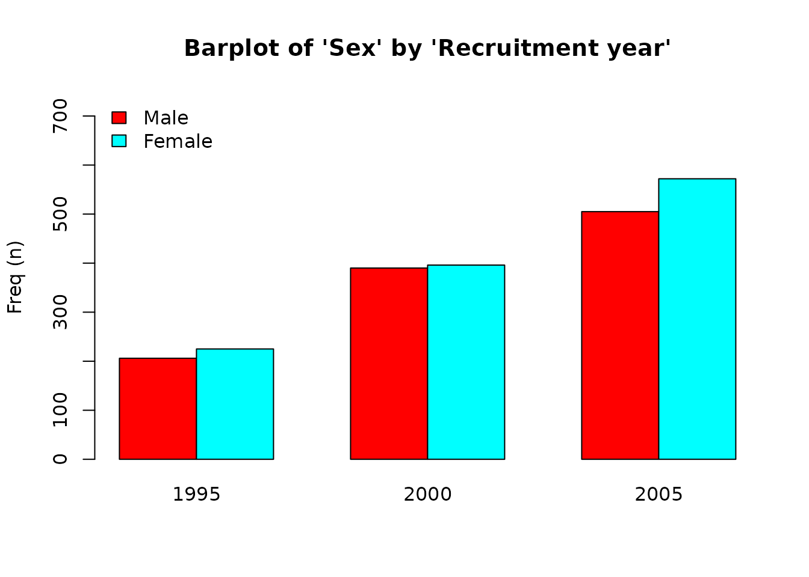
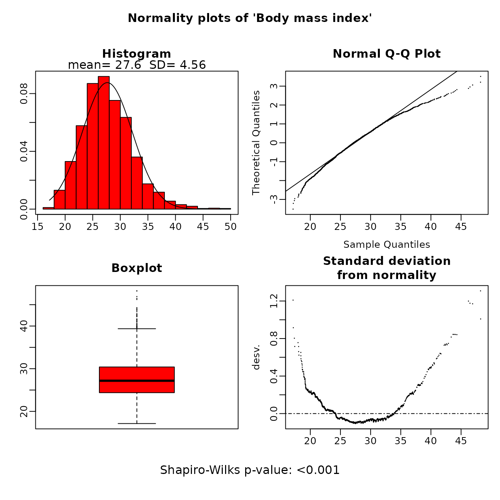
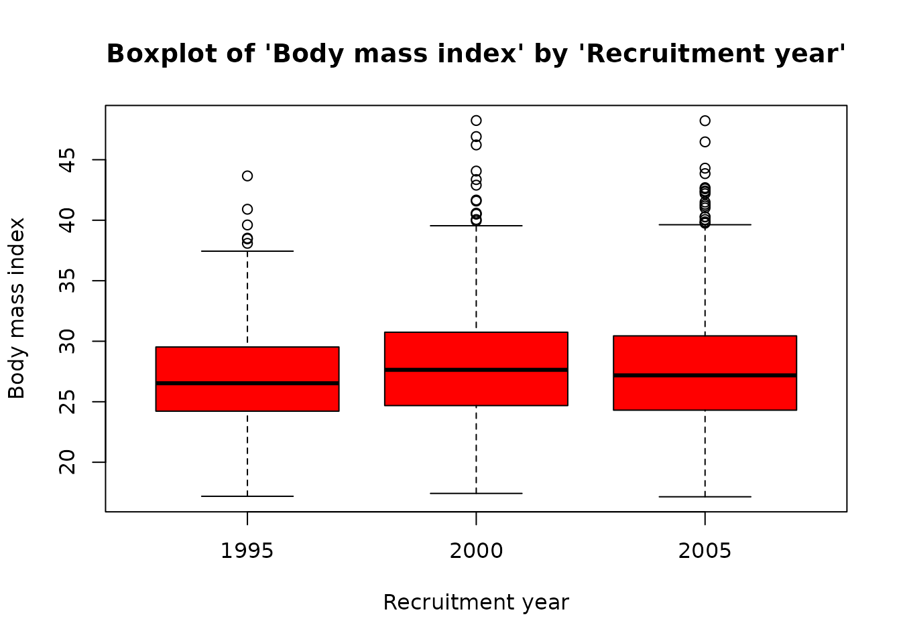

# Example 2: Exploring your data graphically.

Barplots, boxplots or normality plots are displayed according to the
nature of described variable. These plots are useful to explore visually
whether a continuous variable follows a normal distribution or to
identify possible outliers or rare categories, etc.

## Step 1. Install the package

Install **`compareGroups`** package from CRAN and then load it by
typing:

``` r
install.packages("compareGroups")
library(compareGroups)
```

## Step 2. Load data

Load the REGICOR example data available in **`compareGroups`** package:

``` r
data(regicor)
```

## Setp 3. Computations

First use `compareGroups` function to store all values used to perform
plots afterwards.

``` r
res <- compareGroups(year ~ .  , data = regicor)
```

  

You can use `varinfo` function to recover the original name of variables
(not labels which are displayed in the results).

``` r
varinfo(res)
```

    --- Analyzed variable names ----

       Orig varname Shown varname                                   
    1  year         Recruitment year                                
    2  id           Individual id                                   
    3  age          Age                                             
    4  sex          Sex                                             
    5  smoker       Smoking status                                  
    6  sbp          Systolic blood pressure                         
    7  dbp          Diastolic blood pressure                        
    8  histhtn      History of hypertension                         
    9  txhtn        Hypertension treatment                          
    10 chol         Total cholesterol                               
    11 hdl          HDL cholesterol                                 
    12 triglyc      Triglycerides                                   
    13 ldl          LDL cholesterol                                 
    14 histchol     History of hyperchol.                           
    15 txchol       Cholesterol treatment                           
    16 height       Height (cm)                                     
    17 weight       Weight (Kg)                                     
    18 bmi          Body mass index                                 
    19 phyact       Physical activity (Kcal/week)                   
    20 pcs          Physical component                              
    21 mcs          Mental component                                
    22 cv           Cardiovascular event                            
    23 tocv         Days to cardiovascular event or end of follow-up
    24 death        Overall death                                   
    25 todeath      Days to overall death or end of follow-up       

## Step 4. Perform plots

by using the `plot` method which takes the results created by
`compareGroups` function. Inside “\[” brackets you can select which
variable to plot. And, indicating `bivar=TRUE` a bivariate plot is
performed, i.e. stratifying by groups.

1.  For categorical variables a barplot is performed, stratifying by
    groups (right plot) or not (left plot):

``` r
plot(res['sex'])
```


``` r
plot(res['sex'], bivar=TRUE)
```



2.  For continuous variables boxplots or normality plots are performed
    depending whether groups are considered or not, respectively.

``` r
plot(res['bmi'])
```



``` r
plot(res['bmi'],bivar=TRUE)
```


