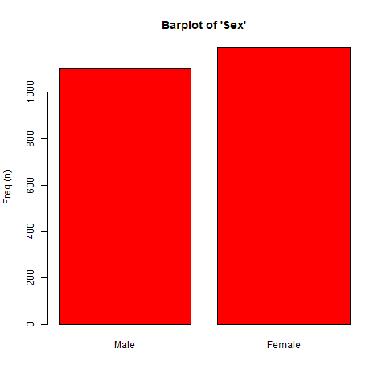
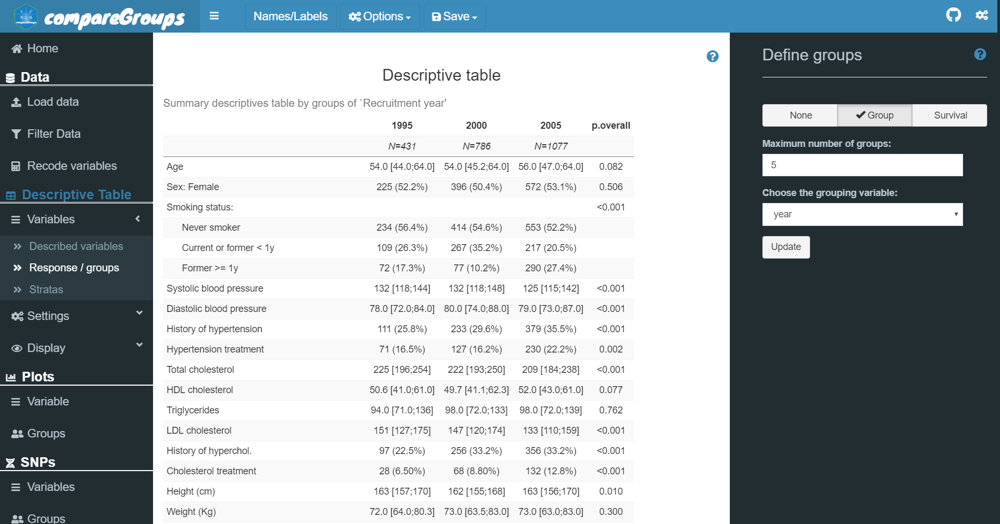

---
md_document:
  variant: markdown_github
title: "compareGroups"
output: md_document
always_allow_html: true
---


```{r setup, include=FALSE}
knitr::opts_chunk$set(echo = TRUE, warning=FALSE, message=FALSE, comment="")
library(knitr)
```


# **compareGroups** 


**_package to create descriptive tables_**


[](https://cran.r-project.org/package=compareGroups)  


## Overview

xxxxxx

**compareGroups** is an R package available on CRAN which performs descriptive tables displaying means, standard deviation, quantiles or frequencies of several variables. Also, p-value to test equality between groups is computed using the appropiate test. <br>

With a very simple code, nice, compact and ready-to-publish descriptives table are displayed on R console. They can also be exported to different formats, such as Word, Excel, PDF or inserted in a R-Sweave or R-markdown document.<br>

You will find an extensive manual describing all **compareGropus** capabilities with real examples in the [vignette](./articles/compareGroups_vignette.html).<br>


Also, **compareGroups** package has been published in Journal of Statistical Software [Subirana et al, 2014] (https://www.jstatsoft.org/v57/i12/).


*********

## Who we are


**`compareGroups`** is developed and maintained by Isaac Subirana, Hector Sanz, Joan Vila and collaborators at the cardiovascular epidemiology research unit (URLEC), located at [Barcelona Biomedical Research Park (PRBB)](http://www.prbb.org/) .


<br><br><br><br><br>


As the driving force behind the [REGICOR study](https://www.regicor.org), URLEC has extensive experience in statistical epidemiology, and is a national reference centre for research into cardiovascular diseases and their risk factors.


<br><br>

*********

## Gets started

Install the package from CRAN


```{r, eval=FALSE}
install.packages("compareGroups")
```

or the lattest version from Github

```{r, eval=FALSE}
library(devtools)
devtools::install_github("isubirana/compareGroups")
```

### Building the descriptive table

```{r}
library(compareGroups)

data(regicor)

tab <- descrTable(year ~ . -id , regicor, hide.no = "no", 
                  method=c(triglyc=2, tocv=2, todeath=2), sd.type = 3)

export2md(tab, header.background = "black", header.color = "white", 
          caption = "Summary by intervention group")
```

### Stratified table

<div class="small">

```{r,size=6}
tabstrat <- strataTable(update(tab, . ~ . -sex), "sex")

export2md(tabstrat, header.background = "black", header.color = "white", size=9)
```

</div>

### Visual exploration

```{r, echo=FALSE, fig.show="hide"}
plot(tab["sex"], "./man/figures/var1", type="png") 
plot(tab["age"], "./man/figures/var1", type="png")
```


|            |              |
|:----------:|:------------:|
| `plot(tab["sex"])` | `plot(tab["age"])` |
|  |  |


### Computing Odds Ratios

```{r}
data(SNPs)

tabor <- descrTable(casco ~ .-id, SNPs, show.ratio=TRUE, show.p.overall=FALSE)

export2md(tabor[1:4])
```

### Computing Hazard Ratios

```{r}
library(survival)
regicor$tcv <- Surv(regicor$tocv, regicor$cv=="Yes")

tabhr <- descrTable(tcv ~ .-id-cv-tocv, regicor, 
           method=c(triglyc=2, tocv=2, todeath=2),
           hide.no="no", ref.no="no",
           show.ratio=TRUE, show.p.overall=FALSE)


export2md(tabhr[1:10], header.label=c("p.ratio"="p-value"),
          caption="Descriptives by cardiovascular event")  
```


### Web-based User Interface

For those not familiar to R syntax, a Web User Interface (**WUI**) has been implemented using [Shiny](https://shiny.rstudio.com/) tools, which can be used off line by typing `cGroupsWUI()` after having `compareGroups` package installed and loaded, or remotely just accessing the application hosted in a [shinyapp.io server](https://isubirana.shinyapps.io/compareGroups/).




