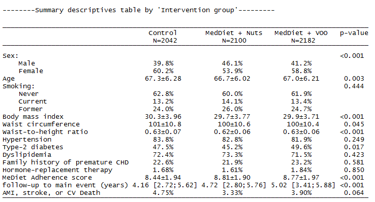
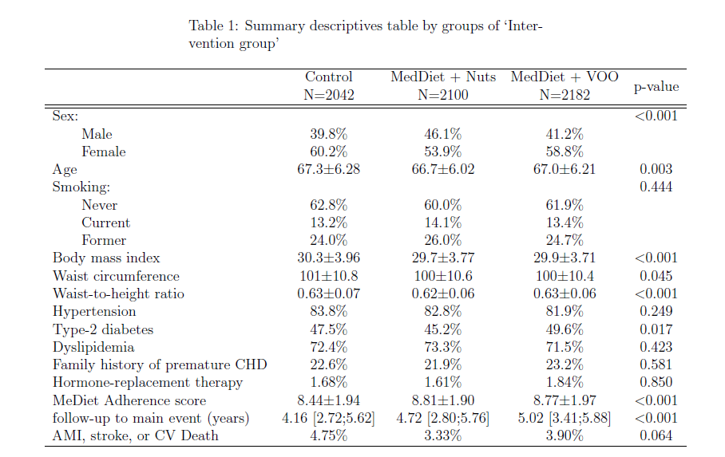
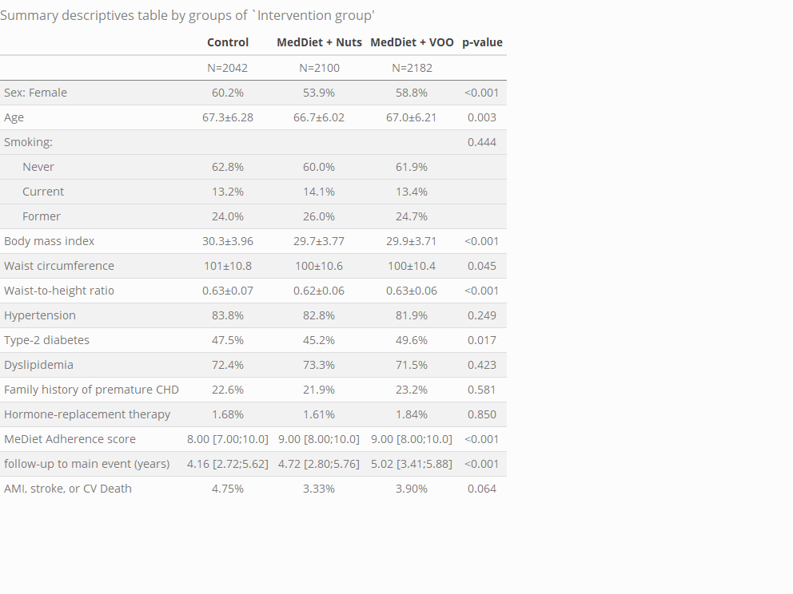
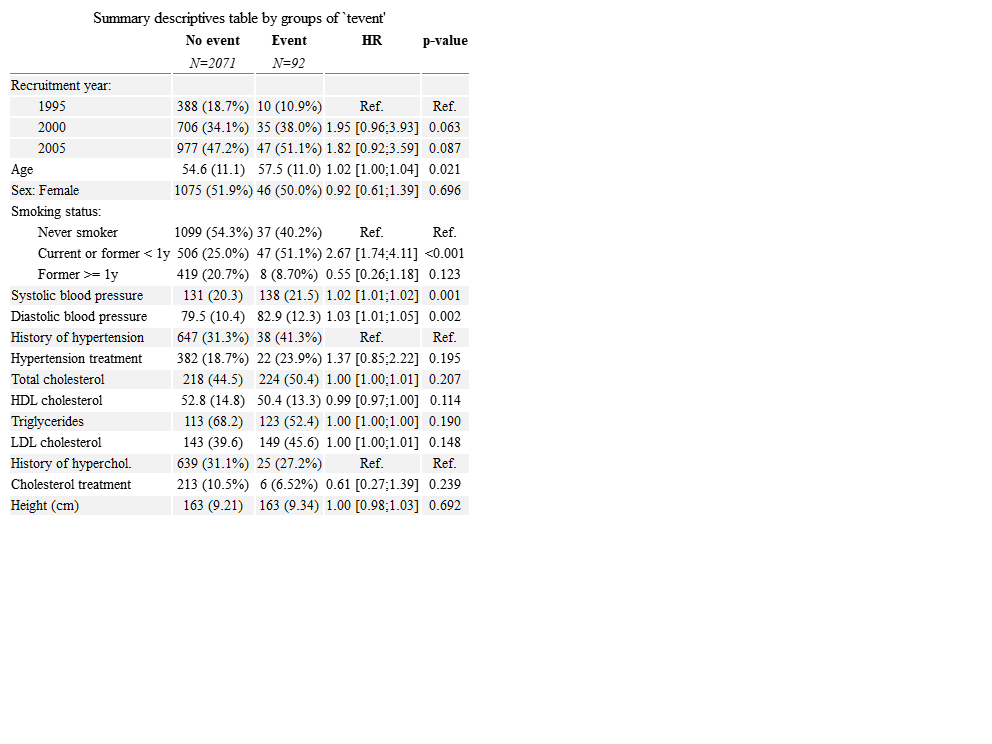
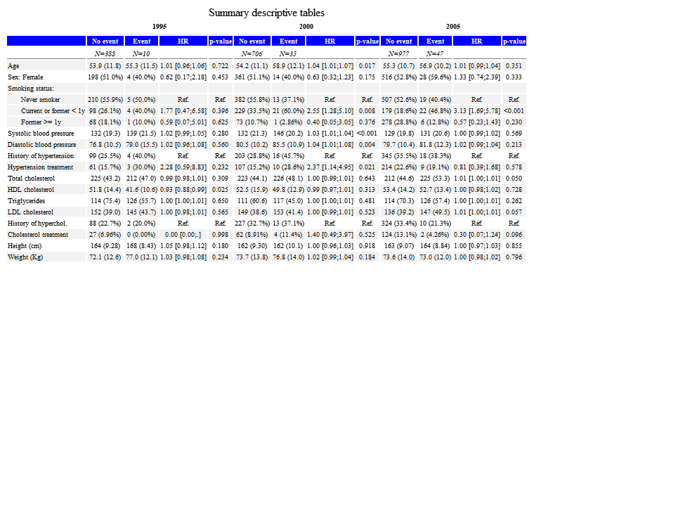
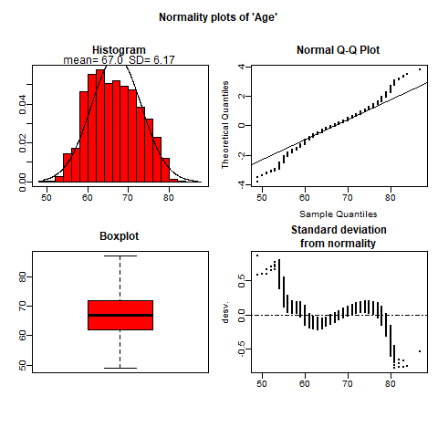
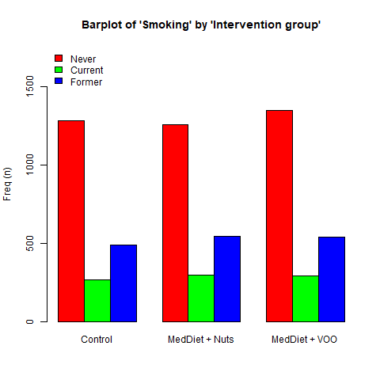
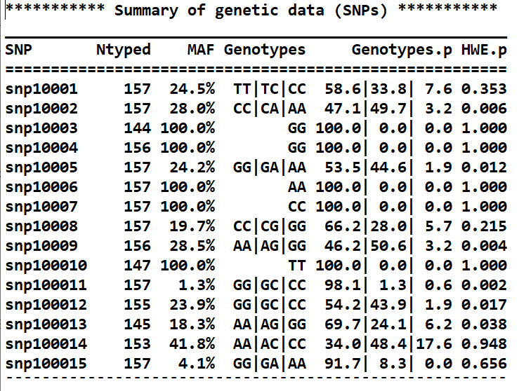

-----

 

<ul>

<li> Build nice and ready-to-publish descriptive tables containing means, medians, percentages, ...

<li> Export the descriptive tables to many formats (HTML, PDF, Word, Excel)

<li> Compute Odds Ratios or Hazard Ratios.

<li> Perform appropiate tests according to the type of described variable.

<li> Embed the code to Rmarkdown to compile your report to PDF, HTML or Word.

<li> Explore your data visutally to check normality.

<li> Analyse genetic data (Single Nucleotid Polymorphism).

<ul>

 

-----

### WUI usage

 

#### **Step 1.** Load your data from a file (SPSS, Excel, TXT, Stata, or R), or use one of the two example data sets available in the package.

 

#### **Step 2.** Select the variables to be described.

 

#### **Step 3.** Choose a variable to compare distribution by its groups or define the survival variable for cohort studies.

 

#### **Step 4.** Set other options such as the type of variables (normal, non-normal, ...).

 

#### **Step 5.** Define format options such as number of decimals, etc., or what you want to be displayed (number of available data for each variable, missing category, etc.).

-----

### Examples

<format style="font-size:12pt"><strong>Descriptives of entire cohort</strong></format>

<format style="font-size:12pt"><strong>Descriptive by groups</strong></format>

<format style="font-size:12pt"><strong>Descriptive by groups customized</strong></format>

<format style="font-size:12pt"><strong>Cohort studies: Hazard Ratios</strong></format>

<format style="font-size:12pt"><strong>Stratified table</strong></format>

<format style="font-size:12pt"><strong>Plots</strong></format>

<table width=80%>
<tr>
<td>  </td>
<td>  </td>
</tr>
</table>

<format style="font-size:12pt"><strong>Genetic variables (SNPs)</strong></format>

-----

### Data Security when using the `compareGroups` WUI

This app is developed by experienced researchers who are actively involved in epidemiological research on human subjects. We understand very well how important it is to guarantee data confidentiality and security, and we have designed the compareGroups WUI so that your data will remain as secure as at your own institute.

**Will my data be safe if I load them into the compareGroups WUI?**

The compareGroups WUI is hosted on <a href="https://www.shinyapps.io/" target="_blank">Shiny cloud server</a>, which guarantees the physical and electronic security of the WUI, and therefore of any data that are loaded into it. Data loaded into the WUI are transmitted over a secure connection via HTTPS.

**What happens to my data when I load them into the compareGroups WUI?**

If you're familiar with R software, you'll know that it loads all data and performs all calculations within the RAM allocated for that R session. This means that it never writes data to the disk, and when the R session ends, all data it has been working on are eliminated.

Accessing the **`compareGroups` WUI** page starts a dedicated session of R to read and manipulate your data, and compute your results. However, this R session never saves data to the hard disk of the server it's running on, and only sends results to the WUI, either in the form of displayed tables or plots, or as files to be downloaded by the the user via the "SAVE" button.

When you close your browser window, the R session is terminated, and all data are lost. To can verify this for yourself by simply re-loading the WUI page, after which you will see that no data are loaded. The **`compareGroups`** developers only have access to the underlying R code that generates that WUI and performes the calculations, and can never gain access to data that have been loaded into a remote session.

If you have any further concerns or questions about the security of your data when using the compareGroups WUI, please get in touch with us via the <a href="http://www.comparegroups.eu/contact">contact form</a>.
