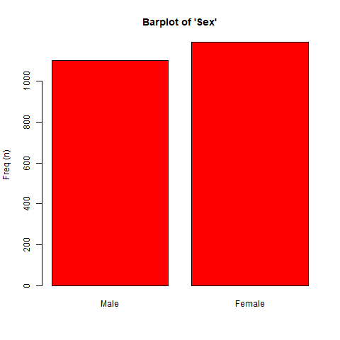

<!--
<style type="text/css">
#TOC {
  position: fixed;
  left: 0px;
  top: 0px;
  font-size: 14px;
  font-weight: bold;
  overflow: hidden;
  max-width: 300px;
  max-height: 1500px;
  border: solid 2px black;
}
#TOC a {
  padding-right: 15px;
}
body{
  font-size: 18px;
  text-align: justify;
  line-height: 150%;
  width: 900px;
  margin: auto;
  margin-left: 50px;
  background-color: #D1F0F0;
}
body p{
  width: 900px;  
}
td, th{  /* Table  */
   font-size: 16px;
}
h1 { /* Header 1 */
 font-size: 32px;
 width: 800px;
 color: DarkBlue;
}
h2 { /* Header 2 */
 font-size: 28px;
 color: DarkBlue;
}
h3 { /* Header 3 */
 font-size: 26px;
 color: DarkBlue;
 line-height: 150%;
}
h4 { /* Header 4 */
 font-size: 24px;
 color: DarkBlue;
 line-height: 150%;
}
code.r{
  font-size: 14px;
  color: black;
}
pre {
  font-size: 14px;
  color: blue;
  background-color: rgb(220,220,220);
  width: 1200px;  
}
</style>
-->


```{r,echo=FALSE,results='hide',warning=FALSE,message=FALSE}
library(knitr)
knitr::opts_chunk$set(comment="", message=FALSE, warning=FALSE,fig.align="center",fig.height=10,fig.width=10,tidy=TRUE,tidy.opts=list(blank=FALSE, width.cutoff=900))
```


<p style="margin-top:50px"></p>

# Introduction

The **`compareGroups`** package [@Subirana2014] allows users to create tables displaying results of univariate analyses, stratified or not by categorical variable groupings.

Tables can easily be exported to CSV, LaTeX, HTML, PDF, Word or Excel.

This package can be used from the **`R`** prompt or from a user-friendly GUI.

Since version 3.0, a Web User Interface (WUI) has been implemented based on **`Shiny`** package [@Shiny] which makes the functionality even more friendly. Also, this can be used remotely from [**`compareGroups`** project webpage](http://www.comparegroups.eu/). See section 6 for more details.

This document provides an overview of the usage of the **`compareGroups`** package.

To load the package using the **`R`** prompt, enter:

```{r, echo=TRUE}
library(compareGroups)
```


Once the package is loaded, non-R users can follow the GUI instructions in Section 5.


<p style="margin-top:50px"></p>
<p style="margin-top:50px"></p>

# Design: classes and methods


The **`compareGroups`** package has three functions:

* `compareGroups` creates an object of class `compareGroups`. This object can be:
    + printed
    + summarized
    + plotted
    + updated
* `createTable` creates an object of class `createTable`. This object can be:
    + printed
    + summarized
* `export2csv`, `export2html`, `export2latex`, `export2pdf`, `export2md`, `export2word` and `export2xls` will export results to CSV, HTML, LaTeX, PDF, Markdown, Word or Excel, respectively. 


Figure 1 shows how the package is structured in terms of functions, classes and methods.

<p style="margin-top:50px"></p>


<p style="margin-top:50px"></p>
<p style="margin-top:50px"></p>

# Data used as example

To illustrate how this package works we sampled 85% data from the participants in [the PREDIMED study](http://www.predimed.org/) [@PREDIMED]. PREDIMED is a multicenter trial in Spain, were randomly assigned participants who were at high cardiovascular risk, but with no cardiovascular disease at enrolment, to one of three diets: a Mediterranean diet supplemented with extra-virgin olive oil (MedDiet+VOO), a Mediterranean diet supplemented with mixed nuts (MedDiet+Nuts), or a control diet (advice to reduce dietary fat). Participants received quarterly individual and group educational sessions and, depending on group assignment, free provision of extra-virgin olive oil, mixed nuts, or small non-food gifts. The primary end point was the rate of major cardiovascular events (myocardial infarction, stroke, or death from cardiovascular causes.


First of all, load PREDIMED data typing:
```{r}
data(predimed)
```

<p style="margin-top:50px"></p>

Variables and labels in this data frame are:

```{r,echo=FALSE,results="asis"}
dicc <- data.frame(
"Name"=I(names(predimed)),
"Label"=I(unlist(lapply(predimed, Hmisc::label))),
"Codes"=I(unlist(lapply(predimed, function(x) paste(levels(x),collapse="; "))))
)
dicc$Codes <- sub(">=","$\\\\geq$",dicc$Codes)
print(xtable(dicc,align=rep("l",4)),include.rownames=FALSE,type="html")
```


<p style="margin-top:50px"></p>

OBSERVATIONS:

1. It is important to note that **`compareGroups`** is not aimed to perform quality control of the data. Other useful packages such as **`2lh`** [@r2lh] are available for this purpose. 

2. It is strongly recommended that the _data.frame_ contain only the variables to be analyzed; the ones not needed in the present analysis should be removed from the list.

3. The nature of variables to be analyzed should be known, or at least which variables are to be used as categorical. It is important to code categorical variables as factors and the order of their levels is meaningful in this package.

3. The function `label` from the **`Hmisc`** package could be used to label the variables properly. The tables of results will contain the variable labels (by default).


<p style="margin-top:50px"></p>

## Time-to-event variables

A variable of class `Surv` must be created to deal with time-to-event variables (i.e., time to Cardiovascular event/censored in our example): 

```{r}
predimed$tmain <- with(predimed, Surv(toevent, event == 'Yes'))
Hmisc::label(predimed$tmain) <- "AMI, stroke, or CV Death"
```

Note that variables _tmain_ and _tcv_ are created as time-to-death and time-to-cardiovascular event, respectively, both taking into account censoring (i.e. they are of class Surv).


<p style="margin-top:50px"></p>
<p style="margin-top:50px"></p>

# Using **`R`** syntax

<p style="margin-top:50px"></p>

## `compareGroups`

This is the main function. It does all the calculus. It is needed to store results in an object. Later, applying the function `createTable` (Section 4.2) to this object will create tables of the analysis results.

For example, to perform a univariate analysis with the _predimed_ data between _group_ ("response" variable) and all other variables ("explanatory" variables), this formula is required:

```{r, results='hide'}
compareGroups(group ~ . , data=predimed)
```

<p style="margin-top:50px"></p>

### Selecting response variables


If only a dot occurs on the right side of the `~` all variables in the data frame will be used.


To remove the variable _toevent_ and _event_ from the analysis:

```{r, results='hide'}
compareGroups(group ~ . -toevent - event, data=predimed)
```

To select some explanatory variables (e.g., _age_, _sex_ and _waist_) and store results in an object of class `compareGroups`:

```{r}
res<-compareGroups(group ~ age + sex + smoke + waist + hormo, data=predimed)
res
```

Note: Although we have full data (n= `r nrow(predimed)`) for Age, Sex and Waist circumference, there are some missing data in Hormone-replacement therapy (probably male participants).

Diet groups have some differences in Smoking and Hormone-replacement therapy  although those don't reach statistical significance (p-value=0.714 and 0.859, repectively); although Age, Sex and Waist circumference are clearly different.

Age & Waist circumference has been used as continuous and normal distributed. Sex, Smoking & Hormone-replacement therapy as categorical.

No filters have been used (e.g., selecting only treated patients); therefore, the _selection_ column lists "ALL" (for all variables).


<p style="margin-top:50px"></p>

### Subsetting

To perform the analysis in a subset of participants (e.g., "female" participants):

```{r}
compareGroups(group ~ age + smoke + waist + hormo, data=predimed, subset = sex=='Female')
```

Note that only results for female participants are shown.

To subset specific variable/s (e.g., _hormo_ and _waist_):


```{r, echo=TRUE}
compareGroups(group ~ age + sex + smoke + waist + hormo, data=predimed, selec = list(hormo= sex=="Female", waist = waist>20 ))
```

Combinations are also allowed, e.g.:

```{r, echo=TRUE}
compareGroups(group ~ age + smoke + waist + hormo, data=predimed, selec = list(waist= !is.na(hormo)), subset = sex=="Female")
```


A variable can appear twice in the formula, e.g.:

```{r.echo=TRUE}
compareGroups(group ~ age + sex + bmi + bmi + waist + hormo, data=predimed, selec = list(bmi.1=!is.na(hormo)))
```

In this case results for _bmi_ will be reported for all participants (n= 6324) and also for only those with no missing in Hormone-replacement therapy  (!is.na(hormo)). Note that "bmi.1" in the `selec` argument refers to the second time that _bmi_ appears in the formula.


<p style="margin-top:50px"></p>

### Methods for continuous variables


By default continuous variables are analyzed as normal-distributed. When a table is built (see `createTable` function, Section 4.2), continuous variables will be described with mean and standard deviation. To change default options, e.g., "waist" used as non-normal distributed:


```{r, echo=TRUE}
compareGroups(group ~ age + smoke + waist + hormo, data=predimed, method = c(waist=2))
```

Note that "continuous non-normal" is shown in the _method_ column for the variable Hormone-replacement therapy.

Possible values in  methods statement are:

* 1: forces analysis as normal-distributed 

* 2: forces analysis as continuous non-normal

* 3: forces analysis as categorical

* NA: performs a Shapiro-Wilks test to decide between normal or non-normal


If the `method` argument is stated as `NA` for a variable, then a Shapiro-Wilk test for normality is used to decide if the variable is normal or non-normal distributed. To change the significance threshold:

```{r, echo=TRUE}
compareGroups(group ~ age + smoke + waist + hormo, data=predimed, method = c(waist=NA), alpha= 0.01)
```

According to Shapiro-Wilk test, stating the cutpoint at 0.01 level, "Hormone-replacement therapy" departed significantly from the normal distribution and therefore the method for this variable will be "continuous non-normal".


All non factor variables are considered as continuous. Exception is made (by default) for those that have fewer than 5 different values. This threshold can be changed in the **min.dis** statement:

```{r, echo=TRUE}
cuts<-"lo:55=1; 56:60=2; 61:65=3; 66:70=4; 71:75=5; 76:80=6; 81:hi=7"
predimed$age7gr<-car::recode(predimed$age, cuts)
compareGroups(group ~ age7gr, data=predimed, method = c(age7gr=NA))
compareGroups(group ~ age7gr, data=predimed, method = c(age7gr=NA), min.dis=8)
```

To avoid errors the maximum categories for the response variable is set at 5 in this example (default value). If this variable has more than 5 different values, the function `compareGroups` returns an error message. For example:

```{r,eval=FALSE}
compareGroups(age7gr ~ sex + bmi + waist , data=predimed))
```

<div style="color:red">
```{r,echo=FALSE}
cat("Error en compareGroups.default(X = X, y = y, include.label = include.label,  :
number of groups must be less or equal to 5
")
```
</div>

Defaults setting can be changed with the **max.ylev** statement:

```{r,echo=TRUE}
compareGroups(age7gr ~ sex + bmi + waist, data=predimed, max.ylev=7)
```

Similarly, by default there is a limit for the maximum number of levels for an explanatory variable. If this level is exceeded, the variable is removed from the analysis and a warning message is printed:

```{r, echo=TRUE, eval=FALSE}
compareGroups(group ~ sex + age7gr, method= (age7gr=3), data=predimed, max.xlev=5)
```

<div style="color:blue">
```{r,echo=FALSE}
cat("Warning in compareGroups.default(X = X, y = y, include.label = include.label,  :
Variables 'age7gr' have been removed since some errors ocurred
")
```
</div>

<p style="margin-top:50px"></p>

### Dressing up the output

Although the options described in this section correspond to `compareGroups` function, results of changing/setting them won't be visible until the table is created with the `createTable` function (explained later).


* **`include.label`:** By default the variable labels are shown in the output (if there is no label the name will be printed). Changing the statement include.label from "= TRUE" (default) to "= FALSE" will cause variable names to be printed instead.

```{r, echo=TRUE}
compareGroups(group ~ age + smoke + waist + hormo, data=predimed, include.label= FALSE)
```

* **`Q1`, `Q3`:** When the method for a variable is stated as "2" (i.e., to be analyzed as continuous non-normal; see section 4.1.3), by default the median and quartiles 1 and 3 will be shown in the final results, after applying the function `createTable` (see Section 4.2).


```{r, echo=TRUE}
resu1<-compareGroups(group ~ age + waist, data=predimed, method = c(waist=2))
createTable(resu1)
```

Note: percentiles 25 and 75 are calculated for "Waist circumference".

To get instead percentile 2.5% and 97.5%:
  
```{r, echo=TRUE}
resu2<-compareGroups(group ~ age + smoke + waist + hormo, data=predimed, method = c(waist=2), Q1=0.025, Q3=0.975)
createTable(resu2)
```

Note: percentiles 2.5% and 97.5% are calculated for Follow-up.

To get minimum and maximum:
  
```{r, echo=TRUE, results='hide'}
compareGroups(group ~ age + smoke + waist + hormo, data=predimed, method = c(waist=2), Q1=0, Q3=1)
```


* **`simplify`:**  Sometimes a categorical variable has no individuals for a specific group. For example, _smoker_ has 3 levels. As an example and to illustrate this problem, we have created a new variable _smk_ with a new category ("Unknown"):
  
```{r, echo=TRUE}
predimed$smk<-predimed$smoke
levels(predimed$smk)<- c("Never smoker", "Current or former < 1y", "Never or former >= 1y", "Unknown")
Hmisc::label(predimed$smk)<-"Smoking 4 cat."
cbind(table(predimed$smk))
```

Note that this new category ("unknown") has no individuals: 

```{r, eval=FALSE}
compareGroups(group ~ age + smk + waist + hormo, data=predimed)
```

<div style="font-color:blue">
```{r,echo=FALSE}
cat("
-------- Summary of results by groups of 'Intervention group'---------


  var                         N    p.value method            selection
1 Age                         6324 0.001** continuous normal ALL      
2 Smoking 4 cat.              6324 0.714   categorical       ALL      
3 Waist circumference         6324 0.019** continuous normal ALL      
4 Hormone-replacement therapy 5650 0.859   categorical       ALL      
-----
Signif. codes:  0 '**' 0.05 '*' 0.1 ' ' 1 

Warning message:
In compare.i(X[, i], y = y, selec.i = selec[i], method.i = method[i],  :
  Some levels of 'smk' are removed since no observation in that/those levels
")
```
</div>

Note that a "Warning" message is printed related to the problem with _smk_.


To avoid using empty categories, `simplify` must be stated as `TRUE` (Default value).

```{r, echo=TRUE, results='hide'}
compareGroups(group ~ age + smk, data=predimed, simplify=FALSE)
```

<div style="font-color:blue">
```{r, echo=FALSE}
cat("
-------- Summary of results by groups of 'Intervention group'---------


  var            N    p.value method            selection
1 Age            6324 0.001** continuous normal ALL      
2 Smoking 4 cat. 6324 .       categorical       ALL      
-----
Signif. codes:  0 '**' 0.05 '*' 0.1 ' ' 1 

Warning messages:
1: In chisq.test(obj, simulate.p.value = TRUE) :
  cannot compute simulated p-value with zero marginals
2: In chisq.test(obj, simulate.p.value = TRUE) :
  Chi-squared approximation may be incorrect
")
```
</div>

Nota that a "warning" message is shown and no p-values are calculated for "Smoking".


<p style="margin-top:50px"></p>

### Summary


Applying the `summary` function to an object of class `createTable` will obtain a more detailed output:
  
```{r, echo=TRUE}
res<-compareGroups(group ~ age + sex + smoke + waist + hormo, method = c(waist=2), data=predimed)
summary(res[c(1, 2, 4)])
```

Note that because only variables 1, 3 and 4 are selected, only results for Age, Sex and Waist circumference are shown. Age is summarized by the mean and the standard deviation, Sex by frequencies and percentage, and Waist circumference (method =2) by the median and quartiles.


<p style="margin-top:50px"></p>

### Plotting

Variables can be plotted to see their distribution. Plots differ according to whether the variable is continuous or categorical. Plots can be seen on-screen or saved in different formats (BMP, JPG', PNG, TIF or PDF). To specify the format use the argument `type'. 

```{r, echo=TRUE}
plot(res[c(1,2)], file="./figures/univar/", type="png")
```





Plots also can be done according to grouping variable. In this case only a boxplot is shown for continuous variables:
  
```{r, echo=TRUE}
plot(res[c(1,2)], bivar=TRUE, file="./figures/bivar/", type="png")
```


<p style="margin-top:50px"></p>

### Updating

The object from `compareGroups` can later be updated. For example:
  
```{r}
res<-compareGroups(group ~ age + sex + smoke + waist + hormo, data=predimed)
res
```

The object `res` is updated using:
  

```{r, echo=TRUE, results='hide'}
res<-update(res, . ~. - sex +  bmi + toevent, subset = sex=='Female', method = c(waist=2, tovent=2), selec = list(bmi=!is.na(hormo)))
res
```

Note that "Sex" is removed as an explanatory variable but used as a filter, subsetting only "Female" participants. Variable "Waist circumference" has been changed to "continuous non-normal". Two new variables have been added: Body mass index and Follow-up (stated continuous non-normal). For Body mass index is stated to show only data of participants with non-missing values in Hormone-replacement therapy.


<p style="margin-top:50px"></p>

### Substracting results

Since version 3.0, there is a new function called `getResults` to retrieve some specific results computed by `compareGroups`, such as p-values, descriptives (means, proportions, ...), etc.

For example, it may be interesting to recover the p-values for each variable as a vector to further manipulate it in **`R`**, like adjusting for multiple comparison with `p.adjust`. For example, lets take the example data from **`SNPassoc`** package that contains information of dozens of SNPs (genetic variants) from a sample of cases and controls. In this case we analize five of them:

```{r}
library(SNPassoc)
data(SNPs)
tab <- createTable(compareGroups(casco ~ snp10001 + snp10002 + snp10005 + snp10008 + snp10009, SNPs))
pvals <- getResults(tab, "p.overall")
p.adjust(pvals, method = "BH")
```


<p style="margin-top:50px"></p>

### Odds Ratios and Hazard Ratios


When the response variable is binary, the Odds Ratio (OR) can be printed in the final table. If the response variable is time-to-event (see Section 3.1), the Hazard Ratio (HR) can be printed instead.


* **`ref`:**  This statement can be used to change the reference category:
  
```{r, echo=TRUE}
res1<-compareGroups(htn ~ age + sex + bmi + smoke, data=predimed, ref=1)
createTable(res1, show.ratio=TRUE)
```


Note that for categorical response variables the reference category is the first one in the statement:
  

```{r, echo=TRUE}
res2<-compareGroups(htn ~ age + sex + bmi + smoke, data=predimed, ref=c(smoke=1, sex=2))
createTable(res2, show.ratio=TRUE)
```

Note that the reference category for Smoking status is the first and for Sex the second.


* **`ref.no`:** Similarly to the `ref` statement, `ref.no` is used to state "no" as the reference category for all variables with this category:
  
```{r, echo=TRUE}
res<-compareGroups(htn ~ age + sex + bmi + hormo + hyperchol, data=predimed, ref.no='NO')
createTable(res, show.ratio=TRUE)
```

Note: "no", "No" or "NO" will produce the same results; the coding is not case sensitive.


* **`fact.ratio`**: By default OR or HR for continuous variables are calculated for each unit increase. It can be changed by the `fact.or` statement:
  
```{r, echo=TRUE}
res<-compareGroups(htn ~ age + bmi, data=predimed)
createTable(res, show.ratio=TRUE)
```

Here the OR is for the increase of one unit for Age and Systolic blood pressure.


```{r, echo=TRUE}
res<-compareGroups(htn ~ age + bmi, data=predimed, fact.ratio= c(age=10, bmi=2))
createTable(res, show.ratio=TRUE)
```

Here the OR is for the increase of 10 years for Age and 2 units for "Body mass index".


* **`ref.y`:** By default when OR or HR are calculated, the reference category for the response variable is the first. The reference category could be changed using the `ref.y` statement:  
  
```{r, echo=TRUE}
res<-compareGroups(htn ~ age + sex + bmi + hyperchol, data=predimed)
createTable(res, show.ratio=TRUE)
```

Note: This output shows the OR of having hypertension. Therefore, "Non-hypertension" is the reference category.


```{r, echo=TRUE}
res<-compareGroups(htn ~ age + sex + bmi + hyperchol, data=predimed, ref.y=2)
createTable(res, show.ratio=TRUE)
```

Note: This output shows the OR of having No hypertension, and 'Hypertension' is now the reference category.


When the response variable is of class `Surv`, the bivariate `plot` function returns a Kaplan-Meier figure if the explanatory variable is categorical. For continuous variables the function returns a line for each individual, ending with a circle for censored and with a plus sign for uncensored.

```{r}
plot(compareGroups(tmain ~ sex, data=predimed), bivar=TRUE, file="./figures/bivarsurv/", type="png")
plot(compareGroups(tmain ~ age, data=predimed), bivar=TRUE, file="./figures/bivarsurv/", type="png")
```


<p style="margin-top:50px"></p>

### Time-to-event explanatory variables

When a variable of class `Surv` (see Section 3.1) is used as explanatory it will be described with the probability of event, computed by Kaplan-Meier, up to a stated time.


* **`timemax`:** By default probability is calculated at the median of the follow-up period. `timemax` option allows us to change at what time probability is calculated.


```{r, echo=TRUE, results='hide'}
res<-compareGroups(sex ~  age + tmain, timemax=c(tmain=3), data=predimed)
res
```

Note that `tmain` is calculated at 3 years (see section 3.1).


The `plot` function applied to a variable of class `Surv` returns a Kaplan-Meier figure. The figure can be stratified by the grouping variable.

```{r, echo=TRUE}
plot(res[2], file="./figures/univar/", type="png")
plot(res[2], bivar=TRUE, file="./figures/bivar/", type="png")
```


<p style="margin-top:50px"></p>

## `createTable`

`createTable` function, applied to an object of `compareGroups` class, returns tables with descriptives that can be displayed on-screen or exported to CSV, LaTeX, HTML, Word or Excel.


```{r,echo=TRUE}
res<-compareGroups(group ~ age + sex + smoke + waist + hormo, data=predimed, selec = list(hormo=sex=="Female"))
restab<-createTable(res)
```

Two tables are created with the `createTable` function: one with the descriptives and the other with the available data. The `print` method applied to an object of class `createTable` prints one or both tables on the **`R`** console:
  
```{r, echo=TRUE}
print(restab,which.table='descr')
```

Note that the option "descr" prints descriptive tables.

```{r, echo=TRUE}
print(restab,which.table='avail')
```

While the option "avail" prints the available data, as well as methods and selections.

By default, only the descriptives table is shown. Stating "both" in `which.table` argument prints both tables.


<p style="margin-top:50px"></p>

### Dressing up tables

* **`hide`:** If the explanatory variable is dichotomous, one of the categories often is hidden in the results displayed (i.e., if `r paste(round(prop.table(table(predimed$sex))[1], 3)*100,"%",sep="")` are male, obviously `r paste(round(prop.table(table(predimed$sex))[2], 3)*100,"%",sep="")` are female). To hide some category, e.g., "Male":

```{r}
update(restab, hide = c(sex="Male"))
```

Note that the percentage of males is hidden.

* **`hide.no`:** Similarly, as explained above, if the category "no" is to be hidden for all variables:
  
```{r}
res<-compareGroups(group ~ age + sex + htn + diab, data=predimed)
createTable(res, hide.no='no', hide = c(sex="Male"))
```

Note: "no", "No" or "NO" will produce the same results; the coding is not case sensitive.

* **`digits`:** The number of digits that appear in the results can be changed, e.g:
  
```{r}
createTable(res, digits= c(age=2, sex = 3))
```

Note that mean and standard deviation has two decimal places for age, while percentage in sex has been set to three decimal places.


* **`type`:** By default categorical variables are summarized by frequencies and percentages. This can be changed by the `type` argument:
  
```{r}
createTable(res, type=1)
```

Note that only percentages are displayed.

```{r}
createTable(res, type=3)
```

Note that only frequencies are displayed.


Value 2 or `NA` return the same results, i.e., the default option.


* **`show.n`:** If option `show.n` is set to `TRUE` a column with available data for each variable appears in the results:
  
```{r}
createTable(res, show.n=TRUE)
```

* **`show.descr`:** If argument `show.descr` is set to `FALSE` only p-values are displayed:
  
```{r}
createTable(res, show.descr=FALSE)
```

* **`show.all`:** If `show.all` argument is set to `TRUE` a column is displayed with descriptives for all data:
  
```{r}
createTable(res, show.all=TRUE)
```

* **`show.p.overall`:** If `show.p.overall` argument is set to `FALSE` p-values are omitted from the table:

```{r}
createTable(res, show.p.overall=FALSE)
```

* **`show.p.trend`:** If the response variable has more than two categories a p-value for trend can be calculated. Results are displayed if the `show.p.trend` argument is set to `TRUE`:
  
```{r}
createTable(res, show.p.trend=TRUE)
```

Note: The p-value for trend is computed from the Pearson test when row-variable is normal and from the Spearman test when it is continuous non-normal. If row-variable is of class `Surv`, the test score is computed from a Cox model where the grouping variable is introduced as an integer variable predictor. If the row-variable is categorical, the p-value for trend is computed as `1-pchisq(cor(as.integer(x),as.integer(y))^2*(length(x)-1),1)`

  
* **`show.p.mul`:** For a response variable with more than two categories a pairwise comparison of p-values, corrected for multiple comparisons, can be calculated. Results are displayed if the `show.p.mul` argument is set to `TRUE`:

```{r}
createTable(res, show.p.mul=TRUE)
```
  
Note: Tukey method is used when explanatory variable is normal-distributed and Benjamini & Hochberg [@BH] method otherwise.


* **`show.ratio`:** If response variable is dichotomous or has been defined as class `survival` (see Section 3.1), Odds Ratios and Hazard Ratios can be displayed in the results by stating `TRUE` at the show.ratio option:
  
```{r}
createTable(update(res, subset= group!="Control diet"), show.ratio=TRUE)
```

Note that category "Control diet" of the response variable has been omitted in order to have only two categories (i.e., a dichotomous variable). No Odds Ratios would be calculated if response variable has more than two categories.

```{r}
createTable(compareGroups(tmain ~  group + age + sex, data=predimed), show.ratio=TRUE)
```

Note that when response variable is of class `Surv`, Hazard Ratios are calculated instead of Odds Ratios.


* **`digits.ratio`:** The number of decimal places for Odds/Hazard ratios can be changed by the `digits.ratio` argument:
  
```{r}
createTable(compareGroups(tmain ~  group + age + sex, data=predimed), show.ratio=TRUE, digits.ratio= 3)
```


* **`header.labels`:** Change some key table header, such as the p.overall, etc. Note that this is done when printing the table changing the argument in the `print` function and not in the `createTable` function. This argument is also present in other function that exports the table to pdf, plain text, etc.
  
```{r}
tab<-createTable(compareGroups(tmain ~  group + age + sex, data=predimed), show.all = TRUE)
print(tab, header.labels = c("p.overall" = "p-value", "all" = "All"))
```


<p style="margin-top:50px"></p>

### Combining tables by row

Tables made with the same response variable can be combined by row:
  
```{r}
restab1 <- createTable(compareGroups(group ~ age + sex, data=predimed))
restab2 <- createTable(compareGroups(group ~ bmi + smoke, data=predimed))
rbind("Non-modifiable risk factors"=restab1, "Modifiable risk factors"=restab2)
```

Note how variables are grouped under "Non-modifiable" and "Modifiable"" risk factors because of an epigraph defined in the `rbind` command in the example.


The resulting object is of class `rbind.createTable`, which can be subset but not updated. It inherits the class `createTable`. Therefore, columns and other arguments from the `createTable` function cannot be modified:


To select only Age and Smoking:
  
```{r}
rbind("Non-modifiable"=restab1,"Modifiable"=restab2)[c(1,4)]
```


To change the order:
  
```{r}
rbind("Modifiable"=restab1,"Non-modifiable"=restab2)[c(4,3,2,1)]
```


<p style="margin-top:50px"></p>

### Combining tables by column

Columns from tables built with the same explanatory and response variables but done with a different subset (i.e. "ALL", "Male" and "Female") can be combined:


```{r}
res<-compareGroups(group ~ age +  smoke + bmi + htn , data=predimed)
alltab <- createTable(res,  show.p.overall = FALSE)
femaletab <- createTable(update(res,subset=sex=='Female'), show.p.overall = FALSE)
maletab <- createTable(update(res,subset=sex=='Male'), show.p.overall = FALSE)
cbind("ALL"=alltab,"FEMALE"=femaletab,"MALE"=maletab)
```

With the argument `caption` set to `NULL` no name is displayed for columns.

```{r}
cbind(alltab,femaletab,maletab,caption=NULL)
```

By default the name of the table is displayed for each set of columns.

```{r}
cbind(alltab,femaletab,maletab)
```


NOTE: The resulting object is of class `cbind.createTable` and inherits also the class `createTable`. This cannot be updated. It can be nicely printed on the R console and also exported to LaTeX but it cannot be exported to CSV or HTML.


### **`createTable`** miscellaneous

* **`print`:** By default only the table with the descriptives is printed. With `which.table` argument it can be changed: "avail" returns data available and "both" returns both tables:

```{r}
print(createTable(compareGroups(group ~ age + sex + smoke + waist + hormo, data=predimed)), which.table='both')
```

With the `print` method setting `nmax` argument to `FALSE`, the total maximum "n" in the available data is omitted in the first row.

```{r}
print(createTable(compareGroups(group ~ age + sex + smoke + waist + hormo, data=predimed)),  nmax=FALSE)
```

* **`summary`:** returns the same table as that generated with `print` method setting `which.table='avail'`:

```{r}
summary(createTable(compareGroups(group ~ age + sex + smoke + waist + hormo, data=predimed)))
```

* **`update`:** An object of class `createTable` can be updated:

```{r}
res<-compareGroups(group ~ age + sex + smoke + waist + hormo, data=predimed)
restab<-createTable(res, type=1, show.ratio=TRUE )
restab
update(restab, show.n=TRUE)
```

In just one statement it is possible to update an object of class `compareGroups` and `createTable`:

```{r}
update(restab, x = update(res, subset=c(sex=='Female')), show.n=TRUE)
```

Note that the `compareGroups` object (_res_) is updated, selecting only "Female"" participants, and the _createTable_ class object (_restab_) is updated to add a column with the maximum available data for each explanatory variable.


* **`subsetting`:** Objects from `createTable` function can also be subsetted using "[":

```{r}
createTable(compareGroups(group ~ age + sex + smoke + waist + hormo, data=predimed))
```

```{r}
createTable(compareGroups(group ~ age + sex + bmi, data=predimed))[1:2, ]
```

<p style="margin-top:50px"></p>

## Exporting tables

Tables can be exported to CSV, HTML, LaTeX, PDF, Markdown, Word or Excel

* `export2csv(restab, file='table1.csv')`, exports to CSV format

* `export2html(restab, file='table1.html')`, exports to HTML format

* `export2latex(restab, file='table1.tex')`, exports to LaTeX format (to be included in Swaeave documents R chunks)

* `export2pdf(restab, file='table1.pdf')`, exports to PDF format

* `export2md(restab, file='table1.md')`, to be included inside Markdown documents R chunks

* `export2word(restab, file='table1.docx')`, exports to Word format

* `export2xls(restab, file='table1.xlsx')`, exports to Excel format


Note that, since version 3.0, it is necessary write the extension of the file.


<p style="margin-top:50px"></p>

### General exporting options

* **`which.table`:** By default only the table with the descriptives is exported. This can be changed with the `which.table` argument: 
"avail" exports only available data and "both" exports both tables.


* **`nmax`:** By default a first row with the maximum "n" for available data (i.e. the number of participants minus the least missing data) is exported. Stating `nmax` argument to FALSE this first row is omitted.


* **`sep`:** Only relevant when table is exported to csv. Stating, for example, `sep = ";"` table will be exported to csv with columns separated by ";".


<p style="margin-top:50px"></p>

### Exporting to LaTeX

A special case of exporting is when tables are exported to LaTeX. The function `export2latex` returns an object with the tex code as a character that can be changed in the **`R`** session.


* **`file`:** If `file` argument in `export2latex` is missing, the code is printed in the **`R`** console. This can be useful when **`R`** code is inserted in a LaTeX document chunk to be processed with **`Sweave`** package.

```{r}
restab<-createTable(compareGroups(group ~ age + sex + smoke + waist + hormo, data=predimed))
export2latex(restab)
```


* **`size`:** The font size of exported tables can be changed by this argument. Possible values are "tiny", "scriptsize", "footnotesize", "small", "normalsize", "large", "Large", "LARGE","huge", "Huge" or "same". Default is "same", which means that font size of the table is the same as specified in the main LaTeX document where the table will be inserted.


* **`caption`:** The table caption for descriptives table and available data table. If `which.table` is set to "both" the first element of "caption" will be assigned to descriptives table and the second to available data table. If it is set to "", no caption is inserted. Default value is `NULL`, which writes "Summary descriptives table by groups of 'y'" for descriptives table and "Available data by groups of 'y'" for the available data table.


* **`loc.caption`:** Table caption location. Possible values are "top" or "bottom". Default value is "top".


* **`label`:** Used to cite tables in a LaTeX document. If `which.table` is set to "both" the first element of "label" will be assigned to the descriptives table and the second to the available data table. Default value is `NULL`, which assigns no label to the table/s.


* **`landscape`:** Table is placed in horizontal way. This option is specially usefull when table contains many columns and/or they are too wide to be placed vertically.


### Generating an exhaustive report

Since version 2.0 of **`compareGroups`** package, there is a function called `report` which automatically generates a PDF document with the "descriptive" table as well as the corresponding "available"" table. In addition, plots of all analysed variables are shown.

In order to make easier to navigate throught the document, an index with hyperlinks is inserted in the document.

See the help file of this function where you can find an example with the REGICOR data (the other example data set contained in the **`compareGroups`** package)

```{r, eval=FALSE}
# to know more about report function
?report

# info about REGICOR data set
?regicor  
```

Also, you can use the function `radiograph` that dumps the raw values on a plain text file. This may be usefull to identify possible wrong codes or non-valid values in the data set. 


<p style="margin-top:50px"></p>

## Missing values

Many times, it is important to be aware of the missingness contained in each variable, possibly by groups.
Althought "available" table shows the number of the non-missing values for each row-variable and in each group, it would be desirable to test whether the frequency of non-available data is different between groups.
For this porpose, a new function has been implemented in the **`compareGroups`** package, which is called `missingTable`. This function applies to both `compareGroups` and `createTable` class objects. This last option is useful when the table is already created. To illustrate it, we will use the REGICOR data set, comparing missing rates of all variables by year:

```{r}
# from a compareGroups object
data(regicor)
res <- compareGroups(year ~ .-id, regicor)
missingTable(res)
```

```{r, eval=FALSE,results='hide'}
# or from createTable objects
restab <- createTable(res, hide.no = 'no')
missingTable(restab)
```


Perhaps a NA value of a categorical variable may mean something different from just non available. For example, patients admitted for "Coronary Acute Syndrome" with `NA` in "ST elevation" may have a higher risk of in-hospital death than the ones with available data, i.e. "ST elevation" yes or not. If these kind of variables are introduced in the data set as `NA`, they are removed from the analysis. To avoid the user having to recode `NA` as a new category for all categorical variables, new argument called `include.miss` in `compareGroups` function has been implemented which does it automatically. Let's see an example with all variables from REGICOR data set by cardiovascular event.

```{r}
# first create time-to-cardiovascular event
regicor$tcv<-with(regicor,Surv(tocv,cv=='Yes'))
# create the table
res <- compareGroups(tcv ~ . -id-tocv-cv-todeath-death, regicor, include.miss = TRUE)
restab <- createTable(res, hide.no = 'no')
restab
```


<p style="margin-top:50px"></p>

## Analysis of genetic data


In the version 2.0 of **`compareGroups`**, it is possible to analyse genetic data, more concretely Single Nucleotic Polymorphisms (SNPs), using the function `compareSNPs`. This function takes advantage of **`SNPassoc`** [@SNPassoc] and **`HardyWeinberg`** [@HW] packages to perform quality control of genetic data displaying the Minor Allele Frequencies, Missingness, Hardy Weinberg Equilibrium, etc. of the whole data set or by groups. When groups are considered, it also performs a test to check whether missingness rates is the same among groups.


Following, we illustrate this by an example taking a data set from **`SNPassoc`** package. 


First of all, load the `SNPs` data from **`SNPassoc`**, and visualize the first rows. Notice how are the SNPs coded, i.e. by the alleles. The alleles separator can be any character. If so, this must be specified in the `sep` argument of `compareSNPs` function (type `?compareSNPs` for more details).

```{r}
data(SNPs)
head(SNPs)
```

In this data frame there are some genetic and non-genetic data. Genetic variables are those whose names begin with "snp". If we want to summarize the first three SNPs by case control status:

```{r}
res<-compareSNPs(casco ~ snp10001 + snp10002 + snp10003, data=SNPs)
res
```

Note that all variables specified in the right hand side of the formula must be SNPs, i.e. variables whose levels or codes can be interpreted as genotypes (see `setupSNPs` function from **`SNPassoc`** package for more information).
Separated summary tables by groups of cases and controls are displayed, and the last table corresponds to missingness test comparing non-available rates among groups.

If summarizing SNPs in the whole data set is desired, without separating by groups, leave the left side of formula in blank, as in `compareGroups` function. In this case, a single table is displayed and no missingness test is performed.

```{r}
res<-compareSNPs(~ snp10001 + snp10002 + snp10003, data=SNPs)
res
```


<p style="margin-top:50px"></p>
<p style="margin-top:50px"></p>

# Using GUI

Once the **`compareGroups`** package is loaded, a Graphical User Interface (GUI) is displayed in response to typing `cGroupsGUI(predimed)`. The GUI is meant to make it feasible for users who are unfamiliar with **`R`** to construct bivariate tables.
Note that, since version 3.0, it is necessary to specifiy an existing data.frame as input. So, for example, you can load the PREDIMED data by typing `data(predimed)` before calling `cGroupsGUI` function.


In this section we illustrate, step by step, how to construct a bivariate table containing descriptives by groups from the _predimed_ data  using the GUI:
  

```{r, echo=FALSE, results='asis'}
export2md(createTable(compareGroups(group ~  age + sex + smoke + bmi + waist + wth + htn + diab + hyperchol + famhist + hormo + p14 + toevent + event, data=predimed), hide.no="No",hide = c(sex="Male")))
```


<p style="margin-top:50px"></p>

* **Step 1.** Browse for and select the data to be loaded. Valid file types include SPSS or **`R`** format, CSV plain text file or a _data.frame_ already existing in the Workspace. By default, the _predimed_ example data is loaded when the GUI is opened.


<p style="margin-top:50px"></p>

* **Step 2.** Choose the variables to be described (row-variables).


<p style="margin-top:50px"></p>

* **Step 3.** If descriptives by group are desired (for example), move the variable _group_ to the GUI top frame, making it the factor variable. To report descriptives for the whole sample (i.e., no groups), click on the "none" button.


<p style="margin-top:50px"></p>

* **Step 4.** It is possible to hide the first, last or no categories of a categorical row-variable. In this example, "Male" levels will be hidden for Sex; conversely, all categories will be shown for other categorical variables. 


<p style="margin-top:50px"></p>

* **Step 5.** For each continuous variable, it is possible to specify whether to treat it as normal or non-normal or to transform a numerical variable into a categorical one. This last option can be interesting if a categorical variable has been coded as numerical. By default, all continuous variables are treated as normal. In this example, Waist circumference will be treated as non-normal, i.e., median and quartiles will be reported instead of mean and standard deviation.


<p style="margin-top:50px"></p>

* **Step 6.** For each row-variable, it is possible to select a subset of individuals from the data set to be included. In this example, descriptives of Body mass index, Waist circumference and Waist-to-height ratio will be reported only for Female participants. Also, it is possible to specify criteria to select a subset of individuals to be included for all row-variables: type the logical condition (selection criteria of individuals) on the "Global subset" window instead of "Variable subset".


<p style="margin-top:50px"></p>

* **Step 7.** Some bivariate table characteristics can be set by clicking on "Report options" from the main menu, such as to report descriptives (mean, frequencies, medians, etc.), display the p-trend, and show only relative frequencies.


<p style="margin-top:50px"></p>

* **Step 8.** Finally, specify the bivariate table format (LaTeX, CVS plain text or HTML). Clicking on "print"" will then display the bivariate table, as well as a summary (available data, etc.), on the **`R`** console. The table can also be exported to the file formats listed.


<p style="margin-top:50px"></p>

## Computing Odds Ratio

For a case-control study, it may be necessary to report the Odds Ratio between cases and controls for each variable. The table below contains Odds Ratios for each row-variable by hypertension status.

```{r, echo=FALSE, results='asis'}
export2md(createTable(compareGroups(htn ~  age + sex + smoke + bmi + waist + wth + diab + hyperchol + famhist + hormo + p14 + toevent + event, data=predimed), hide.no="No",hide = c(sex="Male"), show.ratio=TRUE, show.descr=FALSE))
```

To build this table, as illustrated in the screens below, you would select _htn_ variable (Hypertension status) as the factor variable, indicate "no" category on the "reference" pull-down menu, and mark "Show odds/hazard ratio" in the "Report Options" menu before exporting the table.


<p style="margin-top:50px"></p>

## Computing Hazard Ratio

In a cohort study, it may be more informative to compute hazard ratio taking into account time-to-event.

```{r, echo=FALSE, results='asis'}
export2md(createTable(compareGroups(tmain ~  group + age + sex, data=predimed), show.ratio=TRUE))
```

To generate this table, select _toevent_ variable and _event_, indicating the time-to-event and the status, respectively, and select the event category for the status variable. Finally, as for Odds Ratios, mark 'Show odds/hazard ratio' in the 'Report Options' menu before exporting the table.


<p style="margin-top:1cm"></p>
To return to the **`R`** console, just close the GUI window.


<p style="margin-top:50px"></p>
<p style="margin-top:50px"></p>

# Using WUI

Since version 2.1, **`compareGropus`** package incorporates a **Web User Interface (WUI)** based on **`shiny`** **`R`** available on CRAN repository [@Shiny] [shiny website](http://shiny.rstudio.com) to facilitate the use of the package for non **`R`** users.

This application includes almost all the options existing in "type on" version. Also, thanks to the power of **`shiny`** package, the user can see the results when setting the included variable, the groups, number of decimals, etc almost instantaneously ("reactivity" -see **`shiny`** manual and examples-). This is very useful to modify and customize the descriptive table before saving it in the desired format saving a lot of time.

In the following subsections, we list and describe all the options available in the **`Shiny-compareGroups`** application, and we illustrate how it works with a real example.


<p style="margin-top:50px"></p>

## Menus and options

Once the WUI is called, a web browser is launched with two main parts: in the left hand side there are all the control menu options to read the data frame from different format files, select the variables list to be analysed, specify the number of digits of the descriptives or p-values displayed in the bivariate table, and much more other aspects; while the right hand side contains the results, i.e, a table containing a basic summary of all variables, the bivariate table or some plots.

Following, an exhaustive list describing all the options are presented:


### Control menu (left side)

<p style="margin-top:50px"></p>

#### START

A panel with all the options to select the data base and to select the analysed variables. Different file formats are allowed; in the present version these are: SPSS, plain text (txt or csv), EXCEL (2000 or 2007) or **`R`** (.rda or RData). Also, it is possible to select example data already present in the **`compareGroups`** package (REGICOR and PREDIMED) and SNPS from **`SNPassoc`** package.

<p style="margin-top:50px"></p>

#### SETTINGS

A panel with different issues to control for different aspects of the bivariate table:

* <font style="color:blue">Type</font> Each variable can be analysed as normal or non-normal or as categorical. In the first case, mean and standard deviation are displayed; for the second case, medians and quantiles; and for the latest, frequencies and proportions.

* <font style="color:blue">Response</font> Control menu to select which variable indicates the group. Three choices are possible:

    1. **None:** descriptives are performed for the entire data set with no groups.
		2. **Group:** a variable must be selected. By default, only factor variables with five or less categories can be selected. The descriptives will be performed by these groups. When the grouping variable has only 2 categories, Odds Ratio (OR) can be computed.
		3. **Survival:** to perform survival analysis where the response is a right censored variable,i.e., with time variable and a variable indicating the censoring (i.e., whether or not the individual suffered the disease). Also, the disease or case status must be indicated.

* <font style="color:blue">Hide</font> For categorical variables, select the category you want to be hidden. Additionally, in the "hide no" input text windows you can type the category which represents "no" in the sense that the category named as indicated for all binary variables are hidden.
	
* <font style="color:blue">Subset</font> A global subset can be typed affecting all analysed variables. Also you can select a subgroup of individuals for each variable. In any case, a logical expression in **`R`** language must be typed:
	  
	  | Operator | **R**   |
	  |:--------:|:-------:|
	  |=         | `==`    |
	  |or        | `|`     |
	  |and       | `&`     |
	  |not       | `!`     |

>>Note that to indicate the category, you must type the number that appears in the "VALUES" table on right side of the application instead of its >>name. For example, for gender, type 1 instead of "male" and 2 instead of "female", if "male" is the first category and "female" is the second.
	
* <font style="color:blue">OR/HR</font> Options for Odds Ratio (OR) when response is binary or Hazard Ratios (HR) for right censored response. You can specify the reference category when computing the OR or HR for the categorical variables. For continuous variables, the scale can be changed. This is very useful for variables with a wide range such as total cholesterol, where it makes more sense to display the OR/HR for each 10 units of change rather than a single unit.

<p style="margin-top:50px"></p>

#### DISPLAY

In this panel, the user can select which information must be displayed in the resulting bivariate table, and in which format, etc.

* <font style="color:blue">Show</font> What to be displayed in the bivariate table:
    
    + **ALL:** Descriptives for the entire data set.
    + **p-overall:** p-value comparing the means, medians, proportions or incidence among groups.
    + **Descriptives:** Descriptives (means, medians, proportions, etc.) by groups.
    + **p-trend:** p-value for trend. It is supposed that the groups are ordered.
    + **OR/HR:** Odds Ratio or Hazard Ratio for binary or time-to-event response (grouping variable), respectively.
    + **Available:** Number of individuals with valid data for each variable and each groups.
    + **NA category:** For categorical variables, the non-available data is considered as a new category.
    + **Pairwise p-value:** When more than two groups are considered, p-values corresponding to 2 by 2 comparisons are performed taking into account multiple testing.
    + **Simplify:** Empty categories (with no available data) are removed from the analyses.

* <font style="color:blue">Format</font> The user can specify how to display the mean and standard deviation, the quantiles
and frequencies.

* <font style="color:blue">Decimals</font> The number of decimals to be displayed in the bivariate table, for descriptives, p-values and for OR / HR.

* <font style="color:blue">Labels</font> This tab allows to change the "key" headers of the descriptive table such as "ALL", "p-value", etc.

<p style="margin-top:50px"></p>

#### SAVE

A panel with the options to save the bivariate table in different formats: PDF, CSV, TXT, HTML, Word (.docx) or Excel (.xlsx).

If PDF format is selected, size can be specified as well as landscape format. These options may be useful when the table is big or contains lots of columns.


<p style="margin-top:50px"></p>

### Results panels (right side)}

* <font style="color:blue">ABOUT:</font> 
  Explanation about both the **`compareGroups`** **`R`**-package and its Web User Interface (WUI) version. Also, it contains the security rules of the data sent by the user when using WUI remotely (from [**`compareGroups`** website](http://www.comparegroups.eu/)). 


* <font style="color:blue">VALUES</font>
  Using this tab, the user can take a look at the data contained in the data set.

    + **Summary:** A table with the the name, label and a basic summary of all the variables contained in the data set.
    
    + **Values:** A table with the raw values in the data set. By default only the first ten rows are displayed, but the user can set the number of rows to be shown and navigate through the data set.

* <font style="color:blue">TABLE</font>
  The bivariate table contaning the descriptives, p-values, etc. for the selected variables. Additionaly, 
pressing "info" button it is displayed the "info table" containing, for each descripted variable, how many observations are available for each group, whether it is treated as normal, non-normal or categorical, which criteria, if any, has been used to select a subset of individuals and if, the Odds Ratio or Hazard Ratio is computed, the factor for which the variable has been multiplied.

* <font style="color:blue">PLOT</font>
  Univariate or bivariate (taking into account the groups if proceeds) plots of selected variable.

* <font style="color:blue">SNPs</font> 
  Descriptives of SNPs (Single Nucleotide Polymorphims) with appropriate statistics and tests for these genetic variants. To perform this analysis, only SNPs variables can be selected. A factor response to display genotype frequencies by groups is permitted but not a time-to-event response variable.


## Example


In this section we illustrate how to analyse a data set.

<p style="margin-top:50px"></p>

### Launch the WUI application

To use the WUI locally (and not on a remote server), first load the **`compareGroups`** package and call the <font style="color:red">`cGroupsWUI`</font> function:

```{r, eval=FALSE}
library(compareGroups)
cGroupsWUI()
```

<p style="margin-top:50px"></p>

### Load the data 

In this example we will load the PREDIMED data set from the PREDIMED study [@PREDIMED]. This data is already available in the **`compareGroups`** package.


<p style="margin-top:50px"></p>

### Select the variables to be analysed

After the data is loaded satisfactory, the "Step 2. Select variable" panel is opened automatically. 
Using this panel, we will select all variables except the "event" and "toevent" (the time-to-event) variables. They will represent the response and must be removed from the row-variables.


<p style="margin-top:50px"></p>

### Select the grouping variable

Since PREDIMED is a longitudinal study where the main goal is to check whether the mediterranean diet is related to a less incidence of cardiovascular disease, we will take the response as the time to cardiovascular event. To do so, we will select "Survival" response type, setting the "toevent" as time variable and "event" as indicator variable (taking "yes" as case code).


<p style="margin-top:50px"></p>

### Take a look at the plots 

To see which continuous variables should be treated as normal and which not. By default, **`compareGroups`** performs a Shapiro-Wilks normality test to decide which variables are normal. But we may want to check the normality assumption graphically.


<p style="margin-top:50px"></p>

### Set the options.


* **Type:** Specify the variables to be treated as normal and the ones as non normal. To specify that all of them will be treated as normal, except `p14' for which median and quartiles are displayed instead of mean and SD:

	


<p style="margin-top:50px"></p>

* **Hide:** To hide the "No" category for binary variables such as hypertension, diabetes, etc., we will type "No" in the "hide no" input text window. Also, to hide the "female" category for we will select the "sex" variable and "female" category and press "Update" button afterwards.

	


<p style="margin-top:50px"></p>

* **OR:** Since we have hidden the females, we have to do the same for the HR. Also, for the waist we will change the scale to 5. Doing this, the HR will represent the change in 5 units.


	


<p style="margin-top:50px"></p>

* **Subset:** If we want to do the analysis only for male type "sex==1" or "sex==2" in only females must be analysed in the "global subset" text input window.

	


<p style="margin-top:50px"></p>

### What to be displayed and how.


* **Show:** Then, we specify which columns (information) to be displayed in the bivariate table. For instance, if we want to display the Odds Ratio, its p-value, but not the descriptives for the entire cohort "p.overall":	

	

<p style="margin-top:50px"></p>

* **Format:** Also, we may want to display only the percentages for categorical variables, mean and standard deviation with plus/minus symbol and rounded brackets for first and third quantiles for continuous normal and non-normal variables, respectively:

		
		
		

<p style="margin-top:50px"></p>

* **Decimals:** Moreover, it may be important to report more decimals for the odds ratio. By default, two decimals are reported. If we want to report 3 decimals for all variables:

		


<p style="margin-top:50px"></p>

* **Headers:** Finally, some "key" words in the header of the descriptive tables, (such as "p.ratio", ...) may be changed:

		


<p style="margin-top:50px"></p> 

### Visualize the table

To see the output, click on TABLE tab on the right panel.

		


By pressing "View options" button a slider to customize the font-size of the bivariate table appears, as well as an "info" button. Pressing the "info" button a table containg information about the number of available data by variable and group, type of variable (normal, non-normal or categorical, etc) is displayed on a modal.

		


<p style="margin-top:50px"></p>

### Saving the table

Finally, once the table contains all the desired figures and in the appropriate format, it can be downloaded and stored in different formats:

a. **PDF:** a LaTeX compiler such as MikTex must be installed to build the PDF document with the descriptive table. The user can select the font size and whether table must be placed vertically or horizontally (landscape option).
	
b. **CSV:** a plain text file with columns separated by commas or semicolons. For Windows users, this format is useful since it can be opened by Excel.

c. **HTML:** a web browser is opened and the table can be easily copied and pasted to  Word, for instance.
	
d. **TXT:** a plain text file which can be opened by any text editor program and which contains the table as in **`R`** console with a nice format. Once the "download" button is pressed, the file is automatically stored in your PC/Mac.	

e. **Word:** A Word document file (either 2000, 2003 or 2010 version) is created.	

f. **Excel:** An Excel sheet file (either 200, 2003 or 2010 version) is created.	


	

	


<p style="margin-top:50px"></p>
<p style="margin-top:50px"></p>

# References


