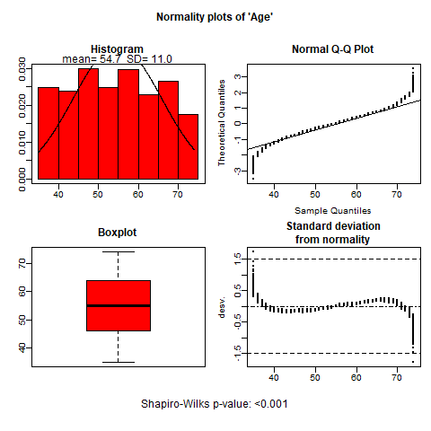
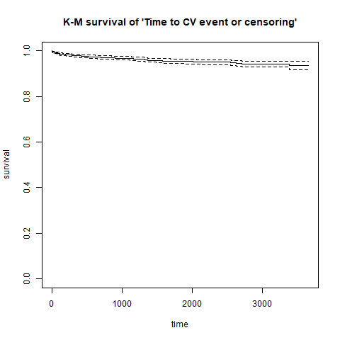

<!-- #TOC { -->
<!--   position: fixed; -->
<!--   left: 0px; -->
<!--   top: 0px; -->
<!--   font-size: 14px; -->
<!--   font-weight: bold; -->
<!--   overflow: hidden; -->
<!--   max-width: 300px; -->
<!--   max-height: 1500px; -->
<!--   border: solid 2px black; -->
<!-- } -->
<!-- #TOC a { -->
<!--   padding-right: 15px; -->
<!-- } -->
<!-- code.r pre{ -->
<!--   width: 1500px; -->
<!-- } -->


<!-- <style type="text/css"> -->
<!-- body{ -->
<!--   font-size: 14px; -->
<!--   text-align: justify; -->
<!--   line-height: 150%; -->
<!--   width: 1000px; -->
<!--   margin: auto; -->
<!--   /*margin-left: 50px;*/ -->
<!--   /*background-color: #D1F0F0;*/ -->
<!-- } -->
<!-- body p{ -->
<!--   width: 900px;   -->
<!-- } -->
<!-- td, th{  /* Table  */ -->
<!--    font-size: 16px; -->
<!-- } -->
<!-- h1 { /* Header 1 */ -->
<!--  font-size: 28px; -->
<!--  width: 800px; -->
<!--  color: DarkBlue; -->
<!-- } -->
<!-- h2 { /* Header 2 */ -->
<!--  font-size: 24px; -->
<!--  color: DarkBlue; -->
<!-- } -->
<!-- h3 { /* Header 3 */ -->
<!--  font-size: 22px; -->
<!--  color: DarkBlue; -->
<!--  line-height: 150%; -->
<!-- } -->
<!-- h4 { /* Header 4 */ -->
<!--  font-size: 20px; -->
<!--  color: DarkBlue; -->
<!--  line-height: 150%; -->
<!-- } -->
<!-- .small-code pre code { -->
<!--   font-size: 7.5pt; -->
<!-- } -->
<!-- </style> -->


<style>
.small-code pre code {
  font-size: 6pt;
  width: 1000px;
}
</style>

```{r,echo=FALSE,results='hide',warning=FALSE,message=FALSE}
library(knitr)
knitr::opts_chunk$set(comment="", message=FALSE, warning=FALSE,fig.align="center",fig.height=10,fig.width=10,tidy=TRUE,tidy.opts=list(blank=FALSE, width.cutoff=1200))
options(width=150)
library(kableExtra)
```


<p style="margin-top:50px"></p>


**News**

- `tibble` class data sets possibly imported by `haven`, `readxl`, `readr`, etc. or to be used by `tydiverse` and `dplyr` packages are supported.

- new function called `descrTable` has been implemented to build descriptive tables in a single step.

- `export2md` to export descriptive tables to R-markdown documents has been improved and now supports stratified tables for HTML.

- new funciton called `strataTable` has been implemented to build descriptive tables by stratas (values or levels of a variable).

- Date variables are treated as continuous-non normal, performing medians, quartiles and non-parametric tests, but now are printed dates.

- New argument `var.equal` added in `compareGroups` and `descrTable`. This allows to consider different variances when comparing means between more than two groups.


# Introduction

The **`compareGroups`** package [@Subirana2014] allows users to create tables displaying results of univariate analyses, stratified or not by categorical variable groupings.

Tables can easily be exported to CSV, LaTeX, HTML, PDF, Word or Excel, or inserted in R-markdown files to generate reports automatically.

This package can be used from the **`R`** prompt or from a user-friendly graphical user interface for non-R familiarized users.

The **`compareGroups`** package is available on CRAN repository. To load the package using the **`R`** prompt, enter:

```{r, echo=TRUE}
library(compareGroups)
```


This document provides an overview of the usage of the **`compareGroups`** package with a real examples, both using the R syntax and the graphical user interface. It is structure as follows: 

- Introduction of the package ([section 2](#package)) and the data used as example ([section 3](#data)), 
- Instructions to perform descriptive tables and exploration plots using R syntax are explained ([section 4](#syntax)), and  
- Usage of graphical user interface based on tcl-tk ([section 5](#gui)) and based on Shiny ([section 6](#wui)) are shown.


<p style="margin-top:50px"></p>
<p style="margin-top:50px"></p>


# Package structure: classes and methods {#package}


The **`compareGroups`** package has three functions:

* `compareGroups` creates an object of class `compareGroups`. This object can be:
    + printed
    + summarized
    + plotted
    + updated
* `createTable` creates an object of class `createTable`. This object can be:
    + printed
    + summarized
* `export2csv`, `export2html`, `export2latex`, `export2pdf`, `export2md`, `export2word` and `export2xls` will export results to CSV, HTML, LaTeX, PDF, Markdown, Word or Excel, respectively. 


Figure 1 shows how the package is structured in terms of functions, classes and methods.

<p style="margin-top:50px"></p>


<p style="margin-top:50px"></p>


Since version 4.0, a new function called **`descrTable`** has been implemented which is a shortcut of `compareGroups`and `createTable`, i.e. step 1 and step 2 in a single step (see [section 4.2.5](#descrTable)). 

<p style="margin-top:50px"></p>
<p style="margin-top:50px"></p>


# Data used as example {#data}


To illustrate how this package works we took a sample from [REGICOR study](http://www.regicor.cat). REGICOR is a cross-sectional study with participants from a north-east region of Spain from whom different sets of variables were collected: demographic (age, sex, ...), anthropomorphic (height, weight, waist, ...), lipid profile (total and cholesterol, triglycerides, ...), questionnaires (physical activity, quality of life, ...), etc. Also, cardiovascular events and mortality were obtained from hospital and official registries and reports along more than 10 years.


First of all, load REGICOR data typing:
```{r}
data(regicor)
```

<p style="margin-top:50px"></p>

Variables and labels in this data frame are:

```{r,echo=FALSE,results="asis"}
dicc <- data.frame(
"Name"=I(names(regicor)),
"Label"=I(unlist(lapply(regicor, attr, which="label", exact=TRUE))),
"Codes"=I(unlist(lapply(regicor, function(x) paste(levels(x),collapse="; "))))
)
dicc$Codes <- sub(">=","$\\\\geq$",dicc$Codes)
kable(dicc, align=rep("l",4), row.names=FALSE, format = "html")
```


<p style="margin-top:50px"></p>

OBSERVATIONS:

1. It is important to note that **`compareGroups`** is not aimed to perform quality control of the data. Other useful packages such as **`2lh`** [@r2lh] are available for this purpose. 

2. It is strongly recommended that the _data.frame_ contain only the variables to be analyzed; the ones not needed in the present analysis should be removed from the list.

3. The nature of variables to be analyzed should be known, or at least which variables are to be used as categorical. It is important to code categorical variables as factors and the order of their levels is meaningful in this package.

3. To label the variables set the "label" attributes from each of them. The tables of results will contain the variable labels (by default).


<p style="margin-top:50px"></p>

## Time-to-event variables

A variable of class `Surv` must be created to deal with time-to-event variables (i.e., time to Cardiovascular event/censored in our example): 

```{r}
library(survival)
regicor$tmain <- with(regicor, Surv(tocv, cv == 'Yes'))
attr(regicor$tmain,"label") <- "Time to CV event or censoring"
```

Note that variable _tcv_ are created as time-to-death and time-to-cardiovascular event taking into account censoring (i.e. they are of class Surv).


<p style="margin-top:50px"></p>
<p style="margin-top:50px"></p>

# Using syntax {#syntax}

<p style="margin-top:50px"></p>

## Computing descriptives

`compareGroups` is the main function which does all the calculus. It is needed to store results in an object. Later, applying the function `createTable` (Section 4.2) to this object will create tables of the analysis results.

For example, to perform a univariate analysis with the _regicor_ data between _year_ ("response" variable) and all other variables ("explanatory" variables), this formula is required:

```{r, results='hide'}
compareGroups(year ~ . , data=regicor)
```


<p style="margin-top:50px"></p>

### Selecting response variables


If only a dot occurs on the right side of the `~` all variables in the data frame will be used.


To remove the variable _id_ from the analysis, use `-` in the formula:

```{r, results='hide'}
compareGroups(year ~ . - id, data=regicor)
```

To select some explanatory variables (e.g., _age_, _sex_ and _bmi_) and store results in an object of class `compareGroups`:

```{r}
res<-compareGroups(year ~ age + sex + bmi, data=regicor)
res
```

Note: Although we have full data (n= `r nrow(regicor)`) for Age and Sex, there are some missing data in body mass index (bmi).

Mean values of body mass index is statistically different among recruitment years (p-value < 0.05), while Age and Sex are not statistically related to recruitment year (p-value > 0.05).

Age & BMI has been used as continuous and normal distributed, while sex as categorical.

No filters have been used (e.g., selecting only treated patients); therefore, the _selection_ column lists "ALL" (for all variables).


<p style="margin-top:50px"></p>

### Subsetting

To perform the analysis in a subset of participants (e.g., "female" participants):

```{r}
compareGroups(year ~ age + smoker + bmi, data=regicor, subset = sex=='Female')
```

Note that only results for female participants are shown.

To subset specific variable/s (e.g., _age_ and _bmi_):


```{r, echo=TRUE}
compareGroups(year ~ age + bmi + smoker, data=regicor, selec = list(age= sex=="Female", bmi = age>50 ))
```

In this case, age distribution are computed among females, while BMI among people older than 50 years.


Combinations are also allowed, e.g.:

```{r, echo=TRUE}
compareGroups(year ~ age + smoker + bmi, data=regicor, selec = list(bmi=age>50), subset = sex=="Female")
```


A variable can appear twice in the formula, e.g.:

```{r, echo=TRUE}
compareGroups(year ~ age + sex + bmi + bmi, data=regicor, selec = list(bmi.1=txhtn=='Yes'))
```

In this case results for _bmi_ will be reported for all participants (n= `r nrow(regicor)`) and also for only those recieving no hypertension treatment. Note that "bmi.1" in the `selec` argument refers to the second time that _bmi_ appears in the formula.


<p style="margin-top:50px"></p>

### Methods for continuous variables


By default continuous variables are analyzed as normal-distributed. When a table is built (see `createTable` function, Section 4.2), continuous variables will be described with mean and standard deviation. To change default options, e.g., "tryglic" used as non-normal distributed:


```{r, echo=TRUE}
compareGroups(year ~ age + smoker + triglyc, data=regicor, method = c(triglyc=2))
```

Note that "continuous non-normal" is shown in the _method_ column for the variable Hormone-replacement therapy.

Possible values in  methods statement are:

* 1: forces analysis as normal-distributed 

* 2: forces analysis as continuous non-normal

* 3: forces analysis as categorical

* NA: performs a Shapiro-Wilks test to decide between normal or non-normal


If the `method` argument is stated as `NA` for a variable, then a Shapiro-Wilks test for normality is used to decide if the variable is normal or non-normal distributed. To change the significance threshold:

```{r, echo=TRUE}
compareGroups(year ~ age + smoker + triglyc, data=regicor, method = c(triglyc=NA), alpha= 0.01)
```

According to Shapiro-Wilks test, stating the cutpoint at 0.01 significance level, triglycerides departed significantly from the normal distribution and therefore the method for this variable will be "continuous non-normal".


All non factor variables are considered as continuous. Exception is made (by default) for those that have fewer than 5 different values. This threshold can be changed in the **min.dis** statement:

```{r, echo=TRUE}
regicor$age7gr<-as.integer(cut(regicor$age, breaks=c(-Inf,40,45,50,55,65,70,Inf), right=TRUE))
compareGroups(year ~ age7gr, data=regicor, method = c(age7gr=NA))
compareGroups(year ~ age7gr, data=regicor, method = c(age7gr=NA), min.dis=8)
```

To avoid errors the maximum categories for the response variable is set at 5 in this example (default value). If this variable has more than 5 different values, the function `compareGroups` returns an error message. For example:

```{r,eval=FALSE}
regicor$var6cat <- factor(sample(1:5, nrow(regicor), replace=TRUE))
compareGroups(age7gr ~ sex + bmi + smoker, data=regicor)
```

<div style="color:red">
```{r,echo=FALSE}
cat("Error in compareGroups.fit(X = X, y = y, include.label = include.label, : 
number of groups must be less or equal to 5")
```
</div>

Defaults setting can be changed with the **max.ylev** statement:

```{r,echo=TRUE}
compareGroups(age7gr ~ sex + bmi + smoker, data=regicor, max.ylev=7)
```

Similarly, by default there is a limit for the maximum number of levels for an explanatory variable. If this level is exceeded, the variable is removed from the analysis and a warning message is printed:

```{r, echo=TRUE, eval=FALSE}
compareGroups(year ~ sex + age7gr, method=c(age7gr=3), data=regicor, max.xlev=5)
```

<div style="color:blue">
```{r,echo=FALSE}
cat("Warning in compareGroups.fit(X = X, y = y, include.label = include.label,  :
  Variables 'age7gr' have been removed since some errors occurred")
```
</div>

<p style="margin-top:50px"></p>

### Dressing up the output

Although the options described in this section correspond to `compareGroups` function, results of changing/setting them won't be visible until the table is created with the `createTable` function (explained later).


* **`include.label`:** By default the variable labels are shown in the output (if there is no label the name will be printed). Changing the statement include.label from "= TRUE" (default) to "= FALSE" will cause variable names to be printed instead.

```{r, echo=TRUE}
compareGroups(year ~ age + smoker + bmi, data=regicor, include.label= FALSE)
```

* **`Q1`, `Q3`:** When the method for a variable is stated as "2" (i.e., to be analyzed as continuous non-normal; see section 4.1.3), by default the median and quartiles 1 and 3 will be shown in the final results, after applying the function `createTable` (see Section 4.2).


```{r, echo=TRUE}
resu1<-compareGroups(year ~ age + triglyc, data=regicor, method = c(triglyc=2))
createTable(resu1)
```

Note: percentiles 25 and 75 are calculated for "triglycerides".

To get instead percentile 2.5% and 97.5%:
  
```{r, echo=TRUE}
resu2<-compareGroups(year ~ age + triglyc, data=regicor, method = c(triglyc=2), Q1=0.025, Q3=0.975)
createTable(resu2)
```


To get minimum and maximum:
  
```{r, echo=TRUE, results='hide'}
compareGroups(year ~ age + triglyc, data=regicor, method = c(triglyc=2), Q1=0, Q3=1)
```


* **`simplify`:**  Sometimes a categorical variable has no individuals for a specific group. For example, _smoker_ has 3 levels. As an example and to illustrate this problem, we have created a new variable _smk_ with a new category ("Unknown"):
  
```{r, echo=TRUE}
regicor$smk<-regicor$smoker
levels(regicor$smk)<- c("Never smoker", "Current or former < 1y", "Former >= 1y", "Unknown")
attr(regicor$smk,"label")<-"Smoking 4 cat."
cbind(table(regicor$smk))
```

Note that this new category ("unknown") has no individuals: 

```{r, echo=TRUE}
compareGroups(year ~ age + smk + bmi, data=regicor)
```

<div style="font-color:blue">

```{r,echo=FALSE}
cat("Warning in compare.i(X[, i], y = y, selec.i = selec[i], method.i = method[i],  :
  Some levels of 'smk' are removed since no observation in that/those levels")
```
</div>

Note that a "Warning" message is printed related to the problem with _smk_.


To avoid using empty categories, `simplify` must be stated as `TRUE` (Default value).

```{r, echo=TRUE}
compareGroups(year ~ age + smk + bmi, data=regicor, simplify=FALSE)
```

Note that no p-values are calculated for "Smoking" since Chi-squared nor F-Fisher test cannot be computed with a zero row.


<p style="margin-top:50px"></p>

### Summary


Applying the `summary` function to an object of class `createTable` will obtain a more detailed output:

```{r, echo=TRUE}
res<-compareGroups(year ~ age + sex + smoker + bmi + triglyc, method = c(triglyc=2), data=regicor)
summary(res[c(1, 2, 5)])
```

Note that because only variables 1, 3 and 4 are selected, only results for Age, Sex and Triglycerides are shown. Age is summarized by the mean and the standard deviation, Sex by frequencies and percentage, and Triglycerides (method=2) by the median and quartiles.


<p style="margin-top:50px"></p>


### Plotting

Variables can be plotted to see their distribution. Plots differ according to whether the variable is continuous or categorical. Plots can be seen on-screen or saved in different formats (BMP, JPG', PNG, TIF or PDF). To specify the format use the argument `type'.

```{r, echo=TRUE}
plot(res[c(1,2)], file="./figures/univar/", type="png")
```





Plots also can be done according to grouping variable. In this case only a boxplot is shown for continuous variables:

```{r, echo=TRUE}
plot(res[c(1,2)], bivar=TRUE, file="./figures/bivar/", type="png")
```


<p style="margin-top:50px"></p>

### Updating

The object from `compareGroups` can later be updated. For example:

```{r}
res<-compareGroups(year ~ age + sex + smoker + bmi, data=regicor)
res
```

The object `res` is updated using:


```{r, echo=TRUE, results='hide'}
res<-update(res, . ~. - sex + triglyc + cv + tocv, subset = sex=='Female', method = c(triglyc=2, tocv=2), selec = list(triglyc=txchol=='No'))
res
```

Note that "Sex" is removed as an explanatory variable but used as a filter, subsetting only "Female" participants. Three new variables have been added: Triglycerides, cardiovascular event (yes/no) and time to cardiovascular event or censoring (stated continuous non-normal). For Triglycerides is stated to show only data of participants with no treatment for cholesterol.


<p style="margin-top:50px"></p>

### Substracting results

Since version 3.0, there is a new function called `getResults` to retrieve some specific results computed by `compareGroups`, such as p-values, descriptives (means, proportions, ...), etc.

For example, it may be interesting to recover the p-values for each variable as a vector to further manipulate it in **`R`**, like adjusting for multiple comparison with `p.adjust`. For example, lets take the example data from **`SNPassoc`** package that contains information of dozens of SNPs (genetic variants) from a sample of cases and controls. In this case we analize five of them:

```{r}
data(SNPs)
tab <- createTable(compareGroups(casco ~ snp10001 + snp10002 + snp10005 + snp10008 + snp10009, SNPs))
pvals <- getResults(tab, "p.overall")
p.adjust(pvals, method = "BH")
```


<p style="margin-top:50px"></p>


Alternatively, since 4.6.0 version, a new function called **`padjustCompareGroups`** created by Jordi Real <jordireal<at>gmail.com> can be used to compute p-values considering multiple testing. The methods are the same from `p.adjust` function, i.e. Bonferroni, False Discovery Rate, etc.

This function takes the `compareGroups` object and re-computes the p-values. To obtain the same table as above with the p-values correted by "BH" method:

```{r}
cg <- compareGroups(casco ~ snp10001 + snp10002 + snp10005 + snp10008 + snp10009, SNPs)
createTable(padjustCompareGroups(cg, method="BH"))
```


<p style="margin-top:50px"></p>


### Odds Ratios and Hazard Ratios


When the response variable is binary, the Odds Ratio (OR) can be printed in the final table. If the response variable is time-to-event (see Section 3.1), the Hazard Ratio (HR) can be printed instead.


* **`ref`:**  This statement can be used to change the reference category:

```{r, echo=TRUE}
res1<-compareGroups(cv ~ age + sex + bmi + smoker, data=regicor, ref=1)
createTable(res1, show.ratio=TRUE)
```


Note that for categorical response variables the reference category is the first one in the statement:


```{r, echo=TRUE}
res2<-compareGroups(cv ~ age + sex + bmi + smoker, data=regicor, ref=c(smoker=1, sex=2))
createTable(res2, show.ratio=TRUE)
```

Note that the reference category for Smoking status is the first and for Sex the second.


* **`ref.no`:** Similarly to the `ref` statement, `ref.no` is used to state "no" as the reference category for all variables with this category:

```{r, echo=TRUE}
res<-compareGroups(cv ~ age + sex + bmi + histhtn + txhtn, data=regicor, ref.no='NO')
createTable(res, show.ratio=TRUE)
```

Note: "no", "No" or "NO" will produce the same results; the coding is not case sensitive.


* **`fact.ratio`**: By default OR or HR for continuous variables are calculated for each unit increase. It can be changed by the `fact.or` statement:

```{r, echo=TRUE}
res<-compareGroups(cv ~ age + bmi, data=regicor)
createTable(res, show.ratio=TRUE)
```

Here the OR is for the increase of one unit for Age and "Body mass index".


```{r, echo=TRUE}
res<-compareGroups(cv ~ age + bmi, data=regicor, fact.ratio= c(age=10, bmi=2))
createTable(res, show.ratio=TRUE)
```

Here the OR is for the increase of 10 years for Age and 2 units for "Body mass index".


* **`ref.y`:** By default when OR or HR are calculated, the reference category for the response variable is the first. The reference category could be changed using the `ref.y` statement:

```{r, echo=TRUE}
res<-compareGroups(cv ~ age + sex + bmi + txhtn, data=regicor)
createTable(res, show.ratio=TRUE)
```

Note: This output shows the OR of having a cardiovascular event. Therefore, having no event is the reference category.


```{r, echo=TRUE}
res<-compareGroups(cv ~ age + sex + bmi + txhtn, data=regicor, ref.y=2)
createTable(res, show.ratio=TRUE)
```

Note: This output shows the OR of having no event, and event is now the reference category.


When the response variable is of class `Surv`, the bivariate `plot` function returns a Kaplan-Meier figure if the explanatory variable is categorical. For continuous variables the function returns a line for each individual, ending with a circle for censored and with a plus sign for uncensored.


```{r}
plot(compareGroups(tmain ~ sex, data=regicor), bivar=TRUE, file="./figures/bivarsurv/", type="png")
plot(compareGroups(tmain ~ age, data=regicor), bivar=TRUE, file="./figures/bivarsurv/", type="png")
```


<p style="margin-top:50px"></p>

### Time-to-event explanatory variables

When a variable of class `Surv` (see Section 3.1) is used as explanatory it will be described with the probability of event, computed by Kaplan-Meier, up to a stated time.


* **`timemax`:** By default probability is calculated at the median of the follow-up period. `timemax` option allows us to change at what time probability is calculated.


```{r, echo=TRUE, results='hide'}
res<-compareGroups(sex ~  age + tmain, timemax=c(tmain=3*365.25), data=regicor)
res
```

Note that `tmain` is calculated at 3 years, i.e. 3*365.25 days (see section 3.1).


The `plot` function applied to a variable of class `Surv` returns a Kaplan-Meier figure. The figure can be stratified by the grouping variable.

```{r, echo=TRUE}
plot(res[2], file="./figures/univar/", type="png")
plot(res[2], bivar=TRUE, file="./figures/bivar/", type="png")
```




<p style="margin-top:50px"></p>

## Performing the descritive table

The `createTable` function, applied to an object of `compareGroups` class, returns tables with descriptives that can be displayed on-screen or exported to CSV, LaTeX, HTML, Word or Excel.


```{r,echo=TRUE}
res<-compareGroups(year ~ age + sex + smoker + bmi + sbp, data=regicor, selec = list(sbp=txhtn=="No"))
restab<-createTable(res)
```

Two tables are created with the `createTable` function: one with the descriptives and the other with the available data. The `print` method applied to an object of class `createTable` prints one or both tables on the **`R`** console:

```{r, echo=TRUE}
print(restab,which.table='descr')
```

Note that the option "descr" prints descriptive tables.


```{r, echo=TRUE, eval=FALSE}
print(restab,which.table='avail')
```


```{r, echo=FALSE}
print(restab,which.table='avail')
```


While the option "avail" prints the available data, as well as methods and selections.

By default, only the descriptives table is shown. Stating "both" in `which.table` argument prints both tables.


<p style="margin-top:50px"></p>

### Dressing up tables

* **`hide`:** If the explanatory variable is dichotomous, one of the categories often is hidden in the results displayed (i.e., if `r paste(round(prop.table(table(regicor$sex))[1], 3)*100,"%",sep="")` are male, obviously `r paste(round(prop.table(table(regicor$sex))[2], 3)*100,"%",sep="")` are female). To hide some category, e.g., "Male":

```{r}
update(restab, hide = c(sex="Male"))
```

Note that the percentage of males is hidden.

* **`hide.no`:** Similarly, as explained above, if the category "no" is to be hidden for all variables:

```{r}
res<-compareGroups(year ~ age + sex + histchol + histhtn, data=regicor)
createTable(res, hide.no='no', hide = c(sex="Male"))
```

Note: "no", "No" or "NO" will produce the same results; the coding is not case sensitive.

* **`digits`:** The number of digits that appear in the results can be changed, e.g:

```{r}
createTable(res, digits= c(age=2, sex = 3))
```

Note that mean and standard deviation has two decimal places for age, while percentage in sex has been set to three decimal places.


* **`type`:** By default categorical variables are summarized by frequencies and percentages. This can be changed by the `type` argument:

```{r}
createTable(res, type=1)
```

Note that only percentages are displayed.

```{r}
createTable(res, type=3)
```

Note that only frequencies are displayed.


Value 2 or `NA` return the same results, i.e., the default option.


* **`show.n`:** If option `show.n` is set to `TRUE` a column with available data for each variable appears in the results:

```{r}
createTable(res, show.n=TRUE)
```

* **`show.descr`:** If argument `show.descr` is set to `FALSE` only p-values are displayed:

```{r}
createTable(res, show.descr=FALSE)
```

* **`show.all`:** If `show.all` argument is set to `TRUE` a column is displayed with descriptives for all data:

```{r}
createTable(res, show.all=TRUE)
```

* **`show.p.overall`:** If `show.p.overall` argument is set to `FALSE` p-values are omitted from the table:

```{r}
createTable(res, show.p.overall=FALSE)
```

* **`show.p.trend`:** If the response variable has more than two categories a p-value for trend can be calculated. Results are displayed if the `show.p.trend` argument is set to `TRUE`:

```{r}
createTable(res, show.p.trend=TRUE)
```

Note: The p-value for trend is computed from the Pearson test when row-variable is normal and from the Spearman test when it is continuous non-normal. If row-variable is of class `Surv`, the test score is computed from a Cox model where the grouping variable is introduced as an integer variable predictor. If the row-variable is categorical, the p-value for trend is computed as `1-pchisq(cor(as.integer(x),as.integer(y))^2*(length(x)-1),1)`


* **`show.p.mul`:** For a response variable with more than two categories a pairwise comparison of p-values, corrected for multiple comparisons, can be calculated. Results are displayed if the `show.p.mul` argument is set to `TRUE`:

```{r, eval=FALSE}
createTable(res, show.p.mul=TRUE)
```

<div class="small-code">

```{r, echo=FALSE}
createTable(res, show.p.mul=TRUE)
```

</div>


Note: Tukey method is used when explanatory variable is normal-distributed and Benjamini & Hochberg [@BH] method otherwise.


* **`show.ratio`:** If response variable is dichotomous or has been defined as class `survival` (see Section 3.1), Odds Ratios and Hazard Ratios can be displayed in the results by stating `TRUE` at the show.ratio option:

```{r}
createTable(update(res, subset= year!=1995), show.ratio=TRUE)
```


Note that recruitment year 1995 of the response variable has been omitted in order to have only two categories (i.e., a dichotomous variable). No Odds Ratios would be calculated if response variable has more than two categories.


Note that when response variable is of class `Surv`, Hazard Ratios are calculated instead of Odds Ratios.

```{r}
createTable(compareGroups(tmain ~  year + age + sex, data=regicor), show.ratio=TRUE)
```


* **`digits.ratio`:** The number of decimal places for Odds/Hazard ratios can be changed by the `digits.ratio` argument:

```{r}
createTable(compareGroups(tmain ~  year + age + sex, data=regicor), show.ratio=TRUE, digits.ratio= 3)
```


* **`header.labels`:** Change some key table header, such as the p.overall, etc. Note that this is done when printing the table changing the argument in the `print` function and not in the `createTable` function. This argument is also present in other function that exports the table to pdf, plain text, etc.

```{r}
tab<-createTable(compareGroups(tmain ~  year + age + sex, data=regicor), show.all = TRUE)
print(tab, header.labels = c("p.overall" = "p-value", "all" = "All"))
```


<p style="margin-top:50px"></p>


### Combining tables by row (groups of variable)

Tables made with the same response variable can be combined by row:

```{r}
restab1 <- createTable(compareGroups(year ~ age + sex, data=regicor))
restab2 <- createTable(compareGroups(year ~ bmi + smoker, data=regicor))
rbind("Non-modifiable risk factors"=restab1, "Modifiable risk factors"=restab2)
```

Note how variables are grouped under "Non-modifiable" and "Modifiable"" risk factors because of an epigraph defined in the `rbind` command in the example.


The resulting object is of class `rbind.createTable`, which can be subset but not updated. It inherits the class `createTable`. Therefore, columns and other arguments from the `createTable` function cannot be modified:


To select only Age and Smoking:

```{r}
x <- rbind("Non-modifiable"=restab1,"Modifiable"=restab2)
rbind("Non-modifiable"=restab1,"Modifiable"=restab2)[c(1,4)]
```


To change the order:

```{r}
rbind("Modifiable"=restab1,"Non-modifiable"=restab2)[c(4,3,2,1)]
```


<p style="margin-top:50px"></p>

### Combining tables by column (strata)

Columns from tables built with the same explanatory and response variables but done with a different subset (i.e. "ALL", "Male" and "Female", strata) can be combined:


```{r}
res<-compareGroups(year ~ age +  smoker + bmi + histhtn , data=regicor)
alltab <- createTable(res,  show.p.overall = FALSE)
femaletab <- createTable(update(res,subset=sex=='Female'), show.p.overall = FALSE)
maletab <- createTable(update(res,subset=sex=='Male'), show.p.overall = FALSE)
```

```{r, eval=FALSE}
cbind("ALL"=alltab,"FEMALE"=femaletab,"MALE"=maletab)
```

<div class="small-code">

```{r, echo=FALSE}
cbind("ALL"=alltab,"FEMALE"=femaletab,"MALE"=maletab)
```
</div>


By default the name of the table is displayed for each set of columns.

```{r, eval=FALSE}
cbind(alltab,femaletab,maletab)
```

<div class="small-code">

```{r, echo=FALSE}
cbind(alltab,femaletab,maletab)
```
</div>


NOTE: The resulting object is of class `cbind.createTable` and inherits also the class `createTable`. This cannot be updated. It can be nicely printed on the R console and also exported to LaTeX but it cannot be exported to CSV or HTML.

<br>

Since version 4.0, it exists the function **`strataTable`** to build tables within stratas defined by the values or levels defined of a variable. Notice that the syntax is much simpler than using `cbind` method. For example, to perform descriptives by groups, and stratified per gender:

1. first build the table with descriptives by groups:

```{r}
res <- compareGroups(year ~ age + bmi + smoker + histchol + histhtn, regicor)
restab <- createTable(res, hide.no="no")
```

2. and then apply the `strataTable` function on the table:

```{r, eval=FALSE}
strataTable(restab, "sex")
```


<div class="small-code">

```{r, echo=FALSE}
strataTable(restab, "sex")
```

</div>


### Miscellaneous

In this section some other `createTable` options and methods are discussed:

* **`print`:** By default only the table with the descriptives is printed. With `which.table` argument it can be changed: "avail" returns data available and "both" returns both tables:

```{r}
print(createTable(compareGroups(year ~ age + sex + smoker + bmi, data=regicor)), which.table='both')
```

With the `print` method setting `nmax` argument to `FALSE`, the total maximum "n" in the available data is omitted in the first row.

```{r}
print(createTable(compareGroups(year ~ age + sex + smoker + bmi, data=regicor)),  nmax=FALSE)
```

* **`summary`:** returns the same table as that generated with `print` method setting `which.table='avail'`:

```{r}
summary(createTable(compareGroups(year ~ age + sex + smoker + bmi, data=regicor)))
```

* **`update`:** An object of class `createTable` can be updated:

```{r}
res<-compareGroups(year ~ age + sex + smoker + bmi, data=regicor)
restab<-createTable(res, type=1)
restab
update(restab, show.n=TRUE)
```

In just one statement it is possible to update an object of class `compareGroups` and `createTable`:

```{r}
update(restab, x = update(res, subset=c(sex=='Female')), show.n=TRUE)
```

Note that the `compareGroups` object (_res_) is updated, selecting only "Female"" participants, and the _createTable_ class object (_restab_) is updated to add a column with the maximum available data for each explanatory variable.


* **`subsetting`:** Objects from `createTable` function can also be subset using "[":

```{r}
createTable(compareGroups(year ~ age + sex + smoker + bmi + histhtn, data=regicor))
```

```{r}
createTable(compareGroups(year ~ age + sex + smoker + bmi + histhtn, data=regicor))[1:2, ]
```


### Building tables in one step {#descrTable}


Making use of **`descrTable`** the user can build descriptive table in one step. This function takes all the arguments of `compareGroups` function plus the ones from `createTable` function.
The result is the same as if the user first call compareGroups and then createTable. Therefore one can use the same methods and functions avaiable for createTable objects (subsetting, ploting, printing, exporting, etc.)


To describe all varaible from regicor dataset, just type:

```{r}
descrTable(regicor)
```

To describe some variables, make use of formula argument (just as using `compareGroups` function)


```{r}
descrTable(~ age + sex, regicor)
```

To hide "no" category from yes-no variables, use the `hide.no` argument from `createTable`:

```{r}
descrTable(regicor, hide.no="no")
```

To report descriptives by group as well as the descriptives of the entire cohort:

```{r}
descrTable(year ~ ., regicor, hide.no="no", show.all=TRUE)
```


Or you can select individuals using the `subset` argument.

```{r}
descrTable(regicor, subset=age>65)
```


<p style="margin-top:50px"></p>


## Exporting tables

Tables can be exported to CSV, HTML, LaTeX, PDF, Markdown, Word or Excel

* `export2csv(restab, file='table1.csv')`, exports to CSV format

* `export2html(restab, file='table1.html')`, exports to HTML format

* `export2latex(restab, file='table1.tex')`, exports to LaTeX format (to be included in Swaeave documents R chunks)

* `export2pdf(restab, file='table1.pdf')`, exports to PDF format

* `export2md(restab, file='table1.md')`, to be included inside Markdown documents R chunks

* `export2word(restab, file='table1.docx')`, exports to Word format

* `export2xls(restab, file='table1.xlsx')`, exports to Excel format


Note that, since version 3.0, it is necessary write the extension of the file.


<p style="margin-top:50px"></p>


### General exporting options

* **`which.table`:** By default only the table with the descriptives is exported. This can be changed with the `which.table` argument:
"avail" exports only available data and "both" exports both tables.


* **`nmax`:** By default a first row with the maximum "n" for available data (i.e. the number of participants minus the least missing data) is exported. Stating `nmax` argument to FALSE this first row is omitted.


* **`sep`:** Only relevant when table is exported to csv. Stating, for example, `sep = ";"` table will be exported to csv with columns separated by ";".


<p style="margin-top:50px"></p>


### Exporting to LaTeX

A special case of exporting is when tables are exported to LaTeX. The function `export2latex` returns an object with the tex code as a character that can be changed in the **`R`** session.


* **`file`:** If `file` argument in `export2latex` is missing, the code is printed in the **`R`** console. This can be useful when **`R`** code is inserted in a LaTeX document chunk to be processed with **`Sweave`** package.

```{r}
restab<-createTable(compareGroups(year ~ age + sex + smoker + bmi + histchol, data=regicor))
export2latex(restab)
```


* **`size`:** The font size of exported tables can be changed by this argument. Possible values are "tiny", "scriptsize", "footnotesize", "small", "normalsize", "large", "Large", "LARGE","huge", "Huge" or "same". Default is "same", which means that font size of the table is the same as specified in the main LaTeX document where the table will be inserted.


* **`caption`:** The table caption for descriptives table and available data table. If `which.table` is set to "both" the first element of "caption" will be assigned to descriptives table and the second to available data table. If it is set to "", no caption is inserted. Default value is `NULL`, which writes "Summary descriptives table by groups of 'y'" for descriptives table and "Available data by groups of 'y'" for the available data table.


* **`loc.caption`:** Table caption location. Possible values are "top" or "bottom". Default value is "top".


* **`label`:** Used to cite tables in a LaTeX document. If `which.table` is set to "both" the first element of "label" will be assigned to the descriptives table and the second to the available data table. Default value is `NULL`, which assigns no label to the table/s.


* **`landscape`:** Table is placed in horizontal way. This option is specially useful when table contains many columns and/or they are too wide to be placed vertically.


### Exporting to Rmarkdown

Since 4.0 version, `export2md` supports `cbind.createTable` class objects, i.e. when exporting stratified descriptive tables. Also, nicer and more customizable tables can be reported making use of `kableExtra` package (such as size, strip rows, etc.).

Following, there are some examples when exporting to HTML.

First create the descriptive table of REGICOR variables by recruitment year.

```{r}
res <- compareGroups(year ~ ., regicor)
restab <- createTable(res, hide.no="no")
```

* **Default export2md to HTML:**

```{r}
export2md(restab)
```

* **Add strip rows, colouring rows by variables:**

```{r}
export2md(restab, strip=TRUE, first.strip=TRUE)
```

* **Change size:**

```{r}
export2md(restab, size=6)
```

* **Making variable names column wider:**

```{r}
export2md(restab, width="400px")
```

* **Stratified table:**

```{r}
restab <- strataTable(descrTable(year ~ . -id, regicor), "sex")
```

```{r}
export2md(restab, size=8)
```


## Generating an exhaustive report

Since version 2.0 of **`compareGroups`** package, there is a function called `report` which automatically generates a PDF document with the "descriptive" table as well as the corresponding "available"" table. In addition, plots of all analysed variables are shown.

In order to make easier to navigate through the document, an index with hyperlinks is inserted in the document.

See the help file of this function where you can find an example with the REGICOR data (the other example data set contained in the **`compareGroups`** package)

```{r, eval=FALSE}
# to know more about report function
?report

# info about REGICOR data set
?regicor
```

Also, you can use the function `radiograph` that dumps the raw values on a plain text file. This may be useful to identify possible wrong codes or non-valid values in the data set.


<p style="margin-top:50px"></p>


## Dealing with missing values

Many times, it is important to be aware of the missingness contained in each variable, possibly by groups.
Although "available" table shows the number of the non-missing values for each row-variable and in each group, it would be desirable to test whether the frequency of non-available data is different between groups.

For this porpose, a new function has been implemented in the **`compareGroups`** package, which is called `missingTable`. This function applies to both `compareGroups` and `createTable` class objects. This last option is useful when the table is already created. To illustrate it, we will use the REGICOR data set, comparing missing rates of all variables by year:

```{r}
# from a compareGroups object
data(regicor)
res <- compareGroups(year ~ .-id, regicor)
missingTable(res)
```

```{r, eval=FALSE,results='hide'}
# or from createTable objects
restab <- createTable(res, hide.no = 'no')
missingTable(restab)
```


Perhaps a NA value of a categorical variable may mean something different from just non available. For example, patients admitted for "Coronary Acute Syndrome" with `NA` in "ST elevation" may have a higher risk of in-hospital death than the ones with available data, i.e. "ST elevation" yes or not. If these kind of variables are introduced in the data set as `NA`, they are removed from the analysis. To avoid the user having to recode `NA` as a new category for all categorical variables, new argument called `include.miss` in `compareGroups` function has been implemented which does it automatically. Let's see an example with all variables from REGICOR data set by cardiovascular event.

```{r}
# first create time-to-cardiovascular event
regicor$tcv<-with(regicor,Surv(tocv,cv=='Yes'))
# create the table
res <- compareGroups(tcv ~ . -id-tocv-cv-todeath-death, regicor, include.miss = TRUE)
restab <- createTable(res, hide.no = 'no')
restab
```


<p style="margin-top:50px"></p>

## Analysis of genetic data


In the version 2.0 of **`compareGroups`**, it is possible to analyse genetic data, more concretely Single Nucleotic Polymorphisms (SNPs), using the function `compareSNPs`. This function takes advantage of **`SNPassoc`** [@SNPassoc] and **`HardyWeinberg`** [@HW] packages to perform quality control of genetic data displaying the Minor Allele Frequencies, Missingness, Hardy Weinberg Equilibrium, etc. of the whole data set or by groups. When groups are considered, it also performs a test to check whether missingness rates is the same among groups.


Following, we illustrate this by an example taking a data set from **`SNPassoc`** package.


First of all, load the `SNPs` data from **`SNPassoc`**, and visualize the first rows. Notice how are the SNPs coded, i.e. by the alleles. The alleles separator can be any character. If so, this must be specified in the `sep` argument of `compareSNPs` function (type `?compareSNPs` for more details).

```{r}
data(SNPs)
head(SNPs)
```

In this data frame there are some genetic and non-genetic data. Genetic variables are those whose names begin with "snp". If we want to summarize the first three SNPs by case control status:

```{r}
res<-compareSNPs(casco ~ snp10001 + snp10002 + snp10003, data=SNPs)
res
```

Note that all variables specified in the right hand side of the formula must be SNPs, i.e. variables whose levels or codes can be interpreted as genotypes (see `setupSNPs` function from **`SNPassoc`** package for more information).
Separated summary tables by groups of cases and controls are displayed, and the last table corresponds to missingness test comparing non-available rates among groups.

If summarizing SNPs in the whole data set is desired, without separating by groups, leave the left side of formula in blank, as in `compareGroups` function. In this case, a single table is displayed and no missingness test is performed.

```{r}
res<-compareSNPs(~ snp10001 + snp10002 + snp10003, data=SNPs)
res
```


<p style="margin-top:50px"></p>
<p style="margin-top:50px"></p>


# Using the Graphical User Inferface (GUI) - tcltk {#gui}

Once the **`compareGroups`** package is loaded, a Graphical User Interface (GUI) is displayed in response to typing `cGroupsGUI(regicor)`. The GUI is meant to make it feasible for users who are unfamiliar with **`R`** to construct bivariate tables.
Note that, since version 3.0, it is necessary to specifiy an existing data.frame as input. So, for example, you can load the REGICOR data by typing `data(regicor)` before calling `cGroupsGUI` function.


In this section we illustrate, step by step, how to construct a bivariate table containing descriptives by groups from the _regicor_ data  using the GUI:


```{r, echo=FALSE, results='asis'}
export2md(descrTable(year ~  age + sex + smoker + sbp + dbp + histhtn + txhtn + chol + hdl + triglyc + ldl + histchol + txchol + bmi, data=regicor, method=c(triglyc=2), hide.no="No",hide = c(sex="Male")))
```


<p style="margin-top:50px"></p>

* **Step 1.** Browse for and select the data to be loaded. Valid file types include SPSS or **`R`** format, CSV plain text file or a _data.frame_ already existing in the Workspace. You need to specify a data set. In this example the _regicor_ data is loaded.


<p style="margin-top:50px"></p>

* **Step 2.** Choose the variables to be described (row-variables).


<p style="margin-top:50px"></p>

* **Step 3.** If descriptives by recruitment year are desired (for example), move the variable _year_ to the GUI top frame, making it the factor variable. To report descriptives for the whole sample (i.e., no groups), click on the "none" button.


<p style="margin-top:50px"></p>

* **Step 4.** It is possible to hide the first, last or no categories of a categorical row-variable. In this example, "Male" levels will be hidden for Sex; conversely, all categories will be shown for other categorical variables.


<p style="margin-top:50px"></p>

* **Step 5.** For each continuous variable, it is possible to specify whether to treat it as normal or non-normal or to transform a numerical variable into a categorical one. This last option can be interesting if a categorical variable has been coded as numerical. By default, all continuous variables are treated as normal. In this example, triglycerides will be treated as non-normal, i.e., median and quartiles will be reported instead of mean and standard deviation.


<p style="margin-top:50px"></p>

* **Step 6.** For each row-variable, it is possible to select a subset of individuals from the data set to be included. In this example, descriptives of systolic and diastolic blood pressure (_sbp_ and _dbp_) be reported only for those with no htn treatment. Also, it is possible to specify criteria to select a subset of individuals to be included for all row-variables: type the logical condition (selection criteria of individuals) on the "Global subset" window instead of "Variable subset".


<p style="margin-top:50px"></p>

* **Step 7.** Some bivariate table characteristics can be set by clicking on "Report options" from the main menu, such as to report descriptives (mean, frequencies, medians, etc.), display the p-trend, and show only relative frequencies.


<p style="margin-top:50px"></p>

* **Step 8.** Finally, specify the bivariate table format (LaTeX, CVS plain text or HTML). Clicking on "print"" will then display the bivariate table, as well as a summary (available data, etc.), on the **`R`** console. The table can also be exported to the file formats listed.


<p style="margin-top:50px"></p>


## Computing Odds Ratio


For a case-control study, it may be necessary to report the Odds Ratio between cases and controls for each variable. The table below contains Odds Ratios for cardiovascular event for each row-variable.

```{r, echo=FALSE, results='asis'}
export2md(descrTable(cv ~  age + sex + smoker + bmi + chol + triglyc + ldl + sbp + dbp + txhtn, data=regicor, method=c(triglyc=2), hide.no="No",hide = c(sex="Male"), show.ratio=TRUE, show.descr=FALSE))
```

To build this table, as illustrated in the screens below, you would select _htn_ variable (Hypertension status) as the factor variable, indicate "no" category on the "reference" pull-down menu, and mark "Show odds/hazard ratio" in the "Report Options" menu before exporting the table.


<p style="margin-top:50px"></p>

## Computing Hazard Ratio

In a cohort study, it may be more informative to compute hazard ratio taking into account time-to-event.

```{r, echo=FALSE, results='asis'}
export2md(createTable(compareGroups(tcv ~  year + age + sex, data=regicor), show.ratio=TRUE))
```

To generate this table, select _tocv_ variable and _cv_, indicating the time-to-event and the status, respectively, and select the event category for the status variable. Finally, as for Odds Ratios, mark 'Show odds/hazard ratio' in the 'Report Options' menu before exporting the table.


<p style="margin-top:1cm"></p>
To return to the **`R`** console, just close the GUI window.


<p style="margin-top:50px"></p>
<p style="margin-top:50px"></p>


# References