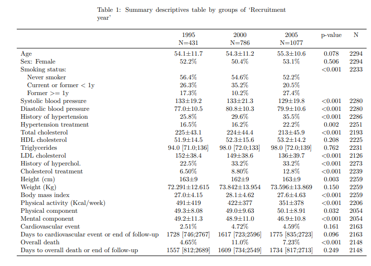
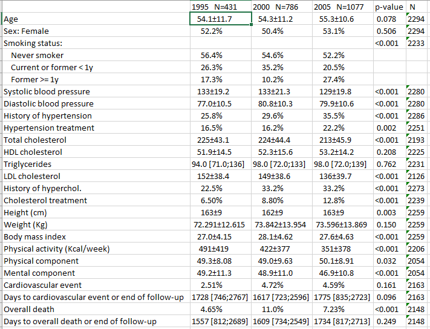

Several types of statistics (mean, standard deviation, quantiles or frequencies) are displayed according to the nature of each variable (categorical, continuous and normal-distributed or other quantitative type distribution). Also, p-value to test equality between groups is computed using the appropiate test.

```{r setup, include=FALSE}
knitr::opts_chunk$set(comment="",message=FALSE,warning=FALSE)
```

## Step 1. Install the package

Install the **`compareGroups`** package from CRAN and then load it by typing:

```{r, eval=FALSE}
install.packages("compareGroups")
library(compareGroups)
```

```{r, echo=FALSE}
library(compareGroups)
```

## Step 2. Load data

Load the REGICOR example data available in **`compareGroups`** package:

```{r}
data(regicor)
```

## Step 3. Compute descriptives and tests

Compute all descriptives and tests from selected variables by using the **`compareGroups`** function. <br> Note the use of `formula` argument as usual in `R`, so "." indicates all variables in the dataset while "-" sign indicates removing, and variable on left side of "\~" sign indicates the groups (if descriptives of whole datset without separating by groups is desired left it in blank). Store the results in an object that can be used afterwards to perform plots or bivariate table itself.<br> By the argument `method` we set triglycerides (`triglyc`), days to cardiovascular event (`tocv`) and days until death (`todeath`) variables to be reported as median and quartiles instead of mean and standard deviation.

```{r}
res <- compareGroups(year ~ . - id, data = regicor, 
                     method=c(triglyc=2, tocv=2, todeath=2))
```

## Step 4. Create the descriptive table

Use the **`creaTable`** function passing the previous object computed by **`compareGroups`** function (`res`). Using this function you can customize how categorical variables are displayed (only percertage or absolute frequencies or both) by `type` argument or whether standard deviation appears inside brackets or separated by plus/minus symbol by `sd.type` argument. <br> Also note the use of `hide.no` category which is useful to hide "no" level for those binary variables. <br> If you only want to show "Female" category use `hide` argument for `sex` variable indicating which category is going to be hiden. This argument also applies to categorical variables with more than two categories. To specify the number of decimal digits to show use `digits`arguments. In this example `height` have no decimals and for `weight` with three digits. Finally, if you want to show how many individuals have non-missing values in each described variable, set `show.n` argument to `TRUE`.

```{r}
restab <- createTable(res, digits = c(height=0, weight=3), type = 1, sd.type = 2, 
                      hide = c(sex = "Male"), hide.no = "no", show.n = TRUE)
```

## Step 5. Print or export the descriptive table

### Print on R console

The descriptive table can be printed in the `R` console using the method `print`, i.e. just typing the name of the object:

```{r}
restab
```

If you want to change some bivariate table header, such "p-value" instead of "p.overall" use `header.labels` argument:

```{r}
print(restab, header.labels = c(p.overall = "p-value"))
```

### Exporting to different formats



-   **Word**

Export to a Word.

```{r, eval=FALSE}
export2word(restab, file = "example1.docx", header.labels = c(p.overall = "p-value"))
```


-   **PDF**

If you want to create a PDF document with the table in a publish-ready format

```{r, eval=FALSE}
export2pdf(restab, file = "example1.pdf", header.labels = c(p.overall = "p-value"))
```


*Note: To create tables in PDF you must have some LaTeX compiler installed on your computer.*

-   **Excel**

If you want export the descriptive table to an Excel file:

```{r, eval=FALSE}
export2xls(restab, file = "example1.xlsx", header.labels = c(p.overall = "p-value"))
```





*Note: You must have `writexlR` package installed.*

-   **Markdown**

You can translate to Markdown code and insert it in a R-markdown chunk to create reproducible reports.

```{r, eval=TRUE}
export2md(restab, header.labels = c(p.overall = "p-value"))
```

-   **LaTeX**

Similar to Markdown file, it is possible to insert LaTeX code in a .tex.

```{r, eval=FALSE}
export2tex(restab, header.labels = c(p.overall = "p-value"))
```
