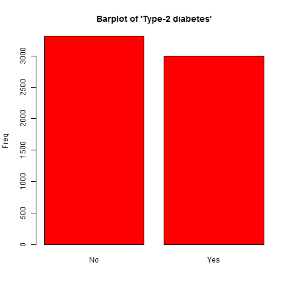
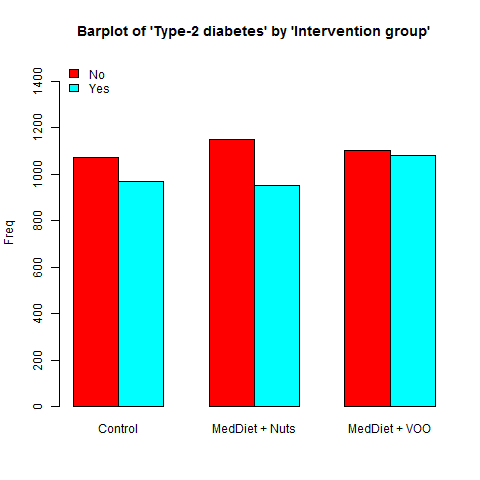

Barplots, boxplots or normality plots are displayed according to the nature of described variable. These plots are useful to explore visually whether a continuous variable follows a normal distribution or to identify possible outliers or rare categories, etc.


```{r setup, include=FALSE}
knitr::opts_chunk$set(comment="",message=FALSE,warning=FALSE)
```


# Step 1. Install the package

Install **`compareGroups`** package from CRAN and then load it by typing:

```{r, eval=FALSE}
install.packages("compareGroups")
library(compareGroups)
```

```{r, echo=FALSE}
library(compareGroups)
```


# Step 2. Load data

Load the PREDIMED example data available in **`compareGroups`** package:

```{r}
data(predimed)
```


# Setp 3. Computations  

First use `compareGroups` function to store all values used to perform plots afterwards.

```{r}
res <- compareGroups(group ~ . - toevent, data = predimed)
```

<br>

You can use <font style="color:blue">`varinfo`</font> function to recover the original name of variables (not labels which are displayed in the results).

```{r}
varinfo(res)
```


# Step 4. Perform plots 

by using the `plot` method which takes the results created by <font style="color:blue">`compareGroups`</font> function. Inside "[" brackets you can select which variable to plot. And, indicating `bivar=TRUE` a bivariate plot is performed, i.e. stratifying by groups.

a. For categorical variables a barplot is performed, stratifying by groups (right plot) or not (left plot):


```{r,echo=FALSE,results="hide"}
plot(res['diab'],file="xxx",type="png")
file.copy(file.path(getwd(),"xxxdiab.png"),"C:/programs/Dropbox/CompareGroups/web/markdown/examples/example2a.png",overwrite=TRUE)
file.remove(file.path(getwd(),"xxxdiab.png"))
plot(res['diab'],file="xxx",type="png",bivar=TRUE)
file.copy(file.path(getwd(),"xxxdiab.png"),"C:/programs/Dropbox/CompareGroups/web/markdown/examples/example2b.png",overwrite=TRUE)
file.remove(file.path(getwd(),"xxxdiab.png"))
```

```{r,eval=FALSE}
plot(res['diab'])
plot(res['diab'],bivar=TRUE)
```





b. For continuous variables boxplots or normality plots are performed depending whether groups are considered or not, respectively.


```{r,echo=FALSE,results="hide"}
plot(res['bmi'],file="xxx",type="png")
file.copy(file.path(getwd(),"xxxbmi.png"),"C:/programs/Dropbox/CompareGroups/web/markdown/examples/example2c.png",overwrite=TRUE)
file.remove(file.path(getwd(),"xxxbmi.png"))
plot(res['bmi'],file="xxx",type="png",bivar=TRUE)
file.copy(file.path(getwd(),"xxxbmi.png"),"C:/programs/Dropbox/CompareGroups/web/markdown/examples/example2d.png",overwrite=TRUE)
file.remove(file.path(getwd(),"xxxbmi.png"))
```


```{r}
plot(res['bmi'])
plot(res['bmi'],bivar=TRUE)
```


